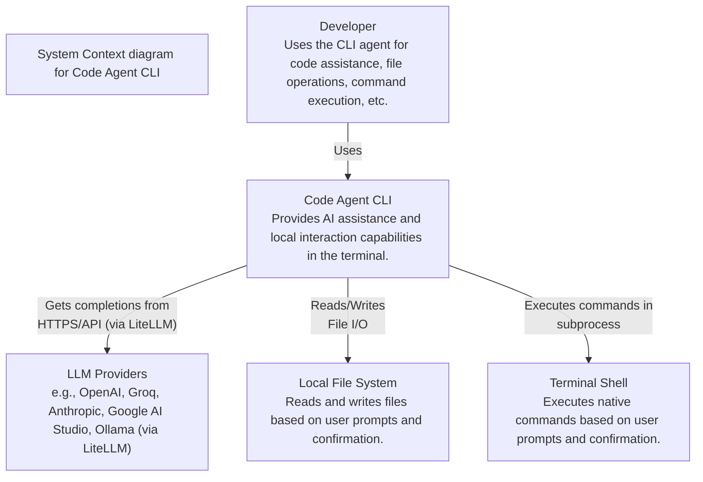
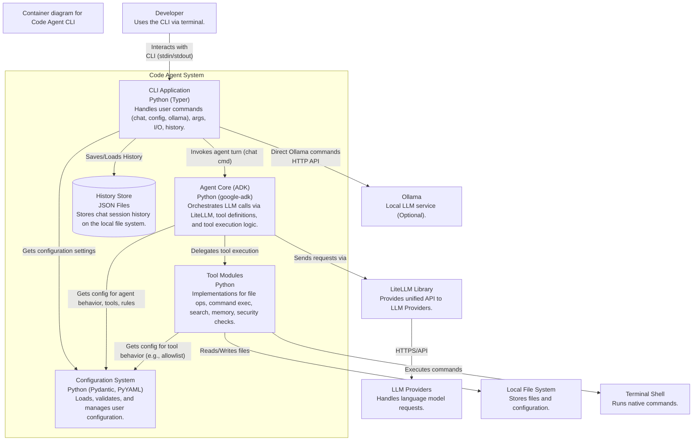

# Code Agent Architecture

This document provides a deep analysis of the Code Agent software architecture.

## Overview

The Code Agent is a framework designed for developing and running specialized AI agents. It leverages the Google Agent Development Kit (ADK) for its core execution capabilities while providing a command-line interface (CLI), custom services for persistence, and a modular structure for defining agents and their tools. It uses LiteLLM to interact with various LLM providers.

## High-Level Views (C4 Model)

These diagrams provide a higher-level perspective based on the C4 model.

### Level 1: System Context

This diagram shows the Code Agent system in relation to its users and the external systems it interacts with.



### Level 2: Container Diagram

This diagram decomposes the Code Agent system into its key deployable/runnable components (containers in the C4 sense).


*(Note: The "History Store" container maps to the custom `FileSystemSessionService` and `JsonFileMemoryService` discussed below).*

## Detailed Architecture Diagram (Component/Module Level)

This diagram shows the primary internal components and their relationships.

```mermaid
graph TD
    subgraph User Interface
        CLI[CLI (Typer)<br>code_agent/cli]
    end

    subgraph Core Framework
        ADK_Client[ADK Client<br>(in run.py)]
        Config[Config Service<br>code_agent/config]
        ADK_Services[ADK Services Integration<br>code_agent/adk]
        FS_Session[FileSystemSessionService<br>code_agent/services] --> ADK_Services
        JSON_Memory[JsonFileMemoryService<br>code_agent/adk] --> ADK_Services
        SharedTools[Shared Tools<br>code_agent/tools] --> ADK_Services
    end

    subgraph Agents
        direction LR
        AgentLoader[Agent Loader<br>(in run.py)] -- Loads --> AgentX[Agent X (root_agent)<br>code_agent/agent/agent_x/agent_x/agent.py]
        AgentX -- Uses --> AgentX_Tools[Agent X Tools<br>code_agent/agent/agent_x/agent_x/tools]
        AgentX -- Uses --> AgentX_SubAgents[Agent X SubAgents<br>code_agent/agent/agent_x/agent_x/sub_agents]
        AgentX -- Uses --> AgentX_Prompts[Agent X Prompts<br>code_agent/agent/agent_x/agent_x/prompt.py]
        AgentX -- Uses --> ADK_Services
    end

    CLI -- Invokes --> AgentLoader
    CLI -- Reads/Updates --> Config
    AgentLoader -- Configures --> ADK_Client
    AgentLoader -- Uses --> Config
    ADK_Client -- Interacts with --> AgentX
    ADK_Client -- Uses --> ADK_Services
    ADK_Services -- Reads --> Config


    style AgentX fill:#f9d,stroke:#333,stroke-width:2px
    style CLI fill:#ccf,stroke:#333,stroke-width:2px
    style CoreFramework fill:#eee,stroke:#666,stroke-width:1px
```

*Diagram Key:*
*   **Blue (CLI):** User interaction layer and command dispatch.
*   **Grey (Core Framework):** Foundational components, ADK integration, shared services, and tool abstractions.
*   **Pink (Agents):** Dynamically loaded agent modules containing specific logic and resources.

## Sequence Diagram (Run Command)

This diagram details the typical sequence of operations when using the `code-agent run` command.

```mermaid
sequenceDiagram
    participant User
    participant CLI (main.py)
    participant RunCmd (run.py)
    participant Config
    participant AgentLoader (run.py)
    participant ADK_Client
    participant Agent (root_agent)
    participant FSSessionSvc (services/session_service.py)
    participant JSONMemorySvc (adk/json_memory_service.py)
    participant Tools (adk/tools.py + tools/*)

    User->>CLI: code-agent run [args] "instruction"
    CLI->>RunCmd: Invoke run_command()
    RunCmd->>Config: initialize_config(cli_overrides)
    RunCmd->>Config: get_config()
    RunCmd->>RunCmd: setup_logging(cfg.verbosity)
    RunCmd->>RunCmd: Check ADK installed
    RunCmd->>RunCmd: _resolve_agent_path_str(path_arg, cfg)
    RunCmd->>AgentLoader: Dynamically load agent module
    AgentLoader->>Agent: Instantiate root_agent
    RunCmd->>FSSessionSvc: __init__(cfg.sessions_dir)
    RunCmd->>JSONMemorySvc: __init__(cfg.memory_dir) # Assumes memory dir config
    RunCmd->>ADK_Client: __init__(session_svc, memory_svc, artifact_svc, tools) # Simplified
    RunCmd->>+ADK_Client: run_turn("instruction")
    ADK_Client->>+Agent: process_turn("instruction")
    Note right of Agent: Agent processes instruction,<br>decides on action (reply/tool)
    alt Agent needs Tool
        Agent->>-ADK_Client: Request Tool Call (e.g., read_file)
        ADK_Client->>Tools: Execute Tool (read_file)
        Tools->>Tools: Perform file I/O, run command, etc.
        Tools-->>ADK_Client: Tool Result
        ADK_Client->>+Agent: Provide Tool Result
        Agent->>-ADK_Client: Agent Response (Text)
    else Agent replies directly
        Agent->>-ADK_Client: Agent Response (Text)
    end
    ADK_Client-->>-RunCmd: Agent Response
    RunCmd->>User: Display Response
    loop Interactive Mode
        User->>RunCmd: Follow-up instruction
        RunCmd->>+ADK_Client: run_turn("follow-up")
        ADK_Client->>+Agent: process_turn("follow-up")
        Note right of Agent: Agent processes, potentially uses tools...
        Agent->>-ADK_Client: Agent Response
        ADK_Client-->>-RunCmd: Agent Response
        RunCmd->>User: Display Response
    end
    note over RunCmd, JSONMemorySvc: After loop finishes...
    RunCmd->>ADK_Client: Get final session/memory state (implicit or explicit call)
    RunCmd->>FSSessionSvc: Save session state to file (e.g., write session JSON)
    RunCmd->>JSONMemorySvc: Save memory state to file (e.g., write memory JSON)

```


## Key Components & Code References

1.  **Core Framework (ADK + Customizations)**:
    *   **Description**: Relies on `google.adk` for the fundamental agent execution lifecycle, service abstractions (Session, Memory, Artifact), and tool integration. Extends ADK with custom services for file-based persistence.
    *   **ADK Integration/Customization Code**: `code_agent/adk` package
        *   *JSON Memory Service*: `code_agent/adk/json_memory_service.py` - Persists agent memory state to JSON files.
        *   *Tool Integration*: `code_agent/adk/tools.py` - Defines ADK-compatible tool wrappers. These often delegate to implementations in the `code_agent/tools` directory (e.g., `adk/tools.py:read_file` might call logic in `tools/file_tools.py`). Manages how shared and agent-specific tools are exposed to the ADK execution environment.
    *   **File Session Service Code**: `code_agent/services/session_service.py` (`FileSystemSessionService`) - Persists session metadata and history references to JSON files, augmenting ADK's in-memory handling.

2.  **CLI (`code_agent.cli`)**:
    *   **Description**: Built with `Typer`, providing the main user interface. It parses commands, manages configuration loading, dynamically loads the specified agent, initializes ADK services, and manages the interaction loop. Contains subcommands for interacting with configuration, providers, and potentially local services like Ollama.
    *   **Entry Point Code**: `code_agent/cli/main.py` - Defines the Typer app, registers commands/sub-apps, handles global options (`--version`), and initial config loading.
    *   **Command Implementations**: `code_agent/cli/commands/` directory
        *   *Run Command*: `run.py` (`run_command`) - Implements the core `run` logic: agent loading, ADK service setup (using custom implementations), ADK `Client` creation, invoking the interaction loop (`run_cli`).
        *   *Config Commands*: `config.py` - Handles `config show/reset`.
        *   *Providers Command*: `provider.py` - Handles `providers list`.
        *   *Session Commands*: `session.py` - Handles `history` and `sessions`.
        *   *(Potentially others like `ollama.py` if present)*

3.  **Agents (`code_agent.agent/<agent_name>`)**:
    *   **Description**: Self-contained Python modules or packages representing specific agent capabilities (e.g., `software_engineer`, `travel-concierge`). Dynamically loaded by the `run` command. Each agent defines its core logic, prompts, and potentially specific tools or sub-agents.
    *   **Agent Structure (Example: `software_engineer`)**:
        *   *Package Root*: `code_agent/agent/software_engineer/` - May contain agent-specific README, dependencies (`pyproject.toml`), tests, deployment/eval scripts.
        *   *Core Logic/`root_agent` Definition*: `code_agent/agent/software_engineer/software_engineer/agent.py` - Must define the `root_agent` object that the framework loads and runs.
        *   *Agent-Specific Prompts*: `code_agent/agent/software_engineer/software_engineer/prompt.py`
        *   *Agent-Specific Tools*: `code_agent/agent/software_engineer/software_engineer/tools/`
        *   *Sub-agents*: `code_agent/agent/software_engineer/software_engineer/sub_agents/`
        *   *Shared Libraries (Agent-Level)*: `code_agent/agent/software_engineer/software_engineer/shared_libraries/`

4.  **Shared Tools (`code_agent.tools`)**:
    *   **Description**: A library of common, reusable functionalities provided by the framework for agents to use. Contains the underlying implementations for operations like file I/O, security checks, native command execution, etc. These are typically wrapped by ADK-compatible tool definitions in `code_agent/adk/tools.py`.
    *   **Code**: `code_agent/tools` package (contains modules like `file_tools.py`, `security.py`, `native_tools.py`, `simple_tools.py`, etc.)

5.  **Configuration (`code_agent.config`)**:
    *   **Description**: Provides a centralized, layered configuration system (defaults, file (`config.toml`), environment variables, CLI overrides). Manages settings like LLM provider/model details (via LiteLLM), API keys, logging levels, persistence directory paths, and default agent paths. Uses Pydantic for structure and validation.
    *   **Code**: `code_agent/config` package. Key files include:
        *   `__init__.py`: Exposes `initialize_config()` and `get_config()`.
        *   `config.py`: Core logic for loading from files/env.
        *   `settings.py` (or similar like `settings_based_config.py`): Defines the Pydantic models for configuration structure.
        *   `validation.py`: Contains custom validation logic for config values.
        *   `llm.py`: Likely handles LLM/LiteLLM specific configuration models.

## Control Flow (Run Command)

1.  User executes `code-agent run --agent-path <path> "instruction" [options...]`.
2.  `cli/main.py`: Typer parses the command and arguments. Global callback `main()` performs initial config load (defaults, file, env).
3.  `cli/commands/run.py` (`run_command`):
    a. Re-initializes config using `initialize_config()`, applying CLI overrides (`--provider`, `--model`, etc.).
    b. Sets up logging based on the final effective configuration (`setup_logging`).
    c. Checks if `google-adk` is installed.
    d. Resolves the agent code path (`_resolve_agent_path_str`).
    e. Dynamically imports the agent module/package from the resolved path.
    f. Retrieves the `root_agent` instance from the loaded module.
    g. Instantiates ADK services, specifically using `FileSystemSessionService` and `JsonFileMemoryService`.
    h. Creates the ADK `Client`, configuring it with the services and potentially tools.
    i. Calls `cli/utils.py:run_cli()` with the `Client`, `root_agent`, initial instruction, and interaction options.
4.  `cli/utils.py` (`run_cli`):
    a. Starts the main interaction loop.
    b. Sends the user instruction to the `root_agent` via the `Client`.
    c. Receives agent responses (text, tool calls) from the `Client`.
    d. Handles tool execution if requested by the agent (mechanism involves `ADK_Client` dispatching to `code_agent/adk/tools.py`, which may call underlying implementations in `code_agent/tools/*`).
    e. Displays agent output to the user.
    f. Prompts for further input if in interactive mode.
    g. Repeats until conversation ends.
    h. Saves the final session state using `FileSystemSessionService` and memory state using `JsonFileMemoryService` after the loop finishes (logic likely resides within `run_command` or `run_cli`).

## Dependencies

*   **Core**: `google-adk`, `typer`, `rich`, `python-dotenv`, `pydantic`, `litellm`.
*   **Agents**: May have their own specific dependencies defined in their respective `pyproject.toml` files (e.g., within `code_agent/agent/software_engineer/`).
*   **LLM Providers**: Dependencies are conditional based on the selected provider and are managed by `litellm` or explicitly via extras in the main `pyproject.toml`.

This analysis provides a comprehensive overview of the Code Agent's architecture as of the time of review. 