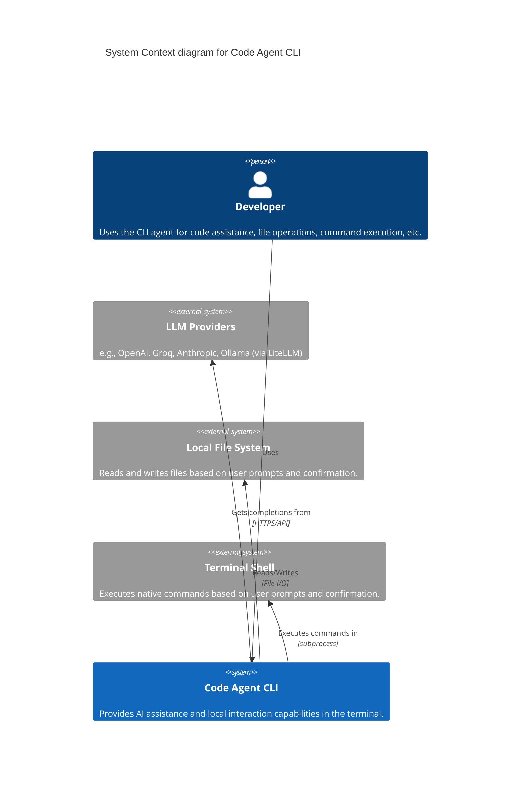
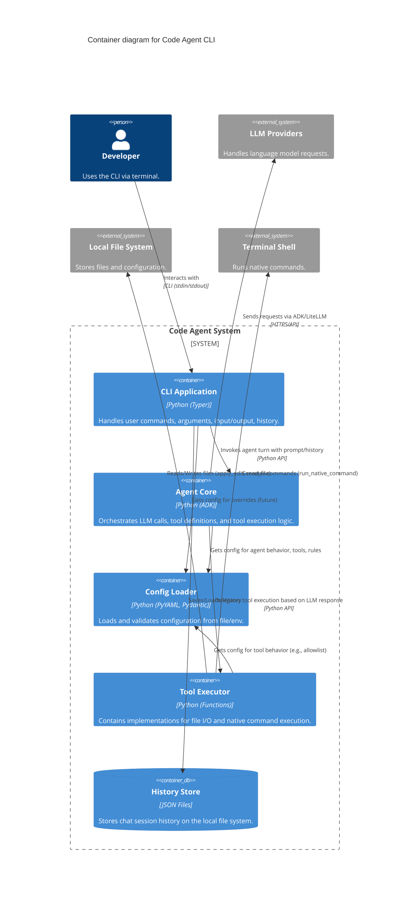

# Code Agent Architecture

This document provides a high-level overview of the Code Agent system architecture using C4 model diagrams rendered with Mermaid.

## Level 1: System Context

This diagram shows the Code Agent system in relation to its users and the external systems it interacts with.



## Level 2: Container Diagram

This diagram decomposes the Code Agent system into its key deployable/runnable components (containers in the C4 sense).



*Note: ADK itself handles some internal communication with LLM providers and potentially tool execution flow, which isn't fully detailed at this container level.*

## Level 3: Component Diagram (Agent Core - Simplified)

This diagram provides a glimpse into the components within the `Agent Core` container.

```mermaid
C4Component
    title Component diagram for Agent Core

    Container(cli_app, "CLI Application")
    System_Ext(llm_providers, "LLM Providers")
    Container(tool_executor, "Tool Executor")
    Container(config_loader, "Config Loader")

    Container_Boundary(agent_boundary, "Agent Core") {
        Component(agent_runner, "Agent Runner", "agent.py", "Initializes ADK agent, passes history/prompt, invokes run.")
        Component(adk_agent, "ADK Agent", "google.adk.agents.Agent", "Manages interaction cycle, LLM calls, tool dispatch.")
        Component(adk_runtime, "ADK Runtime", "google.adk.runtime.phidata_runtime", "Executes the agent run cycle, handling async/sync logic.")

        Rel(agent_runner, adk_runtime, "Uses to run agent")
        Rel(agent_runner, config_loader, "Gets config for initialization")
        Rel(adk_runtime, adk_agent, "Executes")
        Rel(adk_agent, llm_providers, "Sends API requests")
        Rel(adk_agent, tool_executor, "Requests tool execution") # ADK decides when to call tools
    }

    Rel(cli_app, agent_runner, "Invokes run_agent_turn")

``` 