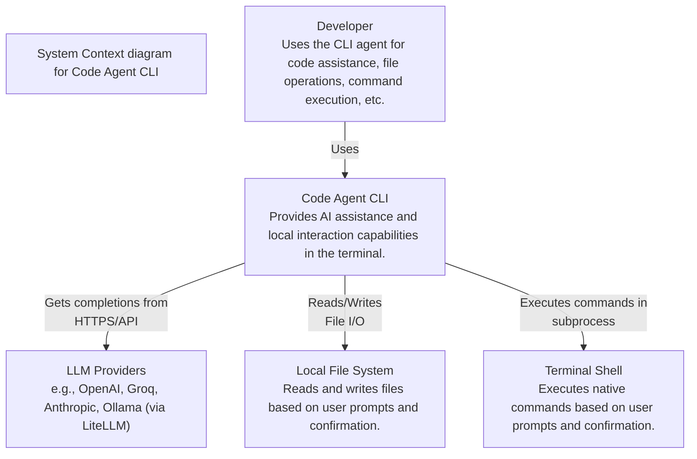
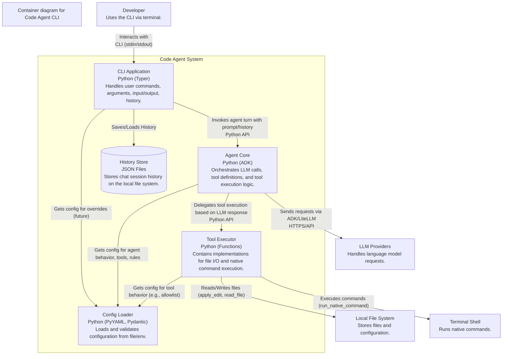
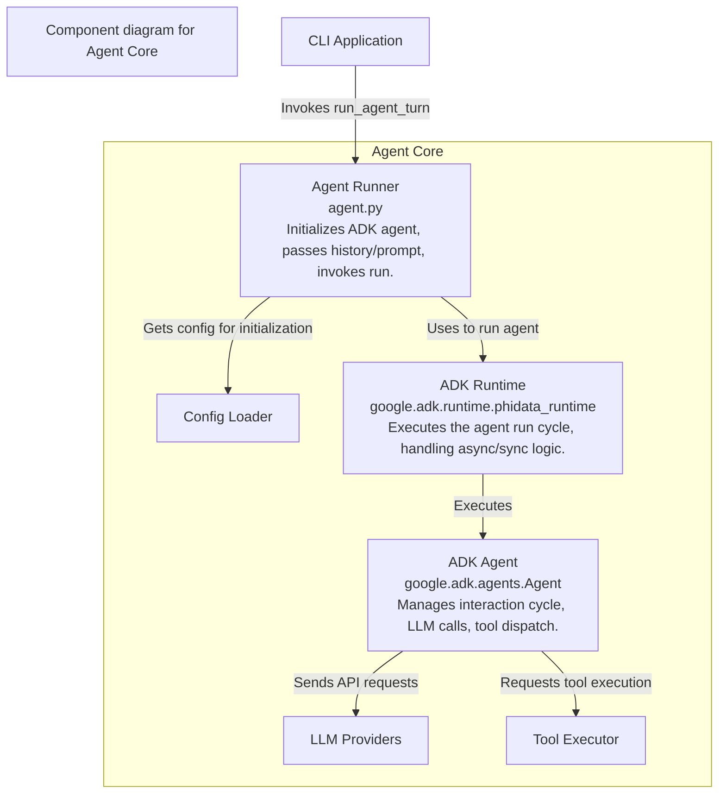

# Code Agent Architecture

This document provides a high-level overview of the Code Agent system architecture using C4 model diagrams rendered with Mermaid.

## Level 1: System Context

This diagram shows the Code Agent system in relation to its users and the external systems it interacts with.

## Level 2: Container Diagram

This diagram decomposes the Code Agent system into its key deployable/runnable components (containers in the C4 sense).

*Note: ADK itself handles some internal communication with LLM providers and potentially tool execution flow, which isn't fully detailed at this container level.*

## Level 3: Component Diagram (Agent Core - Simplified)

This diagram provides a glimpse into the components within the `Agent Core` container.

