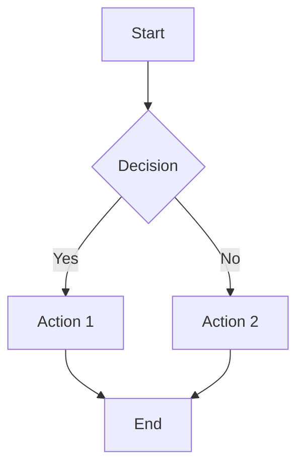

# Mermaid Diagram Validation

## Validation Procedure

After making changes to Mermaid diagrams in the documentation, follow these steps to validate that they render correctly on GitHub:

1. Commit and push your changes to the repository.
2. Wait a few minutes for GitHub to process the changes.
3. Visit the documentation page on GitHub.
4. Check that each diagram renders properly instead of showing "Loading" text.
5. If any diagrams are not rendering:
   - Confirm the diagram uses syntax compatible with GitHub's Mermaid implementation.
   - Simplify complex diagrams that may exceed GitHub's rendering capabilities.
   - Remove special styling, if present.
   - Ensure proper indentation and avoid special characters.
   - **Check for extraneous characters:** Ensure lines don't have unintended trailing characters, especially after semicolons.
   - **Quote complex labels:** Enclose node labels in double quotes (`""`) if they contain HTML (like `<br>`), markdown, punctuation (like `()`, `,`, `/`), or other non-alphanumeric characters (excluding underscores). When in doubt, quote the label. (e.g., `NodeId["Label line 1<br>Label line 2"]`, `AnotherId["My Label (New)"]`).
   - **Use specific types:** Prefer explicitly listed types (like `flowchart TD`) over more general ones (`graph TD`) if encountering issues.

## Mermaid Version Check

You can check GitHub's current Mermaid version with this code:

```mermaid
info
```

## Common Diagram Types Supported

The following diagram types are well-supported by GitHub's Mermaid implementation:

1. **Flowchart** (using `flowchart TD` or `flowchart LR`)
2. **Sequence Diagram** (using `sequenceDiagram`)
3. **Class Diagram** (using `classDiagram`)
4. **State Diagram** (using `stateDiagram-v2`)
5. **Entity Relationship Diagram** (using `erDiagram`)
6. **User Journey** (using `journey`)
7. **Gantt** (using `gantt`)
8. **Pie Chart** (using `pie`)
9. **Requirement Diagram** (using `requirementDiagram`)

## Testing Diagram

Here's a simple test diagram that should always render correctly:


