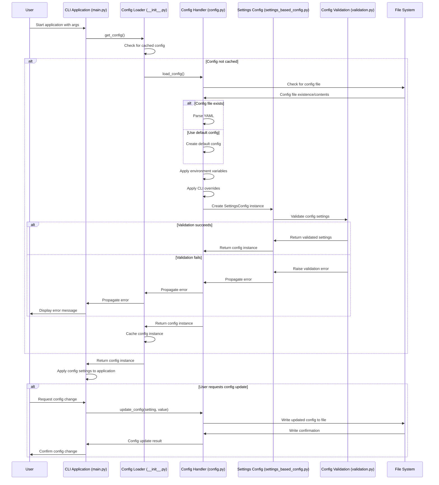

# Configuration System

The code-agent CLI provides a comprehensive configuration system with multiple ways to set up and customize your environment. Configuration follows a priority hierarchy (CLI > Environment Variables > Config File > Defaults).

## Configuration Management

- **Config file location**: `~/.config/code-agent/config.yaml`
- **Command to view config**: `code-agent config show`
- **Reset to defaults**: `code-agent config reset`
- **Validate configuration**: `code-agent config validate [--verbose]`

## Provider Configuration

The CLI supports multiple AI providers:

| Provider | Config Command | API Key Format | Environment Variable | Default Models |
|----------|---------------|----------------|---------------------|----------------|
| Google AI Studio | `config aistudio` | `aip-*` | `AI_STUDIO_API_KEY` | gemini-2.0-flash, gemini-2.0-pro |
| OpenAI | `config openai` | `sk-*` | `OPENAI_API_KEY` | gpt-4o, gpt-4-turbo, gpt-3.5-turbo |
| Groq | `config groq` | `gsk-*` | `GROQ_API_KEY` | llama3-70b-8192, mixtral-8x7b-32768 |
| Anthropic | `config anthropic` | `sk-ant-*` | `ANTHROPIC_API_KEY` | claude-3-5-sonnet, claude-3-opus, claude-3-sonnet, claude-3-haiku |

### Provider-Specific Configuration Commands

Each provider has a dedicated configuration command that provides:

- Current status information (whether it's the default provider and if the API key is configured)
- Setup instructions for obtaining an API key
- Configuration options (environment variables and config file entries)
- Available models and their capabilities
- Usage examples for running commands with the provider
- Documentation links

For example, to view Anthropic configuration details:
```bash
code-agent config anthropic
```

## Provider Management

The `code-agent providers list` command provides a comprehensive overview of all configured providers with:

- Current default provider and model
- Status of each provider (configured or not configured)
- Setup commands for unconfigured providers
- Example usage for configured providers
- Quick usage tips

Example:
```bash
code-agent providers list
```

## Configuration Options

You can configure the system via:

1. **Command-line options**:
   - `--provider`: Specify the LLM provider
   - `--model`: Specify the model to use
   - `--auto-approve-edits`: Auto-approve file edits
   - `--auto-approve-native-commands`: Auto-approve command execution

2. **Environment variables**:
   - Provider API keys (see table above)
   - Other configuration options following pydantic-settings conventions

3. **Config file entries**:
   ```yaml
   default_provider: "provider_name"
   default_model: "model_name"
   api_keys:
     provider_name: "your-api-key"
   ```

## Configuration Validation

The `code-agent config validate` command performs comprehensive validation of your configuration:

- Checks model compatibility with the selected provider
- Validates API key formats
- Assesses security of command allowlist patterns
- Identifies potential security risks in configuration

Use the `--verbose` flag to see detailed validation results even when the configuration is valid.

## Feature Highlights

- **Provider management**: List and configure all available providers with `code-agent providers list`
- **Dynamic validation**: Configuration is validated with clear error messages
- **Security options**: Control auto-approval of potentially dangerous operations
- **Multiple model support**: Each provider offers multiple models with different capabilities

## Sequence Diagram

The following sequence diagram illustrates how the configuration system loads, validates, and provides access to configuration settings:



This diagram illustrates:
1. How the configuration is loaded when the application starts
2. The validation process for configuration settings
3. How CLI arguments, environment variables, and config files interact
4. The fallback to default configuration when a config file doesn't exist
5. How configuration updates are handled and persisted
