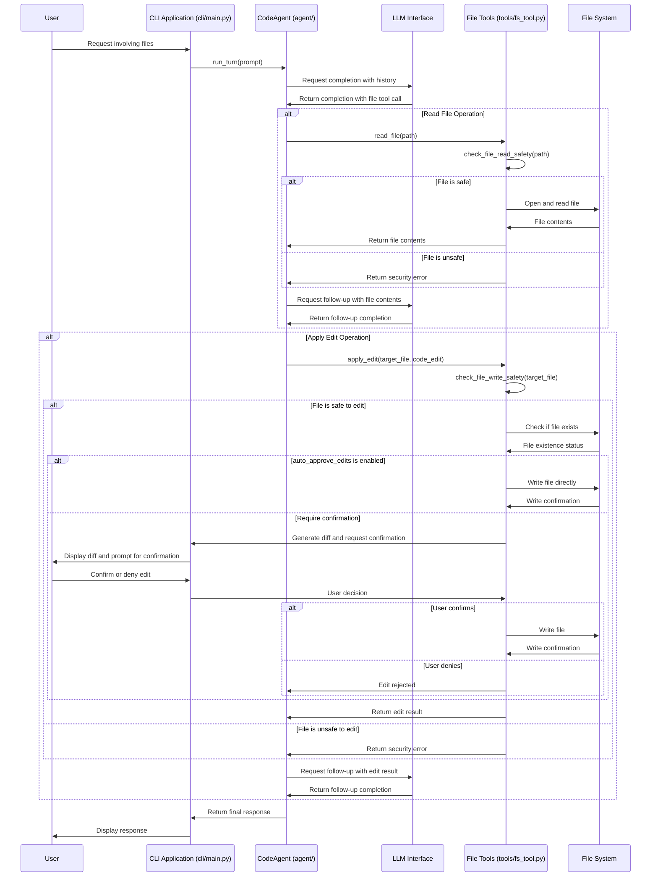

# File Operations Feature

This document details the file operation capabilities in Code Agent, including reading files and applying edits.

## Read File Operations

The `read_file` tool provides the agent with the ability to access file contents from the local file system.

### Basic Usage

The agent can read files using:

```python
read_file(path="path/to/file.txt")
```

### Size Limits and Pagination

To prevent memory issues and improve performance, the `read_file` tool implements size limits and pagination:

#### Default Size Limits

- **Maximum file size**: 1MB by default
- **Maximum lines**: 1000 lines by default
- **Maximum output tokens**: Configurable based on the model's context window

These limits can be configured in `~/.config/code-agent/config.yaml`:

```yaml
file_operations:
  read_file:
    max_file_size_kb: 1024  # 1MB default
    max_lines: 1000         # Default line limit
    max_output_tokens: 4000 # Default token estimation
```

#### Pagination Controls

For files exceeding the default limits, pagination is automatically implemented:

1. **Automatic chunking**: Large files are broken into manageable chunks
2. **Position tracking**: The read position is tracked to allow sequential reading
3. **Line ranges**: Specific line ranges can be requested

Example usage with pagination:

```python
# Read the first chunk of a file
first_chunk = read_file(path="large_file.txt")

# Read the next chunk (handled automatically by the agent)
next_chunk = read_file(path="large_file.txt", offset=continuation_point)

# Read specific line ranges
middle_section = read_file(path="large_file.txt", start_line=500, end_line=600)
```

### Content Summary

When reading large files, the agent may provide:

- A summary of file contents
- Line count and size information
- Content type detection
- Syntax highlighting based on file extension

## Apply Edit Operations

The `apply_edit` tool allows the agent to propose changes to files, which are then reviewed by the user before application.

### Basic Usage

The agent proposes edits using:

```python
apply_edit(
    target_file="path/to/file.txt",
    code_edit="New content to write to the file"
)
```

### Edit Review Process

The edit review process includes:

1. **Diff Generation**: The tool generates a diff between the current and proposed content
2. **Diff Display**: The diff is displayed with syntax highlighting
3. **User Confirmation**: The user is prompted to approve/reject the edit
4. **Application**: If approved, the edit is applied to the file

### Auto-Approval Option

Auto-approval for edits can be enabled in the configuration, but should be used with caution:

```yaml
auto_approve_edits: false  # Default setting, recommended for safety
```

### File Creation

The `apply_edit` tool can also create new files if they don't exist:

```python
apply_edit(
    target_file="path/to/new_file.txt",
    code_edit="Content for the new file"
)
```

### Best Practices

1. Review all diffs carefully before approving
2. Be cautious with auto-approval settings
3. Verify file paths to prevent unintended modifications
4. Use version control for important files
5. Consider backing up critical files before operations

## File Path Security

All file operations include path validation to prevent security issues:

- Path traversal prevention
- Workspace restrictions (if configured)
- Absolute path validation
- Symlink resolution and validation

See [Security Features](feature_security.md) for more detailed information on file operation security.

## Future Enhancements

Planned improvements to file operations include:

- Partial file editing (specific line ranges)
- Binary file support (with appropriate controls)
- Directory operations (create, list, etc.)
- Enhanced file type detection
- Intelligent file splitting for very large files

## Sequence Diagram

The following sequence diagram illustrates the flow of file operations, focusing on reading a file and applying an edit:



This diagram illustrates:
1. How file read operations are processed, including safety checks
2. How file edit operations work, including the confirmation flow
3. The security validation that occurs for all file operations
4. The different paths for auto-approved vs. manually confirmed edits
