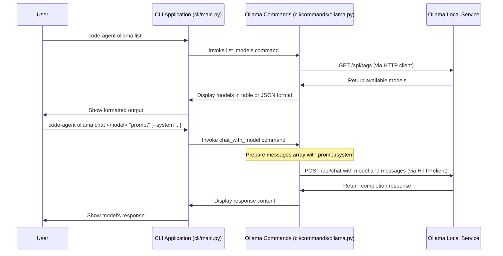

# Ollama Integration

This document explains how to use the integration with [Ollama](https://ollama.ai/) in the Code Agent CLI.

## Overview

Ollama is a tool that allows you to run large language models (LLMs) locally on your own machine. This integration allows you to use Code Agent to:

1. List available Ollama models.
2. Chat with Ollama models directly via a dedicated command.

*(Note: You can also use Ollama models within the main `code-agent chat` command by specifying the provider, e.g., `code-agent chat --provider ollama --model llama3`)*

## Prerequisites

1. Install Ollama from [https://ollama.ai/download](https://ollama.ai/download)
2. Start Ollama service: `ollama serve`
3. Pull models you want to use:
   ```bash
   ollama pull llama3
   ollama pull codellama:13b
   ```

## Commands

### List Available Models

```bash
code-agent ollama list
```

This will display a table of available models with details like parameter size, family, format, and quantization level.

For JSON output:

```bash
code-agent ollama list --json
```

### Chat with a Model

Use this command for direct, stateful chat sessions with a specific Ollama model, separate from the main agent chat history.

```bash
code-agent ollama chat llama3 "Hello, how are you?"
```

Options:
- `--system`: Set a system prompt
  ```bash
  code-agent ollama chat codellama:13b "How do I use async/await in JavaScript?" --system "You are a helpful coding assistant"
  ```
- `--temperature`: Set the temperature (default: 0.7)
  ```bash
  code-agent ollama chat llama3 "Tell me a story" --temperature 0.9
  ```
- `--url`: Specify custom Ollama API URL
  ```bash
  code-agent ollama chat llama3 "Hello" --url http://remote-server:11434
  ```

## Custom Ollama Server URL

By default, the CLI connects to Ollama at `http://localhost:11434`. You can specify a different URL with the `--url` parameter on the `ollama list` or `ollama chat` commands.

## Test Mode

The `ollama list` and `ollama chat` commands support a test mode which allows you to run the commands without making actual API calls to Ollama. This is useful for testing or demonstrating the CLI when Ollama isn't running or available.

To use test mode, add the `--test` flag:

```bash
# List models in test mode
code-agent ollama list --test

# Chat with a model in test mode
code-agent ollama chat llama3 "Hello, how are you?" --test
```

Test mode will display sample data or simulate interaction.

## Advantages of Local Models

- Privacy: All data stays on your machine
- No API key required
- No usage costs
- Works offline
- Customizable with fine-tuning options

## Troubleshooting

Common issues:

1. **Cannot connect to Ollama**: Make sure Ollama is running locally with `ollama serve`
2. **Model not found**: Check that you've pulled the model first with `ollama pull <model_name>`
3. **Slow responses**: Larger models require more computational resources, try using a smaller model

## Sequence Diagram

The following sequence diagram illustrates the flow of information when using the dedicated Ollama commands:



This diagram illustrates:
1. How the dedicated `ollama` CLI commands interact directly with the Ollama service.
2. The API endpoints used for listing models and chat completions.
3. How system prompts are handled in the chat flow.
