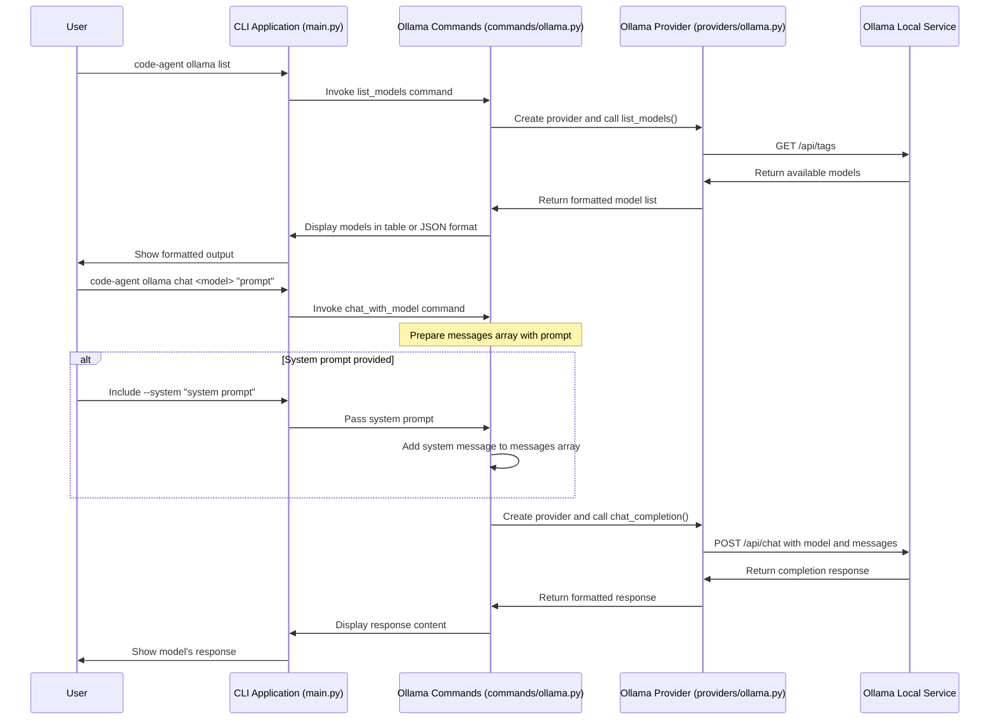

# Ollama Integration

This document explains how to use the integration with [Ollama](https://ollama.ai/) in the CLI Agent.

## Overview

Ollama is a tool that allows you to run large language models (LLMs) locally on your own machine. This integration allows you to:

1. List available Ollama models
2. Run prompts against Ollama models
3. Chat with Ollama models

## Prerequisites

1. Install Ollama from [https://ollama.ai/download](https://ollama.ai/download)
2. Start Ollama service: `ollama serve`
3. Pull models you want to use:
   ```bash
   ollama pull llama3
   ollama pull codellama:13b
   ```

## Commands

### List Available Models

```bash
code-agent ollama list
```

This will display a table of available models with details like parameter size, family, format, and quantization level.

For JSON output:

```bash
code-agent ollama list --json
```

### Run a Single Prompt (New!)

```bash
code-agent ollama run llama3 "Write a hello world program in Python"
```

Options:
- `--system`: Set a system prompt
  ```bash
  code-agent ollama run codellama:13b "Write a sorting algorithm" --system "You are a helpful coding assistant"
  ```
- `--temperature`: Set the temperature (default: 0.7)
  ```bash
  code-agent ollama run llama3 "Generate creative ideas" --temperature 0.9
  ```
- `--url`: Specify custom Ollama API URL
  ```bash
  code-agent ollama run llama3 "Hello" --url http://remote-server:11434
  ```

### Chat with a Model

```bash
code-agent ollama chat llama3 "Hello, how are you?"
```

Options:
- `--system`: Set a system prompt
  ```bash
  code-agent ollama chat codellama:13b "How do I use async/await in JavaScript?" --system "You are a helpful coding assistant"
  ```
- `--temperature`: Set the temperature (default: 0.7)
  ```bash
  code-agent ollama chat llama3 "Tell me a story" --temperature 0.9
  ```
- `--url`: Specify custom Ollama API URL
  ```bash
  code-agent ollama chat llama3 "Hello" --url http://remote-server:11434
  ```

## Custom Ollama Server URL

By default, the CLI connects to Ollama at `http://localhost:11434`. You can specify a different URL with the `--url` parameter:

```bash
code-agent ollama list --url http://192.168.1.100:11434
```

## Test Mode

All commands support a test mode which allows you to run the commands without making actual API calls to Ollama. This is particularly useful for:

- Testing or demonstrating the CLI when Ollama isn't available
- CI/CD environments where Ollama might not be installed
- Unit testing without mocking dependencies
- Quickly verifying command syntax

To use test mode, add the `--test` flag to any command:

```bash
# List models in test mode
code-agent ollama list --test

# Run a prompt in test mode
code-agent ollama run llama3 "Write a hello world program" --test

# Chat with a model in test mode
code-agent ollama chat llama3 "Hello, how are you?" --test
```

Test mode will display all the parameters that would be sent to Ollama and return a sample response so you can see what the output format would look like.

### Extending Test Mode

For developers, test mode provides a reliable way to test command functionality without external dependencies. If you're extending the Ollama commands:

1. Add the `test_mode` parameter to your new commands
2. Implement a test mode branch that provides appropriate sample data
3. Include tests that verify both the test mode and normal operation
4. Document the test mode behavior in the command's docstring

## Using in Code

You can also use the Ollama provider directly in your Python code:

```python
from cli_agent.providers.ollama import OllamaProvider

# Initialize the provider (optionally with custom URL)
provider = OllamaProvider(base_url="http://localhost:11434")

# List models
models = provider.list_models()
for model in models:
    print(f"Model: {model['name']}")

# Get a chat completion
response = provider.chat_completion(
    model="llama3",
    messages=[
        {"role": "system", "content": "You are a helpful assistant"},
        {"role": "user", "content": "Tell me about Python"}
    ],
    temperature=0.7
)
print(response["message"]["content"])
```

## Advantages of Local Models

- Privacy: All data stays on your machine
- No API key required
- No usage costs
- Works offline
- Customizable with fine-tuning options

## API Usage

For developers integrating with the CLI Agent codebase, you can use the `OllamaProvider` class directly:

```python
from cli_agent.providers.ollama import OllamaProvider

# Initialize provider
provider = OllamaProvider()  # or OllamaProvider(base_url="http://custom-url:11434")

# List models
models = provider.list_models()

# Chat completion
messages = [
    {"role": "system", "content": "You are a helpful assistant"},
    {"role": "user", "content": "Hello, who are you?"}
]
response = provider.chat_completion("llama3.2:latest", messages)
print(response["message"]["content"])

# Regular completion
response = provider.get_completion(
    model="llama3.2:latest",
    prompt="Complete this sentence: The sky is",
    system="You are a helpful assistant",
    temperature=0.5
)
print(response["response"])
```

## Troubleshooting

Common issues:

1. **Cannot connect to Ollama**: Make sure Ollama is running locally with `ollama serve`
2. **Model not found**: Check that you've pulled the model first with `ollama pull <model_name>`
3. **Slow responses**: Larger models require more computational resources, try using a smaller model

## Sequence Diagram

The following sequence diagram illustrates the flow of information when using the Ollama integration:



This diagram illustrates:
1. How the CLI commands flow through to the Ollama provider
2. The API endpoints used to communicate with the local Ollama service
3. How system prompts are handled in the chat flow
4. The data flow for both listing models and chat completions

## Using Ollama with Google ADK Integration

Our application now supports using Ollama with the Google Agent Development Kit (ADK) framework, which provides a more structured approach to building agents with various model providers.

### Using Ollama with ADK from CLI

You can use Ollama with the ADK integration by adding the appropriate flags to the `run` command:

```bash
code-agent run "Your prompt here" --use-adk --use-ollama --model llama3
```

Options:
- `--use-adk`: Enables the Google ADK-based implementation
- `--use-ollama`: Uses Ollama with ADK via LiteLLM wrapper
- `--model`: Specifies which Ollama model to use (default from config)
- `--ollama-url`: Specifies the URL of the Ollama server (default: http://localhost:11434)

### Using Ollama with ADK in Python Code

You can also directly use Ollama with ADK in your Python code:

```python
from google.adk.agents import LlmAgent
from code_agent.adk.models import OllamaLlm
from code_agent.adk.tools import read_file, create_apply_edit_tool, create_run_terminal_cmd_tool

# Create Ollama model for ADK
model = OllamaLlm(
    model_name="llama3:latest",  # Use any model you've pulled in Ollama
    base_url="http://localhost:11434",  # Default Ollama server URL
    temperature=0.7,
)

# Create tools
apply_edit_tool = create_apply_edit_tool()
run_cmd_tool = create_run_terminal_cmd_tool()

# Create agent
agent = LlmAgent(
    model=model,
    name="ollama_agent",
    instruction="You are a helpful assistant running locally on Ollama.",
    tools=[read_file, apply_edit_tool, run_cmd_tool],
)

# Run the agent
async def run_agent():
    result = await agent.invoke("What is 2+2?")
    print(result.response.value)

# Call the async function
import asyncio
asyncio.run(run_agent())
```

### Advantages of Using ADK with Ollama

1. **Structured Agent Framework**: ADK provides a more structured approach to building agents with well-defined components.
2. **Tool Integration**: ADK has a robust tool system that makes it easy to define, manage, and execute tools.
3. **Future Compatibility**: As ADK evolves, your agent code will be more maintainable and compatible with future features.
4. **Multi-Agent Systems**: ADK supports advanced features like workflow agents and multi-agent systems.

### Limitations

- API compatibility between Ollama, LiteLLM, and ADK may change over time
- Local models may have different capabilities than cloud-based models
- Tool calling support varies by model

## Test Script

A simple test script is included in the repository to demonstrate how to use Ollama with ADK directly. You can run it with:

```bash
python test_ollama_adk.py
```

This script will connect to your local Ollama instance, create an ADK agent with the Ollama model, and process a simple prompt.
