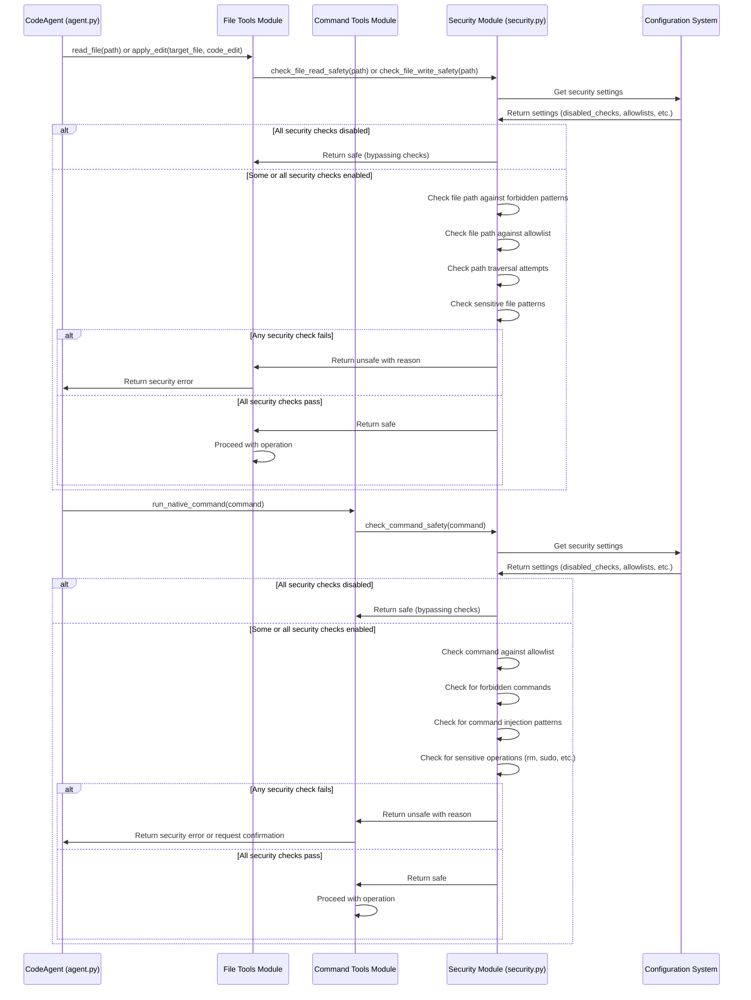

# Security Feature

This document details the security features implemented in the Code Agent to ensure safe interaction with the local environment.

## Overview

The Code Agent has access to powerful capabilities that interact with your local system, including reading files, modifying files, and executing commands. These capabilities require careful security controls to prevent unintended or malicious actions.

## Path Validation and Traversal Prevention

### Implementation

Path validation prevents path traversal attacks and restricts file operations to appropriate directories:

- All file paths are normalized and validated before operations
- Absolute paths are evaluated against allowlisted directories
- Parent directory traversal (`../`) is controlled to prevent escaping from safe directories
- Symbolic links are resolved and validated against security policies

### Configuration

Path security is controlled via the `security` section in the configuration:

```yaml
security:
  # Enable path validation to prevent path traversal attacks (true/false)
  path_validation: true

  # Restrict file operations to the current workspace directory (true/false)
  workspace_restriction: true
```

## File Operations Security

### Read File Security

The `read_file` tool implements:

- Path validation before reading files
- Size limits to prevent loading extremely large files
- Pagination for controlled reading of larger files
- Content validation to detect binary or potentially dangerous files

### Apply Edit Security

The `apply_edit` tool implements:

- Confirmation prompts showing diffs before applying changes (unless auto-approved)
- Path validation for target files
- Content validation to prevent injection issues
- Backup creation before modifications (where appropriate)

## Command Execution Security

### Command Validation

The `run_native_command` tool implements several layers of security:

- Command allowlisting via pattern matching (if configured)
- Mandatory user confirmation before execution (unless auto-approved)
- Input sanitization via `shlex.split` to prevent shell injection
- Output capturing to prevent terminal control characters
- Restricted environment variables for subprocess execution

### Command Allowlist

Commands can be pre-approved using the allowlist in configuration:

```yaml
native_command_allowlist:
  - "ls -la"
  - "tree"
  - "find"
  - "cat"
  # ... more safe commands
```

### Auto-Approval Warning

The auto-approval setting for commands carries significant risk and displays warnings when enabled:

```yaml
auto_approve_native_commands: false  # Default setting - recommended for safety
```

## Configuration Security

- Configuration file permissions are checked for appropriate restrictiveness
- Sensitive data like API keys are masked in logs and output
- Environment variables are preferred for API key storage
- Config validation checks for security risks in settings

## Future Security Enhancements

Planned security improvements include:

- Enhanced command sandboxing
- Resource usage limits for executed commands
- More granular permission system
- Stricter path validation patterns
- Enhanced logging of security-relevant actions

## Security Best Practices

When using Code Agent, follow these best practices:

1. Never enable auto-approval for commands in shared or production environments
2. Keep your command allowlist as restrictive as possible
3. Review all diffs carefully before approving file changes
4. Use environment variables for API keys rather than configuration files
5. Run the agent with the least privileged user account possible
6. Monitor output for any unexpected actions
7. Keep the agent updated to receive security patches

## Sequence Diagram

The following sequence diagram illustrates how security checks are performed for file operations and command execution:



This diagram illustrates:
1. How security checks are performed for both file operations and command execution
2. The different types of security checks applied to each operation type
3. How configuration settings influence security behavior
4. The flow when security checks pass vs. when they fail
5. How the security module interacts with the tool modules
