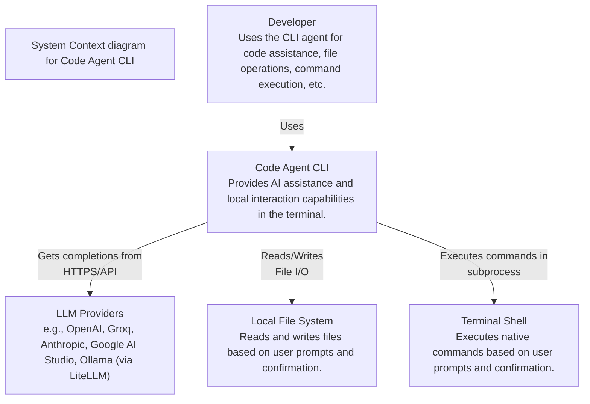
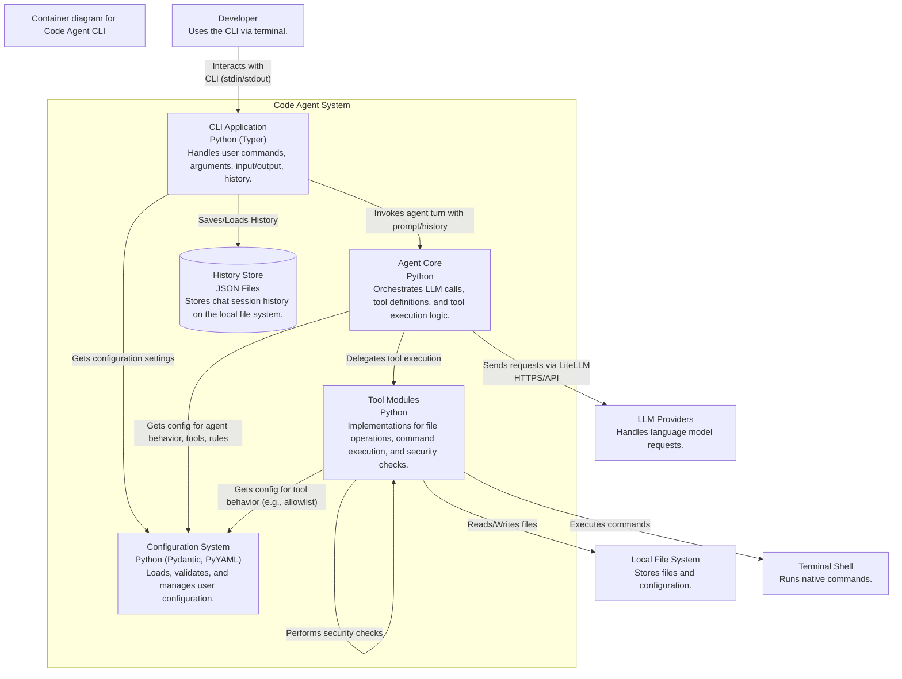
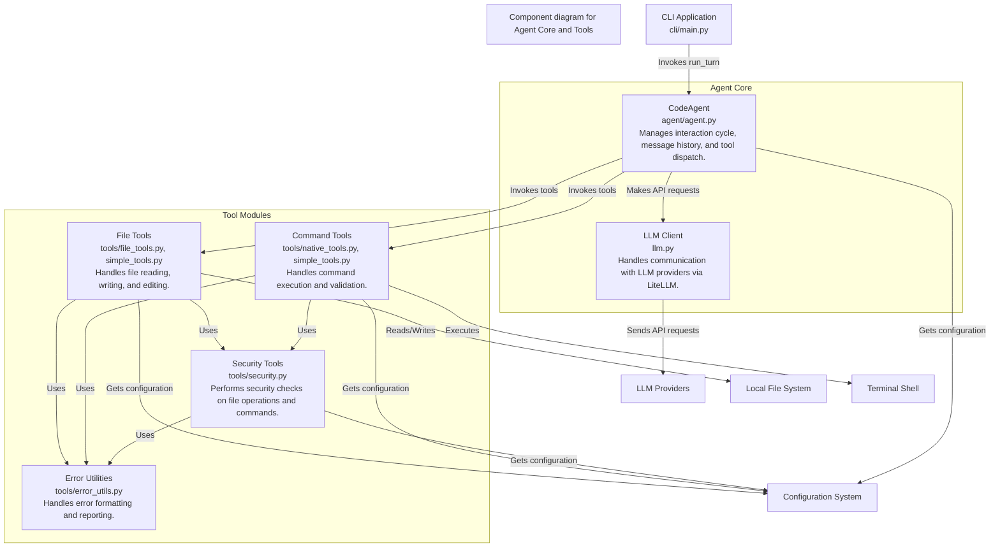
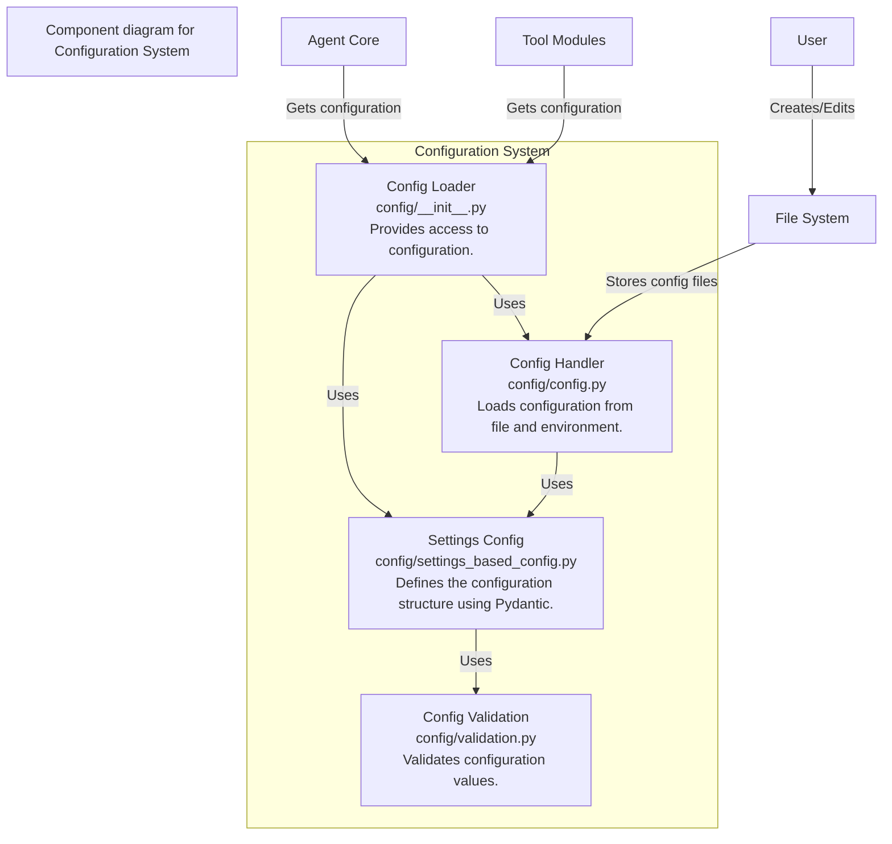

# Code Agent Architecture

This document provides a high-level overview of the Code Agent system architecture using C4 model diagrams rendered with Mermaid.

## Level 1: System Context

This diagram shows the Code Agent system in relation to its users and the external systems it interacts with.

## Level 2: Container Diagram

This diagram decomposes the Code Agent system into its key deployable/runnable components (containers in the C4 sense).

## Level 3: Component Diagram (Agent Core and Tools)

This diagram provides a more detailed view of the components within the Agent Core and Tools modules.

## Level 4: Configuration System Components

This diagram shows the components of the Configuration System and how they interact.

