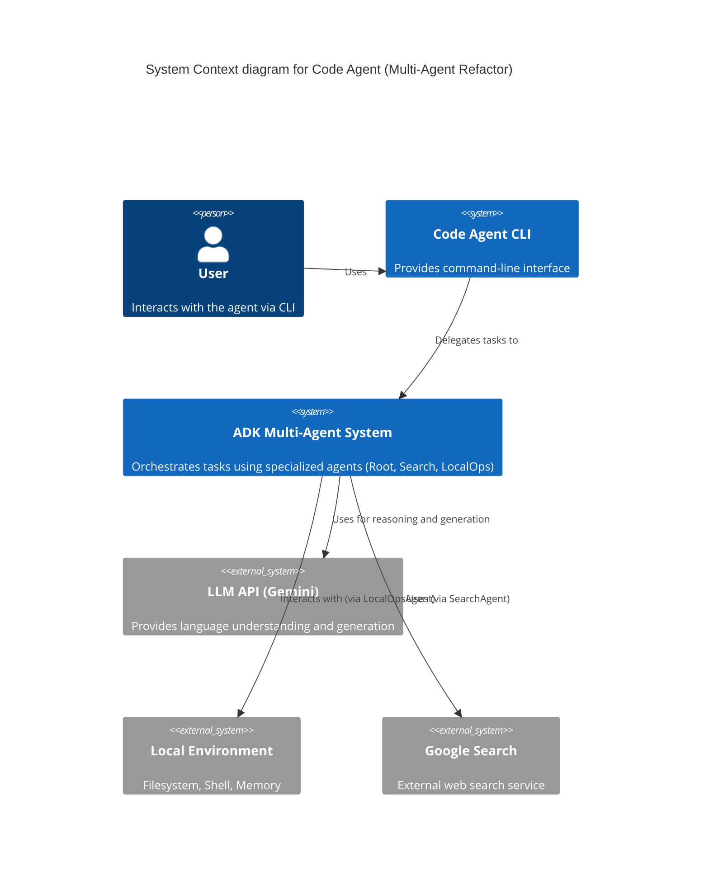
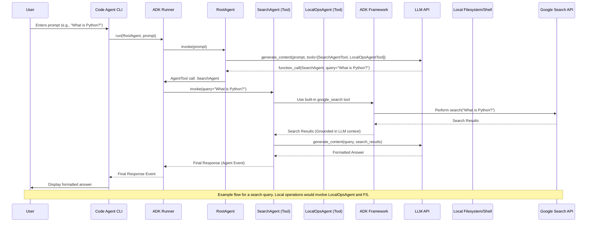

# Multi-Agent Refactor Plan

This document outlines the plan to refactor the `code-agent` application to use a multi-agent architecture based on the Google Agent Development Kit (ADK). The primary goal is to enable the use of the built-in `google_search` tool alongside other custom tools, overcoming the limitation of one built-in tool per agent instance.

## Core Idea

We will create a root orchestrator agent. This agent won't perform tasks directly but will delegate them to specialized sub-agents using the `AgentTool` mechanism. One sub-agent will specialize in web search using the built-in `google_search` tool, and another will specialize in local operations (files, commands, memory) using our existing custom function tools.

## Implementation Plan

1.  **Define Specialized Agents:**
    *   **`SearchAgent`**: An `LlmAgent` whose *only* tool is the built-in `google_search` imported from `google.adk.tools`. It will have instructions focused solely on performing web searches.
    *   **`LocalOpsAgent`**: An `LlmAgent` whose tools are the ADK `FunctionTool` wrappers for our existing custom functions (`read_file`, `apply_edit`, `run_native_command`, `load_memory`). We'll ensure all these wrappers exist in `code_agent/adk/tools.py`. Its instructions will focus on file/command/memory operations.
2.  **Define Root Orchestrator Agent:**
    *   **`RootAgent`**: An `LlmAgent` that acts as the main interface.
    *   Its tools will **not** be the actual search/file/command functions. Instead, its tools will be `AgentTool` instances (from `google.adk.tools.agent_tool`) pointing to the `SearchAgent` and `LocalOpsAgent`.
    *   Its instructions will guide it to delegate tasks: "If the user asks for web information, use the `SearchAgent` tool. If the user asks for file operations, command execution, or memory recall, use the `LocalOpsAgent` tool."
3.  **Refactor Tool Wrappers (`code_agent/adk/tools.py`):**
    *   Verify or create ADK `FunctionTool` wrappers and factory functions (like `create_read_file_tool()`) for `read_file`, `apply_edit`, `run_native_command`, and crucially, add one for `load_memory` if it doesn't exist.
4.  **Refactor Application Entry Point & Loop:**
    *   Modify the main script (e.g., `code_agent/cli/main.py`) where the agent interaction loop resides.
    *   Instead of instantiating and using the old `CodeAgent` class, instantiate the new `RootAgent`.
    *   Use the standard ADK `Runner` (`from google.adk.runners import Runner`) and `SessionService` (`from google.adk.sessions import InMemorySessionService`) to manage the conversation.
    *   The chat loop will involve getting user input, calling `runner.run` or `runner.run_async` with the `RootAgent`, and processing the stream of events to display the final output.
5.  **Deprecate Old `CodeAgent` Class:** The existing `CodeAgent` class in `code_agent/agent/agent.py` will become largely obsolete as its responsibilities (managing turns, mapping tools, calling APIs directly) will be handled by the ADK `LlmAgent` and `Runner`. We can remove or significantly refactor it later.

## Diagrams

### C4 Context Diagram

### Sequence Diagram

## Rationale

*   Respects the ADK limitation of one built-in tool per agent.
*   Uses the documented `AgentTool` primitive for explicit delegation.
*   Leverages the ADK framework for execution and state management.
*   Provides better modularity and specialization. 