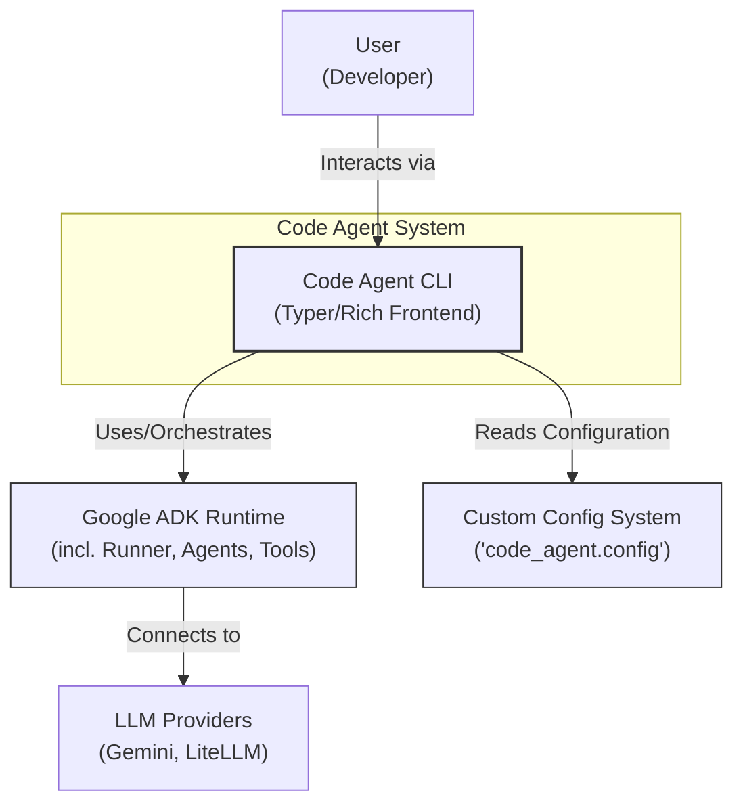
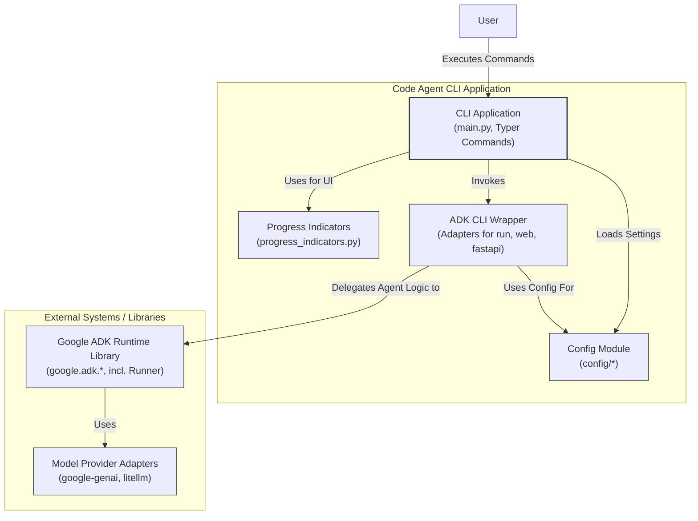

# Code Agent CLI Rewrite: ADK Interface Integration Plan

## 1. Introduction & Goals

This document outlines the plan to rewrite the Code Agent Command Line Interface (CLI). The primary goal is to leverage the robust foundation of the Google Agent Development Kit (ADK) CLI components (`run`, `web`, `fastapi`) while enhancing the user experience with a Typer/Rich interface and retaining valuable custom features of the existing Code Agent.

**This is a rewrite, not a direct migration.** We aim to build a new, improved CLI that combines the strengths of ADK's agent execution capabilities with the developer experience enhancements previously implemented in Code Agent.

**Goals:**

*   Replace the current CLI implementation with one based on ADK.
*   Provide `run`, `web`, and `fastapi` subcommands mirroring ADK functionality.
*   Enhance the `run` command's interface using Typer and Rich for better UX.
*   Retain and adapt the existing `progress_indicators.py` module.
*   Continue supporting multiple LLM providers (Google AI Studio, LiteLLM for proprietary/local models).
*   Retain the existing custom configuration management system (`code_agent/config`).
*   Establish a new, comprehensive test suite.
*   Maintain the current project tooling (`uv`, `pytest`, etc.).

## 1.5 Current Implementation Status

Here's the current progress on the ADK CLI integration:

### ✅ Milestone 1: Core Setup & Basic ADK `run` Integration
- Created new CLI structure with Typer app
- Implemented basic ADK agent loading and execution
- Integrated with configuration system

### ✅ Milestone 2: Enhanced `run` Command with Rich & Progressive CLI Feedback
- Added rich progress indicators
- Implemented interactive mode
- Added validation and error handling for agent paths
- Created comprehensive unit tests

### ✅ Milestone 3: ADK Web & API Interfaces
- Implemented `web` command with ADK integration
- Implemented `fastapi` command with ADK integration
- Added command-line options for host, port, and log level
- Created unit tests for both commands

### 🔄 Next Up: Milestone 4: Enhanced Configuration & Fine-Tuning
- Implement enhanced configuration options for all commands
- Add model options direct via CLI
- Support all cloud provider integrations
- Add verbose logging and debug options

## 2. Key Requirements

1.  **ADK CLI Foundation:** Base the new CLI structure on `google.adk.cli`, specifically incorporating the logic/behavior of its `run`, `web` (`browser`), and `fastapi` commands.
2.  **Interface Enhancement (`run`):** Implement the `code-agent run` command using Typer and Rich, providing a more interactive and visually appealing experience than the base ADK Click interface. Integrate `progress_indicators.py` into this command.
3.  **Direct Integration (`web`, `fastapi`):** Implement the `code-agent web` and `code-agent fastapi` commands by directly utilizing the corresponding ADK implementations (`adk.cli.browser`, `adk.cli.fast_api`) with minimal changes initially.
4.  **Remove `chat` Interface:** The existing `chat` command will be removed, with its core functionality subsumed by the enhanced `run` command.
5.  **Multi-Model Support:** Ensure seamless integration with different model providers as supported by ADK and LiteLLM, configured via the custom configuration system. ([ADK Model Docs](https://google.github.io/adk-docs/agents/models/)).
6.  **Custom Configuration:** Retain and integrate the existing configuration system located in `code_agent/config` for managing settings, API keys, and model choices.
7.  **Progress Indicators:** Keep the `code_agent/tools/progress_indicators.py` module and adapt its usage for the new `run` command's workflow.
8.  **Testing:** Discard the existing test suite and create a new one from scratch, following the established pattern (fixtures, unit, integration tests). Aim for high test coverage (>=80%).
9.  **Tooling:** Continue using the existing development and testing tools (`uv`, `pytest`, pre-commit hooks, etc.). No changes to the development workflow are expected.
10. **Rewrite, Not Migration:** Emphasize that this involves writing new CLI code that *calls* or *adapts* ADK components, rather than trying to merge the existing CLI code with ADK.

## 3. High-Level Architecture (Target State)

The new Code Agent CLI will act as a user-friendly frontend that orchestrates ADK functionality.

*   **User Interaction:** The user interacts with the CLI via Typer/Rich commands (`run`, `web`, `fastapi`).
*   **CLI Application (`code_agent.cli`):** Parses commands, arguments, and options.
    *   For `run`: Manages the enhanced UI (Rich), displays progress (`progress_indicators`), loads configuration (`code_agent.config`), prepares ADK agent execution parameters, and invokes the ADK `run` logic.
    *   For `web`/`fastapi`: Loads configuration (`code_agent.config`) and directly calls the corresponding ADK CLI functions/modules.
*   **ADK Core (`google.adk`):** Handles the underlying agent definition, execution, tool interaction, session management, and communication with LLM providers.
*   **Custom Modules:**
    *   `code_agent.config`: Provides configuration settings to the CLI Application.
    *   `code_agent.tools.progress_indicators`: Used by the `run` command for visual feedback.
*   **Model Providers:** ADK Core interacts with configured LLM providers (Gemini via `google-genai`, others via `litellm`).

## 4. C4 Diagrams (Target State)

*(Using Mermaid syntax compatible with GitHub)*

### System Context Diagram



### Container Diagram



## 5. Milestones & Milestone Diagrams

### Milestone 1: Core Setup & Basic ADK `run` Integration

*   **Goal:** Establish the new CLI project structure, install ADK, create a basic Typer app, and verify that a simple ADK agent can be executed via a placeholder `run` command (without Rich enhancements or custom progress indicators yet). (Reference: [ADK Runtime Docs](https://google.github.io/adk-docs/runtime/))
*   **Tasks:**
    *   Set up `code_agent/cli` directory structure.
    *   Add `google-ads-app-conversion` (ADK) and `typer` as dependencies.
    *   Create `main.py` with a basic Typer application.
    *   Implement a minimal `run` command that takes basic arguments (e.g., agent path, instruction) and uses `google.adk.cli.cli.run` or equivalent ADK functions to execute a simple agent.
    *   Ensure basic execution works without errors.
    *   Integrate `code_agent.config` loading for essential ADK setup (if needed at this stage, e.g., API keys).
*   **Verification:** Successfully run a predefined simple ADK agent using the new `code-agent run` command.
*   **Milestone 1 Diagram:**
    ```mermaid
    flowchart TD
        subgraph "Code Agent CLI (Milestone 1)"
            CLI_M1["Basic Typer App\n(main.py)"]
            RunCmd_M1["Minimal 'run' Cmd"]
            Config_M1["Config Module\n(Basic Loading)"]
        end

        subgraph "ADK"
            ADK_Run_Logic["ADK 'run' Logic\n(adk.cli.cli / core)"]
        end

        CLI_M1 -- "Contains" --> RunCmd_M1
        RunCmd_M1 -- "Loads Settings" --> Config_M1
        RunCmd_M1 -- "Invokes" --> ADK_Run_Logic

        style CLI_M1 fill:#lightblue,stroke:#333,stroke-width:2px
        style RunCmd_M1 fill:#lightblue,stroke:#333,stroke-width:1px
        style Config_M1 fill:#lightgrey,stroke:#333,stroke-width:1px
        style ADK_Run_Logic fill:#orange,stroke:#333,stroke-width:1px
    ```

### Milestone 2: Enhanced `run` Command with Rich & Progress

*   **Goal:** Enhance the `run` command with Typer argument/option handling, Rich output formatting, and integration of the custom `progress_indicators.py`. (Reference: [ADK Runtime Docs](https://google.github.io/adk-docs/runtime/))
*   **Tasks:**
    *   Refine Typer arguments/options for the `run` command to match desired UX.
    *   Integrate `rich` for console output formatting (status messages, results).
    *   Adapt `code_agent.tools.progress_indicators` to work within the ADK execution flow triggered by the `run` command. This might involve using ADK callbacks or wrapping parts of the execution.
    *   Replace basic `print` statements with Rich/Progress indicators.
*   **Verification:** `code-agent run` executes agents, displaying styled output and progress indicators similar to the old CLI, using ADK's backend.
*   **Milestone 2 Diagram:**
    ```mermaid
    flowchart TD
        subgraph "Code Agent CLI (Milestone 2)"
            CLI_M2["Typer App"]
            RunCmd_M2["Enhanced 'run' Cmd\n(Typer args, Rich Output)"]
            Progress_M2["Progress Indicators\n(Integrated)"]
            Config_M2["Config Module"]
            ADK_Wrapper_M2["ADK 'run' Wrapper"]
        end

        subgraph "ADK"
            ADK_Run_Logic_M2["ADK 'run' Logic"]
        end

        CLI_M2 -- "Contains" --> RunCmd_M2
        RunCmd_M2 -- "Uses for UI" --> Progress_M2
        RunCmd_M2 -- "Loads Settings" --> Config_M2
        RunCmd_M2 -- "Invokes" --> ADK_Wrapper_M2
        ADK_Wrapper_M2 -- "Uses" --> Progress_M2
        ADK_Wrapper_M2 -- "Delegates to" --> ADK_Run_Logic_M2

        style RunCmd_M2 fill:#lightblue,stroke:#333,stroke-width:2px
        style Progress_M2 fill:#lightgrey,stroke:#333,stroke-width:2px
        style ADK_Wrapper_M2 fill:#lightblue,stroke:#333,stroke-width:1px
    ```

### Milestone 3: `web` and `fastapi` Commands Integration

*   **Goal:** Implement the `web` and `fastapi` commands by directly leveraging the corresponding ADK CLI functionalities. (Reference: [ADK Runtime Docs](https://google.github.io/adk-docs/runtime/))
*   **Tasks:**
    *   Add `web` and `fastapi` commands to the Typer application.
    *   In the command implementations, import and call the necessary functions/entry points from `google.adk.cli.browser` (for `web`) and `google.adk.cli.fast_api` (for `fastapi`).
    *   Ensure configuration (`code_agent.config`) is loaded and passed appropriately if needed by the ADK commands.
*   **Verification:** `code-agent web` launches the ADK web UI, and `code-agent fastapi` starts the ADK FastAPI server.
*   **Milestone 3 Diagram:**
    ```mermaid
    flowchart TD
        subgraph "Code Agent CLI (Milestone 3)"
            CLI_M3["Typer App"]
            RunCmd_M3["'run' Cmd (from M2)"]
            WebCmd_M3["'web' Cmd"]
            FastApiCmd_M3["'fastapi' Cmd"]
            Config_M3["Config Module"]
        end

        subgraph "ADK CLI Modules"
            ADK_Browser["'adk.cli.browser'"]
            ADK_FastAPI["'adk.cli.fast_api'"]
            ADK_Run["ADK 'run' Logic"]
        end

        CLI_M3 -- "Contains" --> RunCmd_M3
        CLI_M3 -- "Contains" --> WebCmd_M3
        CLI_M3 -- "Contains" --> FastApiCmd_M3

        RunCmd_M3 -- "Uses" ---> ADK_Run
        WebCmd_M3 -- "Loads Config" --> Config_M3
        WebCmd_M3 -- "Invokes" --> ADK_Browser
        FastApiCmd_M3 -- "Loads Config" --> Config_M3
        FastApiCmd_M3 -- "Invokes" --> ADK_FastAPI

        style WebCmd_M3 fill:#lightblue,stroke:#333,stroke-width:2px
        style FastApiCmd_M3 fill:#lightblue,stroke:#333,stroke-width:2px
        style ADK_Browser fill:#orange,stroke:#333,stroke-width:1px
        style ADK_FastAPI fill:#orange,stroke:#333,stroke-width:1px
    ```

### Milestone 4: Configuration & Multi-Model Provider Integration

*   **Goal:** Fully integrate the custom configuration system (`code_agent.config`) and ensure support for multiple LLM providers (Gemini, LiteLLM) works correctly through ADK, configured via the custom config. (Reference: [ADK Runtime Docs](https://google.github.io/adk-docs/runtime/))
*   **Tasks:**
    *   Ensure all necessary settings (API keys, model names, ADK parameters) are read from `code_agent.config`.
    *   Verify that ADK's model registry and LiteLLM integration points can be configured using values from the custom config.
    *   Test executing agents using different model providers specified in the configuration.
    *   Refine configuration loading and error handling.
*   **Verification:** Agents can be successfully run using Google AI Studio models, proprietary models via LiteLLM, and local models via LiteLLM, based solely on the settings in the custom configuration files.
*   **Milestone 4 Diagram:**
    ```mermaid
    flowchart TD
        subgraph "Code Agent CLI (Milestone 4)"
            CLI_M4["Typer App\n(run, web, fastapi)"]
            Config_M4["Config Module\n(Fully Integrated)"]
            ADK_Wrapper_M4["ADK Wrapper/Logic"]
        end

        subgraph "ADK & Model Providers"
            ADK_Core_M4["ADK Core\n(Model Registry Aware)"]
            LiteLLM_Adapter["LiteLLM"]
            Gemini_Adapter["google-genai"]
        end

        CLI_M4 -- "Loads All Settings From" --> Config_M4
        CLI_M4 -- "Invokes" --> ADK_Wrapper_M4
        ADK_Wrapper_M4 -- "Configures" --> ADK_Core_M4
        ADK_Core_M4 -- "Uses Based on Config" --> LiteLLM_Adapter
        ADK_Core_M4 -- "Uses Based on Config" --> Gemini_Adapter

        style Config_M4 fill:#lightgrey,stroke:#333,stroke-width:2px
        style ADK_Core_M4 fill:#orange,stroke:#333,stroke-width:2px
    ```

### Milestone 5: Testing & Refinement

*   **Goal:** Implement a comprehensive test suite and refine the overall CLI behavior and user experience. (Reference: [ADK Runtime Docs](https://google.github.io/adk-docs/runtime/))
*   **Tasks:**
    *   Write unit tests for CLI command parsing, configuration loading, and utility functions.
    *   Write integration tests for the `run`, `web`, and `fastapi` commands, mocking ADK calls and external services where necessary.
    *   Write tests specifically verifying multi-model execution paths.
    *   Ensure test coverage meets the >=80% target.
    *   Run linters and formatters (`ruff`, etc.).
    *   Perform manual testing of common workflows.
    *   Update documentation (README, command help).
*   **Verification:** All tests pass, code quality checks pass, coverage target is met, and the CLI functions reliably according to requirements.

## 6. Testing Strategy

*   **Discard Existing Tests:** The current test suite will be removed.
*   **New Test Suite:** Create a new `tests/` directory structured similarly to the previous one:
    *   `tests/fixtures/`: Reusable test data and fixtures.
    *   `tests/unit/`: Tests for individual modules/functions in isolation (e.g., config loading, argument parsing, progress indicator formatting). Mock external dependencies like ADK core.
    *   `tests/integration/`: Tests for interactions between components (e.g., CLI command execution flow, checking if the correct ADK functions are called with appropriate parameters based on config). Mock external services (LLMs).
*   **Coverage:** Use `pytest-cov` and aim for >= 80% coverage. Enforce this in CI if possible.
*   **Tools:** Use `pytest` as the test runner.

## 7. Tooling

The existing project tooling will be maintained:

*   **Dependency Management:** `uv`
*   **Task Runner:** `uv run` (if applicable, or Makefile/scripts)
*   **Testing:** `uv pytest`
*   **Linting/Formatting:** `uv ruff`, `uv black` (or as configured)
*   **Pre-commit Hooks:** Maintain existing hooks.

No changes are planned for the core development workflow tools.

## 8. Open Questions/Risks

*   **Progress Indicator Integration:** Precisely integrating `progress_indicators.py` with ADK's execution flow might require careful handling, potentially using ADK callbacks or wrapping execution steps. The level of granularity achievable needs investigation.
*   **ADK CLI Stability:** Relying on internal ADK CLI functions (`adk.cli.*`) might pose a risk if their interfaces change in future ADK versions. We should aim to rely on more stable ADK core APIs where possible, using the CLI modules primarily as a reference or starting point.
*   **Configuration Complexity:** Mapping the custom configuration structure to ADK's expected configuration (especially for models and runtime parameters) needs careful implementation.
*   **Implicit Feature Loss:** Ensuring all subtle behaviors or utility features from the old CLI are captured or intentionally omitted in the rewrite requires careful review of the existing codebase.
*   **Performance:** Potential differences in execution speed or resource usage compared to the original CLI need to be monitored during and after the rewrite.

## 9. Conclusion

This plan outlines a strategic rewrite of the Code Agent CLI, transitioning to the Google ADK foundation while preserving and enhancing key features like the custom configuration system, multi-model support, and the improved user experience provided by Typer/Rich and custom progress indicators.

By following the defined milestones, leveraging ADK's robust runtime, and establishing a comprehensive test suite, the new CLI aims to be more maintainable, powerful, and user-friendly, providing a solid base for future development. 