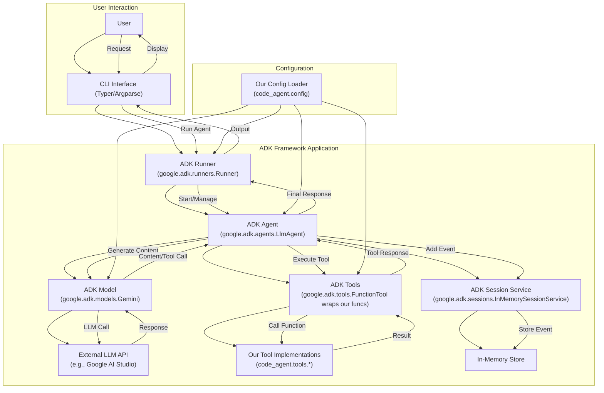

# Planning: Migration to google-adk Framework

## 1. Introduction

This document outlines the plan to migrate our current custom agent implementation (`code_agent`, `cli_agent`) to utilize the Google Agent Development Kit (`google-adk`). The primary goals are to:

*   Reduce the amount of custom framework code we need to maintain.
*   Leverage a standardized, potentially more robust and feature-rich agent framework, including the core **ADK Runtime** ([https://google.github.io/adk-docs/runtime/](https://google.github.io/adk-docs/runtime/)) for orchestrating agent execution.
*   Adopt **Events** ([https://google.github.io/adk-docs/events/](https://google.github.io/adk-docs/events/)) as the fundamental unit for communication, state management, and control flow within the agent system.
*   Utilize ADK **Context** objects ([https://google.github.io/adk-docs/context/](https://google.github.io/adk-docs/context/)) (`InvocationContext`, `ToolContext`, `CallbackContext`) as the standard mechanism for accessing state, services, and invocation details within agents, tools, and callbacks.
*   Enable more robust **agent evaluation** beyond simple pass/fail tests using ADK's evaluation framework ([https://google.github.io/adk-docs/evaluate/](https://google.github.io/adk-docs/evaluate/)) to assess agent trajectory and response quality.
*   Provide mechanisms for implementing robust **Safety and Security** measures ([https://google.github.io/adk-docs/safety/](https://google.github.io/adk-docs/safety/)) through features like Callbacks, Context-aware tools, and structured Authentication.
*   Position the codebase for future **agent interoperability** by adopting standardized structures that align well with emerging protocols like **Agent2Agent (A2A)** ([https://google.github.io/A2A/](https://google.github.io/A2A/)).
*   Improve maintainability and extensibility by adopting ADK conventions.
*   Benefit from future updates and features within the ADK ecosystem.
*   Enable easier implementation of **Multi-Agent Systems** in the future by leveraging ADK primitives like agent hierarchy, **workflow agents** (`SequentialAgent`, `ParallelAgent`, `LoopAgent`), and defined interaction patterns. See [Multi-Agent Systems in ADK](https://google.github.io/adk-docs/agents/multi-agents/) and [Workflow Agents](https://google.github.io/adk-docs/agents/workflow-agents/) for details.
*   Provide a foundation for handling richer input/output beyond text using ADK **Artifacts** ([https://google.github.io/adk-docs/artifacts/](https://google.github.io/adk-docs/artifacts/)) for managing files, images, and other binary data.
*   Allow for fine-grained **observation, customization, and control** of agent behavior through ADK **Callbacks** ([https://google.github.io/adk-docs/callbacks/](https://google.github.io/adk-docs/callbacks/)) at various points in the execution lifecycle.

The official API reference for `google-adk` can be found at: https://google.github.io/adk-docs/api-reference/

## 2. Assessment Summary & Component Mapping

Our analysis revealed significant overlap between our custom code and the components provided by `google-adk`. Migrating will involve replacing or refactoring several parts of our system:

| Current Component                  | `google-adk` Equivalent/Integration Point        | Notes                                                                    |
| :--------------------------------- | :----------------------------------------------- | :----------------------------------------------------------------------- |
| `code_agent.agent.CodeAgent`       | `google.adk.agents.LlmAgent`                     | Replace custom agent loop, state management, and prompt construction.    |
| `code_agent.llm.get_llm_response`  | `google.adk.models.BaseLlm` / `Gemini`           | Replace `litellm` wrapper with ADK model abstraction.                      |
| `code_agent.tools.*_tools.py`      | `google.adk.tools.FunctionTool` / `BaseTool`     | Wrap existing tool functions as `FunctionTool`s for ADK integration.       |
| Session/History (in `CodeAgent`)   | `google.adk.sessions.Session` / `*SessionService` | Replace manual history list with ADK session management (e.g., `InMemory`). |
| `code_agent.cli.main.py`           | `google.adk.runners.Runner` / `InMemoryRunner`   | Replace custom CLI runner logic with ADK runner.                         |
| `cli_agent/`                       | `google.adk.runners.Runner` / `LlmAgent`         | Decommission `cli_agent/` entirely; its functionality will be consolidated into the main agent package using ADK `Runner` and `LlmAgent`. |
| `code_agent.config.*`              | Initialization parameters for ADK components     | Keep config loading logic, adapt to pass values to ADK constructors.       |

## 3. Tech Stack Summary

This project utilizes the following primary technologies:

*   **Language:** Python 3.11+
*   **Package Management:** Poetry
*   **Core Framework (Post-Migration):** Google Agent Development Kit (via `google-cloud-aiplatform[adk]`)
*   **Configuration:** Pydantic (Samples often use `pydantic-settings`)
*   **CLI Framework:** Typer
*   **LLM Interaction (Pre-Migration):** `litellm`
*   **LLM Interaction (Post-Migration):** `google.adk.models` (initially `Gemini`, potentially custom `BaseLlm` wrappers)
*   **Testing:** `pytest`, `pytest-cov`, `pytest-mock`, `pytest-asyncio`
*   **Linting/Formatting:** `ruff`, `pre-commit`
*   **Virtual Environment:** `.venv` (managed by Poetry, potentially accelerated by `uv`)
*   **Installer/Resolver:** Poetry (via `uv`)

## 4. Directory Structure

To facilitate both the migration to ADK and potential future deployments (e.g., GKE), we will adopt the following directory structure, aligning with ADK best practices:

```
/
├── .venv/                    # Poetry-managed virtual environment
├── code_agent/               # Core agent package
│   ├── __init__.py
│   ├── adk/                  # ADK-specific implementation 
│   │   ├── __init__.py
│   │   ├── agent.py          # AdkCodeAgent implementation (LlmAgent subclass)
│   │   ├── models.py         # Custom model implementations (BaseLlm subclasses)
│   │   ├── tools.py          # FunctionTool wrapper implementations
│   │   ├── callbacks.py      # Custom callback implementations
│   │   ├── events.py         # Custom event handlers and processors 
│   │   ├── artifacts.py      # Artifact management implementations
│   │   ├── memory.py         # Memory and state management
│   │   └── services.py       # Custom SessionService/ArtifactService if needed
│   ├── agents/               # Multiple agent implementations
│   │   ├── __init__.py
│   │   ├── code_agent.py     # Code-specific agent implementation
│   │   ├── workflow/         # Workflow agent implementations
│   │   │   ├── __init__.py
│   │   │   ├── sequential.py # Sequential workflow agents
│   │   │   ├── parallel.py   # Parallel execution agents
│   │   │   └── loop.py       # Loop-based workflow agents
│   │   └── other_agents.py   # Additional specialized agents
│   ├── config/               # Configuration management
│   │   ├── __init__.py
│   │   └── settings.py       # Pydantic config models
│   ├── tools/                # Core tool implementations
│   │   ├── __init__.py
│   │   ├── file_tools.py     # File operations (read, write, etc.)
│   │   ├── terminal_tools.py # Command execution tools
│   │   ├── search_tools.py   # Search functionality
│   │   ├── security.py       # Security checks/validation
│   │   ├── function/         # Function tools (simple function wrappers)
│   │   │   ├── __init__.py
│   │   │   └── basic.py      # Basic function tools
│   │   ├── long_running/     # Long-running tools with progress reporting
│   │   │   ├── __init__.py
│   │   │   └── process.py    # Long-running process tools
│   │   ├── openapi/          # OpenAPI tools for API integration
│   │   │   ├── __init__.py
│   │   │   └── clients.py    # OpenAPI client tools
│   │   ├── mcp/              # Model Context Protocol tools
│   │   │   ├── __init__.py
│   │   │   └── memory.py     # Memory management tools
│   │   ├── third_party/      # Third-party service integrations
│   │   │   ├── __init__.py
│   │   │   └── services.py   # External service tools
│   │   ├── auth/             # Authentication-related tools
│   │   │   ├── __init__.py
│   │   │   └── credentials.py # Credential management
│   │   ├── built_in/         # ADK built-in tools wrapper implementations
│   │   │   ├── __init__.py
│   │   │   └── wrappers.py   # Wrappers for ADK built-in tools
│   │   └── utils/            # Tool utilities
│   │       ├── __init__.py
│   │       └── progress.py   # Progress indicators, etc.
│   ├── safety/               # Safety and security implementations
│   │   ├── __init__.py
│   │   ├── filters.py        # Input/output content filters
│   │   ├── validators.py     # Validation logic
│   │   └── guardrails.py     # Safety guardrails
│   ├── memory/               # Memory implementations for agent state
│   │   ├── __init__.py
│   │   ├── providers.py      # Memory provider implementations
│   │   └── state.py          # State management utilities
│   ├── artifacts/            # Artifact handling and management
│   │   ├── __init__.py
│   │   └── handlers.py       # Handlers for different artifact types
│   └── cli/                  # CLI interface
│       ├── __init__.py
│       └── main.py           # Typer CLI with ADK Runner setup
├── tests/                    # Test directory
│   ├── __init__.py
│   ├── conftest.py           # Pytest fixtures
│   ├── unit/                 # Unit tests
│   │   ├── __init__.py
│   │   ├── test_agent.py
│   │   ├── test_tools.py
│   │   └── ...
│   └── integration/          # Integration tests
│       ├── __init__.py
│       └── ...
├── eval/                     # ADK evaluation directory (top-level)
│   ├── __init__.py
│   ├── scenarios.evalset.json
│   ├── evaluation.py
│   ├── test_cases/           # Test cases for evaluation
│   │   ├── __init__.py
│   │   └── basic_tests.test.json
│   └── metrics/              # Custom evaluation metrics
│       ├── __init__.py
│       └── custom_metrics.py
├── docs/                     # Documentation
│   ├── planning_google_adk_migration.md
│   └── ...
├── main.py                   # FastAPI entry point for GKE/cloud deployment
├── pyproject.toml            # Poetry configuration
├── poetry.lock               # Dependency lock file
├── requirements.txt          # For deployment (generated from Poetry)
├── Dockerfile                # Container definition
├── .gitignore
├── .pre-commit-config.yaml
└── README.md
```

Key aspects of this structure:

1. **Core Agent Package:** `code_agent/` contains all agent-related code.
   - Separates ADK-specific implementations in `adk/` subdirectory for clean organization.
   - Adds `agents/` subdirectory to support multiple agent implementations.
   - Maintains existing tool implementations in `tools/` directory, which will be wrapped by ADK's `FunctionTool` in `adk/tools.py`.

2. **Evaluation Directory:** `eval/` is now at the top level, separate from tests.
   - Provides clear separation between unit/integration tests and evaluation scenarios.
   - Contains evaluation sets and scripts for ADK's evaluation framework.

3. **Deployment-Ready Structure:**
   - Places `main.py`, `requirements.txt`, and `Dockerfile` at the project root, following ADK's deployment recommendations.
   - `main.py` will use ADK's `get_fast_api_app()` for serving the agent via FastAPI.

4. **Test Organization:**
   - Separates unit and integration tests in their own directories.
   - Keeps testing concerns separate from evaluation scenarios.

5. **Configuration:**
   - Maintains our existing config structure while adapting it to provide settings to ADK components.

6. **Decommissioned Components:**
   - The existing `cli_agent/` directory will be completely removed as part of milestone 7.
   - The current `code_agent/agent/agent.py` and `code_agent/llm.py` will be replaced by ADK implementations.

This structure supports a phased migration approach by:
- Providing clear locations for new ADK-based code
- Supporting multiple agent implementations
- Maintaining existing tool implementations that will be wrapped
- Supporting both CLI and potential future web deployment
- Setting up for ADK evaluation capabilities
- Following ADK deployment best practices for future cloud deployments

## 5. Proposed Target Architecture

The following diagram illustrates the intended architecture after migrating to `google-adk`:



*Diagram Validation Note:* Based on `docs/feature_diagram_validation.md`, labels with punctuation or newlines should be quoted. This diagram uses simple labels or quotes where necessary.

## 6. Plan Improvements

To ensure the success of this migration, we need to collect the following additional information and address these aspects before proceeding:

1. **Current Implementation Details**:
   * Document the existing agent loop implementation, prompt construction patterns, and tool invocation flows
   * Create a detailed flow diagram of the current implementation to identify all components and interactions
   * Review the history management approach in the current system to ensure proper migration to ADK Sessions

2. **Custom Behavior Requirements**:
   * Identify any unique behaviors in the current agent that might not be standard in ADK's LlmAgent
   * Document any customizations needed for the prompt templates, instruction formatting, or chain-of-thought prompting
   * Catalog any special handling for specific error scenarios or edge cases

3. **Tool Function Migration**:
   * Create a complete inventory of existing tool functions with their signatures, return types, and error handling patterns
   * Analyze which tools might benefit from ADK's `LongRunningFunctionTool` for progress reporting
   * Identify any tools with special authentication requirements 

4. **Model Provider Support**:
   * List all required LLM providers beyond Google's Gemini models
   * Document requirements for local model support (e.g., Ollama integration)
   * Investigate if custom `BaseLlm` implementations are needed for specific providers

5. **Authentication Strategy**:
   * Document the current authentication patterns for tools accessing protected resources
   * Plan for mapping these patterns to ADK's `AuthScheme` and `AuthCredential` mechanisms
   * Consider how to securely manage API keys and credentials in the ADK environment

6. **Evaluation Framework**:
   * Define specific metrics and test cases to validate successful migration
   * Create baseline measurements of the current system for post-migration comparison
   * Design ADK evaluation sets (`.evalset.json`) for key agent scenarios

7. **Dependency Management**:
   * Audit existing dependencies for potential conflicts with ADK requirements
   * Ensure compatibility with the Poetry environment and package versions
   * Plan for any transitional dependencies needed during migration

8. **Migration Phasing**:
   * Establish clear criteria for each phase completion before proceeding to the next
   * Create a testing strategy for incremental validation during the migration process
   * Set up monitoring for performance and behavior changes during transition

9. **Security Implementation**:
   * Document current security measures and requirements
   * Plan for implementing security guardrails using ADK Callbacks
   * Design a validation process for security requirements in the new implementation

These improvements will enhance the migration plan by providing concrete details and validation criteria, ensuring that all aspects of the current implementation are properly considered and migrated to their ADK equivalents.

## 7. Migration Milestones

The migration will proceed in the following phases. Each milestone contains specific tasks that can be checked off as they are completed.

### 7.1. Setup & Dependency Management
**Status**: 🔲 Not Started | ⏳ In Progress | 🔍 In Review | ✅ Completed

- [ ] Add `google-cloud-aiplatform[adk]` package to `pyproject.toml`
  - [ ] Use the latest version available
  - [ ] Note: We'll be using just the core ADK framework, not Vertex AI integration
- [ ] Update version constraints for existing dependencies if needed
- [ ] Run `poetry lock` to resolve dependency conflicts
- [ ] Set up virtual environment using uv:
  - [ ] Create or update `.venv` virtual environment with `uv venv`
  - [ ] Install dependencies with `uv pip install -e .`
  - [ ] Verify installation with `uv pip list`
  - [ ] If the steps above fail, try to run `poetry install` to install updated dependencies
- [ ] Verify successful installation of ADK packages
- [ ] Update CI/CD pipelines to use uv for environment setup 
- [ ] Review ADK documentation for initial setup requirements
- [ ] Set up any required authentication for Google Cloud services (for API access only, not Vertex AI)
- [ ] Create initial scaffolding for the new directory structure
- [ ] Document environment setup procedure in README.md for new contributors

**Directory Structure Changes**:
```
/
├── .venv/                    # Poetry-managed virtual environment (updated)
├── code_agent/               # Existing code
│   ├── __init__.py           # Existing
│   ├── adk/                  # Create this directory
│   │   └── __init__.py       # Create new empty file
├── pyproject.toml            # Update with ADK dependencies
├── poetry.lock               # Updated by poetry lock
└── README.md                 # Update with new setup instructions
```

**Dependencies**: 
- **Previous Milestones**: None
- **Software**: uv (>=0.1.0), Poetry (>=1.2.0), Python (>=3.11)
- **Documentation**: 
  - [ADK Installation Guide](https://google.github.io/adk-docs/getting-started/install/)
  - [Google AI Studio API Keys](https://ai.google.dev/tutorials/setup)
  - Existing docs: git_development.md, testing.md, env_configuration.md, COVERAGE_VERIFICATION.md
- **Knowledge**: Understanding of Python packaging, uv usage, Poetry configuration
- **API Keys**: Google AI Studio API keys for Gemini model access

**Completion Criteria**: 
- All dependencies successfully installed via uv
- Virtual environment setup automated and documented
- Directory structure established
- No conflicts with existing packages
- CI/CD pipelines updated to use uv
- Core ADK framework functionality confirmed working without Vertex AI dependencies

**Validation Method**:
1. Run `uv pip list` to confirm ADK is installed with correct version
2. Verify Python imports work by creating a simple test script that imports key ADK modules
3. Confirm directory structure matches the plan by using `ls -la` on relevant directories
4. Run a basic smoke test that instantiates core ADK components (e.g., a simple Runner or Agent)
5. Check for dependency conflicts
6. Run CI pipeline to verify environment setup works in automated environments

**Important Notes**:
- **NEVER** use nix-shell to install additional tools needed for the migration
- Always use uv or pip to install any required tools
- Maintain compatibility with existing CI/CD workflows that use uv
- Document any new dependencies or tools in the appropriate documentation files

**Dependency Management Policy**:
- Always use the latest versions of libraries and dependencies
- NEVER downgrade package versions to resolve conflicts
- If conflicts arise between existing dependencies and ADK requirements, prioritize the ADK dependencies
- Pin versions as needed, but prioritize staying current
- If dependency issues occur, consult official documentation or search for solutions that maintain forward compatibility
- Aim for functional backward compatibility where sensible, consulting for specific decisions
- Document any version pinning decisions with rationale in comments or documentation

### 7.2a. Tool Refactoring
**Status**: 🔲 Not Started | ⏳ In Progress | 🔍 In Review | ✅ Completed

- [ ] Inventory all existing tool functions in `code_agent/tools/`
  - [ ] Tool dependencies identified in pyproject.toml (typer, pyyaml, rich, pydantic, requests, duckduckgo-search)
  - [ ] Document tool signatures, return types, and dependencies
- [ ] Create empty `code_agent/adk/tools.py` module
- [ ] For each core tool function:
  - [ ] Analyze function signature, docstring, and return values
  - [ ] Create appropriate `FunctionTool` wrapper in `code_agent/adk/tools.py`
  - [ ] Update function signatures to include `ToolContext` parameter
  - [ ] Ensure return values conform to ADK dictionary format with status
  - [ ] Add appropriate error handling and context usage
- [ ] Review and adapt `code_agent/tools/error_utils.py` for ADK compatibility
  - [ ] Adopt Google ADK's error handling patterns and best practices
  - [ ] Prioritize user experience in error handling (minimize technical errors)
  - [ ] Design error reporting to be relevant and actionable for users
- [ ] Evaluate need for progress reporting and implement `LongRunningFunctionTool` if needed
- [ ] Test each wrapped tool function in isolation
  - [ ] Maintain compatibility with SonarCloud quality gates
  - [ ] Create mocks and fixtures for tool dependencies
  - [ ] Ensure test coverage remains above 80%
- [ ] Create utility functions for common tool operations if needed
- [ ] Update migration documentation with clear information on when users can begin testing the implementation via code-agent CLI and chat functions

**Directory Structure Changes**:
```
/
├── code_agent/
│   ├── adk/
│   │   ├── __init__.py       # Update to expose tool wrappers
│   │   └── tools.py          # Create new file with FunctionTool wrappers
│   ├── tools/                # Existing directory, possibly modified files
│   │   ├── file_tools.py     # May need signature updates
│   │   ├── terminal_tools.py # May need signature updates
│   │   ├── search_tools.py   # May need signature updates
│   │   └── error_utils.py    # May need adaptation for ADK
├── tests/
│   ├── unit/
│   │   └── test_adk_tools.py # New test file for ADK tool wrappers
```

**Dependencies**: 
- **Previous Milestones**: Setup & Dependency Management (7.1) completed
- **Software**: Pytest for testing tool functions
- **Documentation**:
  - [ADK Tools Documentation](https://google.github.io/adk-docs/tools/)
  - [Function Tools Guide](https://google.github.io/adk-docs/tools/function-tools/)
  - [Tool Context Documentation](https://google.github.io/adk-docs/context/)
- **Knowledge**: Understanding of existing tools functionality, ADK tool patterns, and Python type hints
- **Code**: Access to existing tool implementations in `code_agent/tools/`

**Completion Criteria**: All tool functions successfully wrapped as `FunctionTool` instances, tests passing, no functionality loss.

**Validation Method**:
1. Create unit tests for each wrapped tool that verify:
   - Correct function signature with `ToolContext` parameter
   - Proper return value format (dictionary with status)
   - Error handling and reporting through ADK mechanisms
   - Same core functionality as original implementation
2. Create integration tests that call tools through the ADK framework
3. Compare the tool inventory list with the implemented wrappers to ensure complete coverage
4. For long-running tools, test progress reporting capabilities
5. Verify docstrings are complete and properly formatted for ADK's tool description generation

### 7.2b. Model Integration
**Status**: 🔲 Not Started | ⏳ In Progress | 🔍 In Review | ✅ Completed

- [ ] Create `code_agent/adk/models.py` module
- [ ] Identify all current LLM providers used in the system
- [ ] For Google Gemini models:
  - [ ] Instantiate a `google.adk.models.Gemini` model
  - [ ] Configure with appropriate settings from `code_agent.config`
  - [ ] Test connectivity to the LLM through the ADK model instance
- [ ] For other model providers:
  - [ ] Create custom `BaseLlm` subclasses as needed
  - [ ] Implement required methods (`generate_content`, etc.)
  - [ ] Test connectivity and response formatting
- [ ] If keeping `litellm` support:
  - [ ] Create a `LiteLlmWrapper` class extending `BaseLlm`
  - [ ] Implement the necessary interface methods
  - [ ] Test with various model providers
- [ ] Create factory function/class to instantiate appropriate model based on config
- [ ] Verify all models produce properly formatted responses for ADK agents

**Directory Structure Changes**:
```
/
├── code_agent/
│   ├── adk/
│   │   ├── __init__.py       # Update to expose model implementations
│   │   ├── tools.py          # From previous milestone
│   │   └── models.py         # Create new file with model implementations
├── tests/
│   ├── unit/
│   │   └── test_adk_models.py # New test file for model implementations
```

**Dependencies**: 
- **Previous Milestones**: Setup & Dependency Management (7.1) completed
- **Software**: Required LLM client libraries (e.g., `google-generativeai` for Gemini)
- **Documentation**:
  - [ADK Models Documentation](https://google.github.io/adk-docs/agents/models/)
  - [BaseLlm Reference](https://google.github.io/adk-docs/api-reference/models/base/)
  - [Gemini Model Reference](https://google.github.io/adk-docs/api-reference/models/gemini/) 
  - Documentation for other model providers (e.g., OpenAI, Anthropic, etc.)
- **Knowledge**: LLM API integration, async Python, error handling patterns
- **API Keys**: API keys for all required LLM providers
- **Code**: Current `litellm` integration code if maintaining compatibility

**Completion Criteria**: All required LLM providers supported, successful connectivity tests, proper response formatting.

**Validation Method**:
1. Create unit tests for each model implementation that verify:
   - Correct initialization with various configuration parameters
   - Proper handling of API keys and authentication
   - Expected response format from `generate_content` calls
2. Create integration tests that:
   - Simulate real API calls (or use mocks if appropriate)
   - Test error handling for API failures
   - Verify content safety filters work as expected
3. Create a compatibility matrix of model providers and test each supported provider
4. Benchmark response times and compare with previous implementation
5. Validate that the model factory correctly instantiates the appropriate model based on config

### 7.3. Early Integration Testing
**Status**: 🔲 Not Started | ⏳ In Progress | 🔍 In Review | ✅ Completed

- [ ] Create a minimal end-to-end test that integrates tools and models
- [ ] Build a simple test harness for calling models with tools
- [ ] Test basic tool calling flows without the full agent implementation
- [ ] Verify tool execution and response handling
- [ ] Document any issues or incompatibilities discovered
- [ ] Adjust tool and model implementations based on integration findings
- [ ] Create integration test fixtures for future component testing

**Directory Structure Changes**:
```
/
├── tests/
│   ├── integration/
│   │   └── test_adk_integration.py # New integration test file
│   ├── conftest.py         # May need updates for test fixtures
│   └── test_harness.py     # Optional test harness for development
```

**Dependencies**: 
- **Previous Milestones**: Tool Refactoring (7.2a) and Model Integration (7.2b) at least partially completed
- **Software**: Pytest, pytest-asyncio for async testing
- **Documentation**: 
  - [ADK Tool Execution Flow](https://google.github.io/adk-docs/tools/creating-tools/)
  - [ADK Events Documentation](https://google.github.io/adk-docs/events/)
- **Knowledge**: Understanding of LLM tool calling patterns, test fixture design, mock object usage
- **API Keys**: API keys for at least one model provider for live testing
- **Code**: Implemented tool wrappers and model interfaces from previous milestones

**Completion Criteria**: Successful integration of tools and models, working tool execution flow, test fixtures created.

**Validation Method**:
1. Execute integration tests that verify:
   - Models can generate valid tool calls
   - Tools can be executed with proper context
   - Results are correctly formatted and returned
2. Document test coverage of integration points
3. Verify error propagation between components
4. Create a simple CLI test command that demonstrates integrated functionality
5. Review and address any issues discovered during integration

### 7.4a. Session Integration
**Status**: 🔲 Not Started | ⏳ In Progress | 🔍 In Review | ✅ Completed

- [ ] Create `code_agent/adk/services.py` module if custom service needed
- [ ] Choose appropriate ADK Session Service (start with `InMemorySessionService`)
- [ ] Instantiate and configure the session service
- [ ] Analyze current history management in `CodeAgent`
- [ ] Map existing history operations to ADK session events and state
- [ ] If custom session behavior needed:
  - [ ] Create custom `SessionService` class
  - [ ] Implement required methods for session management
  - [ ] Test with the early integration components
- [ ] Ensure proper event types are used for different message types
- [ ] Create utility functions for common session operations if needed
- [ ] Test session persistence and retrieval

**Directory Structure Changes**:
```
/
├── code_agent/
│   ├── adk/
│   │   ├── __init__.py       # Update to expose services
│   │   ├── tools.py          # From previous milestone
│   │   ├── models.py         # From previous milestone
│   │   ├── services.py       # Create new file with service implementations
│   │   └── memory.py         # Create optional memory management utilities
├── tests/
│   ├── unit/
│   │   └── test_adk_services.py # New test file for services
```

**Dependencies**: 
- **Previous Milestones**: Early Integration Testing (7.3) at least partially completed
- **Software**: No additional software beyond ADK core
- **Documentation**: 
  - [ADK Sessions Documentation](https://google.github.io/adk-docs/sessions/)
  - [Session Services Guide](https://google.github.io/adk-docs/sessions/session-services/)
  - [State Management](https://google.github.io/adk-docs/sessions/state/)
- **Knowledge**: Event-driven design patterns, state management patterns
- **Code**: Current history management code in `CodeAgent` to understand existing patterns

**Completion Criteria**: Session service successfully integrated, history properly managed, event flow working correctly.

**Validation Method**:
1. Create unit tests for session management that verify:
   - Events are correctly stored and retrieved
   - Session state is properly maintained
   - History operations from previous implementation map correctly to ADK session events
2. Create integration tests that:
   - Simulate multi-turn conversations
   - Verify events are properly sequenced
   - Test session persistence (if implemented)
3. Compare the event structure between old and new implementations for key test cases
4. Test session state access from tools and agents
5. Verify that event types (user, assistant, tool, etc.) are correctly assigned
6. Perform load testing to ensure session performance with large history

### 7.4b. Agent Refactoring
**Status**: 🔲 Not Started | ⏳ In Progress | 🔍 In Review | ✅ Completed

- [ ] Create `code_agent/adk/agent.py` module
- [ ] Create `AdkCodeAgent` class inheriting from `google.adk.agents.LlmAgent`
- [ ] Analyze existing agent instructions and prompt patterns
- [ ] Migrate core instructions to `instruction` or `global_instruction` parameters
- [ ] Configure agent with tools from step 7.2a
- [ ] Configure agent with model instance(s) from step 7.2b
- [ ] Implement any custom behavior required in `_run_async_impl` or similar methods
- [ ] Set up appropriate `generate_content_config` parameters
- [ ] Identify any complex logic in current `CodeAgent.run_turn` that needs custom implementation
- [ ] Design and implement needed callback functions for logging, validation, etc.
- [ ] Create any necessary utility methods for agent configuration
- [ ] Unit test the agent implementation

**Directory Structure Changes**:
```
/
├── code_agent/
│   ├── adk/
│   │   ├── __init__.py       # Update to expose agent implementation
│   │   ├── tools.py          # From previous milestone
│   │   ├── models.py         # From previous milestone
│   │   ├── services.py       # From previous milestone
│   │   ├── agent.py          # Create new file with agent implementation
│   │   └── callbacks.py      # Optional for custom callbacks
│   ├── agents/
│   │   └── code_agent.py     # May need updates for reference
├── tests/
│   ├── unit/
│   │   └── test_adk_agent.py # New test file for agent implementation
```

**Dependencies**: 
- **Previous Milestones**: Early Integration Testing (7.3) completed
- **Software**: No additional software beyond ADK core
- **Documentation**: 
  - [ADK Agents Documentation](https://google.github.io/adk-docs/agents/)
  - [LLM Agent Guide](https://google.github.io/adk-docs/agents/llm-agents/)
  - [Agent Callbacks](https://google.github.io/adk-docs/callbacks/)
  - [Agent Context](https://google.github.io/adk-docs/context/invocation-context/)
- **Knowledge**: Agent design patterns, prompt engineering, instruction formatting
- **Code**: 
  - Existing `CodeAgent` implementation to understand current behavior
  - Prompt templates and instruction sets from current implementation

**Completion Criteria**: Agent successfully instantiated, core instructions preserved, tests passing.

**Validation Method**:
1. Create unit tests for the agent class that verify:
   - Proper initialization with various configuration parameters
   - Correct handling of instructions and prompt templates
   - Appropriate tool registration
   - Model configuration
2. Create integration tests with simulated prompts that:
   - Test the agent's response generation
   - Verify tool selection and execution logic
   - Compare responses with the previous implementation for key test cases
3. Review the instruction template against original to ensure persona consistency
4. Test custom behaviors and callbacks with specific scenarios
5. Perform A/B testing between old and new agent implementations on standardized prompts
6. Verify memory/history handling through multi-turn conversations

### 7.5. Runner Implementation
**Status**: 🔲 Not Started | ⏳ In Progress | 🔍 In Review | ✅ Completed

- [ ] Analyze current `code_agent.cli.main.py` implementation
- [ ] Choose appropriate ADK Runner class (e.g., `InMemoryRunner`)
- [ ] Instantiate and configure the runner with agent from step 7.4b
- [ ] Configure runner with session service from step 7.4a
- [ ] Add initial `InMemoryArtifactService` configuration
- [ ] Adapt CLI argument parsing to work with the runner
- [ ] Implement event handling for runner output
- [ ] Create user response formatting logic
- [ ] Test runner with basic prompts
- [ ] Handle tool execution events appropriately
- [ ] Create appropriate error handling and retry logic if needed
- [ ] Test end-to-end operation with various prompts

**Directory Structure Changes**:
```
/
├── code_agent/
│   ├── cli/
│   │   ├── __init__.py      # Existing file
│   │   └── main.py          # Modify to use ADK Runner
│   ├── adk/
│   │   ├── __init__.py      # From previous milestones
│   │   ├── agent.py         # From previous milestone
│   │   └── artifacts.py     # Optional for artifact handling
├── tests/
│   ├── integration/
│   │   └── test_adk_runner.py # New test file for runner integration
```

**Dependencies**: 
- **Previous Milestones**: Session Integration (7.4a) and Agent Refactoring (7.4b) completed
- **Software**: Typer (for CLI interface)
- **Documentation**: 
  - [ADK Runtime Documentation](https://google.github.io/adk-docs/runtime/)
  - [Runner Guide](https://google.github.io/adk-docs/runtime/runners/)
  - [Artifact Service Documentation](https://google.github.io/adk-docs/artifacts/)
- **Knowledge**: 
  - CLI application design patterns
  - Event processing
  - Async handling in CLI applications
- **Code**: Current CLI implementation in `code_agent.cli.main.py`

**Completion Criteria**: Runner successfully running agent, proper CLI interaction, end-to-end tests passing.

**Validation Method**:
1. Create unit tests for runner configuration and initialization
2. Create integration tests that:
   - Test runner with various CLI arguments
   - Verify event handling and response formatting
   - Test tool execution flow
   - Validate error handling and recovery
3. Perform end-to-end testing with realistic prompts
4. Compare CLI output format between old and new implementations
5. Test artifact handling capabilities
6. Measure performance metrics (response time, memory usage)
7. Test streaming response functionality if implemented

### 7.6. Progressive Code Decommissioning
**Status**: 🔲 Not Started | ⏳ In Progress | 🔍 In Review | ✅ Completed

- [ ] Create a transition strategy for each component:
  - [ ] Map which old components are replaced by which new components
  - [ ] Determine order of replacement to minimize disruption
- [ ] For each component to be decommissioned:
  - [ ] Verify new ADK-based replacement works correctly through testing
  - [ ] Update references to use new implementation
  - [ ] Run tests to ensure replacement functions correctly
  - [ ] Remove old component
- [ ] Components to decommission (in suggested order):
  - [ ] `code_agent/llm.py` (replaced by ADK models)
  - [ ] History management in `code_agent/agent/agent.py` (replaced by Session)
  - [ ] Tool invocation logic (replaced by ADK tool handling)
  - [ ] Main agent loop in `code_agent/agent/agent.py` (replaced by LlmAgent)
  - [ ] CLI runner parts in `code_agent/cli/main.py` (replaced by ADK Runner)
  - [ ] Entire `cli_agent/` directory
- [ ] Remove unused imports and dependencies
- [ ] Update documentation and references throughout the codebase

**Directory Structure Changes**:
```
/
├── code_agent/
│   ├── llm.py                   # Remove this file
│   ├── agent/
│   │   └── agent.py             # Heavily modify or replace this file
│   ├── adk/                     # All files from previous milestones
├── cli_agent/                   # Remove this entire directory
├── pyproject.toml               # Remove unused dependencies
└── tests/                       # Update tests to use new implementations
```

**Dependencies**: 
- **Previous Milestones**: Runner Implementation (7.5) completed for full decommissioning, but can begin progressively as each component is ready
- **Software**: 
  - Static analysis tools (e.g., pyflakes, mypy) to find unused code
  - Version control (git) for tracking removed code
- **Documentation**: None specific, but reference to component mappings from section 2
- **Knowledge**: 
  - Code refactoring techniques
  - Regression testing
  - Version control
- **Code**: Full understanding of code dependencies and import graph

**Completion Criteria**: All old code successfully removed, tests passing, no references to removed components.

**Validation Method**:
1. Run all tests after each component removal to ensure no regressions
2. Use static analysis tools to identify any remaining references to removed components
3. Verify imports throughout the codebase to ensure no dependencies on removed modules
4. Check for any unintended changes in behavior after removing old code
5. Confirm no import errors or module not found errors
6. Verify documentation and comments are updated to reflect new architecture
7. Run the application with various prompts to ensure full functionality remains

### 7.7. Final Testing & Validation
**Status**: 🔲 Not Started | ⏳ In Progress | 🔍 In Review | ✅ Completed

- [ ] Run full test suite (`pytest`)
- [ ] Adapt any remaining tests for ADK agent structure
- [ ] Create new tests specific to ADK functionality
- [ ] Implement ADK evaluation capabilities:
  - [ ] Create test files (`*.test.json`)
  - [ ] Create eval sets (`*.evalset.json`)
  - [ ] Define interaction patterns, tool calls, and expected responses
  - [ ] Use `google.adk.evaluation.AgentEvaluator` with pytest
  - [ ] Run evaluations with `adk eval` CLI command
  - [ ] Define evaluation criteria in `test_config.json`
- [ ] Perform comprehensive manual testing of all workflows
- [ ] Verify code coverage remains above 80%
- [ ] Run linters and formatters
- [ ] Document any behavior changes or differences from previous implementation
- [ ] Create regression test suite for critical functions
- [ ] Conduct performance comparison between old and new implementations
- [ ] Create documentation for the new ADK-based architecture

**Directory Structure Changes**:
```
/
├── eval/                      # Enhanced evaluation directory
│   ├── __init__.py
│   ├── scenarios.evalset.json # Create evaluation set definitions
│   ├── evaluation.py          # Create evaluation scripts
│   ├── test_cases/            # Create this directory
│   │   ├── __init__.py
│   │   └── basic_tests.test.json # Create test definitions
│   └── metrics/               # Create this directory
│       ├── __init__.py
│       └── custom_metrics.py  # Create custom metrics if needed
├── docs/                      # Update documentation
│   ├── adk_architecture.md    # Create architecture documentation
│   └── ...
└── main.py                    # Create FastAPI entry point for potential cloud deployment
```

**Dependencies**: 
- **Previous Milestones**: Progressive Code Decommissioning (7.6) completed
- **Software**: 
  - pytest, pytest-cov for testing and coverage analysis
  - ruff, black, or other linters/formatters
  - `google-cloud-aiplatform[evaluation]` for ADK evaluation capabilities
- **Documentation**: 
  - [ADK Evaluation Documentation](https://google.github.io/adk-docs/evaluate/)
  - [Agent Test Files Guide](https://google.github.io/adk-docs/evaluate/agent-test-files/)
  - [Evaluation Set Guide](https://google.github.io/adk-docs/evaluate/evaluation-sets/)
- **Knowledge**: 
  - Test design patterns
  - Benchmarking techniques
  - Documentation standards
- **Code**: Complete migrated codebase

**Completion Criteria**: All tests passing, code coverage above 80%, no regressions in functionality, documentation updated.

**Validation Method**:
1. Verify test coverage metrics using `pytest-cov` and ensure 80%+ coverage
2. Run the full test suite and confirm all tests pass
3. Execute ADK evaluation sets and verify expected scores
4. Compare system behavior on a standardized set of test prompts between old and new implementations
5. Conduct user acceptance testing with real users on key workflows
6. Run performance benchmarks and compare with baseline
7. Verify all linters pass without errors or warnings
8. Conduct security review of the new implementation
9. Test with edge cases and error conditions to ensure robust handling
10. Validate documentation completeness and accuracy

## 8. Considerations & Risks

*   **Dependencies**: Ensure `google-adk` dependencies don't conflict with existing project dependencies.
*   **Learning Curve**: Team members may need time to familiarize themselves with ADK concepts and APIs.
*   **Behavioral Changes**: The `LlmAgent`'s internal prompting and tool-use logic might differ subtly from our custom `CodeAgent`. This could require adjustments to instructions or tool descriptions.
*   **Configuration Mapping**: Ensure all settings from our `config.yaml` (verbosity, rules, API keys, model names) are correctly passed to the relevant ADK component initializers.
*   **Testing Effort**: Significant effort may be required to adapt existing tests to the new ADK-based structure.
*   **LLM Backend Flexibility (`litellm` Replacement & Local Models)**: 
    *   Confirm ADK's built-in `Gemini` model support covers immediate needs.
    *   To support other providers or **local models (e.g., Ollama)**, we will likely need to implement a **custom `BaseLlm` subclass** (see `google.adk.models`). This custom implementation could potentially wrap `litellm` or interact directly with the desired model API (e.g., Ollama's endpoint).
    *   This structured approach via `BaseLlm` replaces the need for `code_agent/llm.py` and parts of `cli_agent/` related to model interaction.
*   **Tool Authentication**: As more tools are added post-migration, especially those accessing protected resources (e.g., Google Cloud services via MCP Tools, external APIs), we will need to configure authentication. ADK provides mechanisms for this (see [ADK Authentication documentation](https://google.github.io/adk-docs/tools/authentication/)) using `AuthScheme` and `AuthCredential`, which the migration enables us to leverage systematically.
*   **Future Deployment Alignment (GKE)**: To facilitate potential future deployment to Kubernetes environments like GKE, we should aim to structure the refactored project according to ADK deployment best practices (see [Deploy to GKE documentation](https://google.github.io/adk-docs/deploy/gke/)). This typically involves:
    *   Having the core ADK agent definition(s) within a dedicated package (e.g., `code_agent/`).
    *   Placing the FastAPI entry point (`main.py` using `get_fast_api_app`), `requirements.txt`, and `Dockerfile` at the project root level, outside the agent package.
    *   This may require adjustments to our current directory structure during or after the main refactoring milestones.
*   **Refactoring Custom Security Logic**: Our existing security checks (likely in `code_agent/tools/security.py`) will need to be refactored. Instead of a direct replacement module, ADK encourages implementing security guardrails and validations using mechanisms like **Callbacks** (e.g., `before_tool_callback`) or integrating checks directly into **Tools** using `ToolContext` to access state/policy information. See the [Safety and Security docs](https://google.github.io/adk-docs/safety/).
*   **Future Agent2Agent (A2A) Protocol Support**: While implementing the A2A protocol ([https://google.github.io/A2A/](https://google.github.io/A2A/)) is outside the scope of this initial migration, refactoring to ADK's structured agents, tools, and event-driven communication provides a significantly better foundation for potentially adopting or interacting with such interoperability standards in the future compared to the current custom implementation.
*   **Environment/Tooling Consistency**: Ensure consistent use of the established environment management tools (Poetry, `.venv`). Avoid temporary environment wrappers like `nix-shell` for running standard project commands (like `poetry install`), as this can lead to inconsistencies or hide underlying environment setup issues.

## 9. Conclusion

Migrating to `google-adk` will significantly enhance the robustness, maintainability, and extensibility of our agent system. By leveraging ADK's standardized components and features, we can achieve a more robust and feature-rich agent framework. The migration process involves a series of steps to refactor existing code, integrate new components, and ensure compatibility with existing systems.

The migration will proceed in phases, starting with setup and dependency management, tool refactoring, model integration, agent refactoring, session integration, runner implementation, decommissioning old code, and testing & validation. Each phase has specific tasks and considerations to ensure a smooth transition to the new ADK-based system.

By following this plan, we can position our codebase for future agent interoperability and provide a solid foundation for handling richer input/output beyond text using ADK artifacts. The migration will also position our codebase for potential future deployments to Kubernetes environments like GKE.

The migration process involves significant effort, but the benefits of a more robust and feature-rich agent framework will be realized. The team should be prepared for a learning curve and potential behavioral changes in the new ADK-based system.

The migration process will be closely monitored, and testing will be performed to ensure the new system meets the required performance and functionality standards.

The migration to `google-adk` is a significant step towards achieving our long-term goals of a more robust and feature-rich agent system.