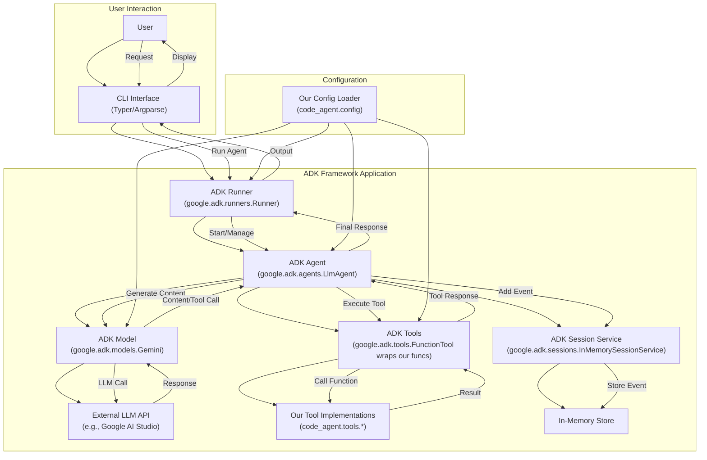

# Planning: Migration to google-adk Framework

## 1. Introduction

This document outlines the plan to migrate our current custom agent implementation (`code_agent`, `cli_agent`) to utilize the Google Agent Development Kit (`google-adk`). The primary goals are to:

*   Reduce the amount of custom framework code we need to maintain.
*   Leverage a standardized, potentially more robust and feature-rich agent framework, including the core **ADK Runtime** ([https://google.github.io/adk-docs/runtime/](https://google.github.io/adk-docs/runtime/)) for orchestrating agent execution.
*   Adopt **Events** ([https://google.github.io/adk-docs/events/](https://google.github.io/adk-docs/events/)) as the fundamental unit for communication, state management, and control flow within the agent system.
*   Utilize ADK **Context** objects ([https://google.github.io/adk-docs/context/](https://google.github.io/adk-docs/context/)) (`InvocationContext`, `ToolContext`, `CallbackContext`) as the standard mechanism for accessing state, services, and invocation details within agents, tools, and callbacks.
*   Enable more robust **agent evaluation** beyond simple pass/fail tests using ADK's evaluation framework ([https://google.github.io/adk-docs/evaluate/](https://google.github.io/adk-docs/evaluate/)) to assess agent trajectory and response quality.
*   Provide mechanisms for implementing robust **Safety and Security** measures ([https://google.github.io/adk-docs/safety/](https://google.github.io/adk-docs/safety/)) through features like Callbacks, Context-aware tools, and structured Authentication.
*   Position the codebase for future **agent interoperability** by adopting standardized structures that align well with emerging protocols like **Agent2Agent (A2A)** ([https://google.github.io/A2A/](https://google.github.io/A2A/)).
*   Improve maintainability and extensibility by adopting ADK conventions.
*   Benefit from future updates and features within the ADK ecosystem.
*   Enable easier implementation of **Multi-Agent Systems** in the future by leveraging ADK primitives like agent hierarchy, **workflow agents** (`SequentialAgent`, `ParallelAgent`, `LoopAgent`), and defined interaction patterns. See [Multi-Agent Systems in ADK](https://google.github.io/adk-docs/agents/multi-agents/) and [Workflow Agents](https://google.github.io/adk-docs/agents/workflow-agents/) for details.
*   Provide a foundation for handling richer input/output beyond text using ADK **Artifacts** ([https://google.github.io/adk-docs/artifacts/](https://google.github.io/adk-docs/artifacts/)) for managing files, images, and other binary data.
*   Allow for fine-grained **observation, customization, and control** of agent behavior through ADK **Callbacks** ([https://google.github.io/adk-docs/callbacks/](https://google.github.io/adk-docs/callbacks/)) at various points in the execution lifecycle.

The official API reference for `google-adk` can be found at: https://google.github.io/adk-docs/api-reference/

## 2. Assessment Summary & Component Mapping

Our analysis revealed significant overlap between our custom code and the components provided by `google-adk`. Migrating will involve replacing or refactoring several parts of our system:

| Current Component                  | `google-adk` Equivalent/Integration Point        | Notes                                                                    |
| :--------------------------------- | :----------------------------------------------- | :----------------------------------------------------------------------- |
| `code_agent.agent.CodeAgent`       | `google.adk.agents.LlmAgent`                     | Replace custom agent loop, state management, and prompt construction.    |
| `code_agent.llm.get_llm_response`  | `google.adk.models.BaseLlm` / `Gemini`           | Replace `litellm` wrapper with ADK model abstraction.                      |
| `code_agent.tools.*_tools.py`      | `google.adk.tools.FunctionTool` / `BaseTool`     | Wrap existing tool functions as `FunctionTool`s for ADK integration.       |
| Session/History (in `CodeAgent`)   | `google.adk.sessions.Session` / `*SessionService` | Replace manual history list with ADK session management (e.g., `InMemory`). |
| `code_agent.cli.main.py`           | `google.adk.runners.Runner` / `InMemoryRunner`   | Replace custom CLI runner logic with ADK runner.                         |
| `cli_agent/`                       | `google.adk.runners.Runner` / `LlmAgent`         | Decommission `cli_agent/` entirely; its functionality will be consolidated into the main agent package using ADK `Runner` and `LlmAgent`. |
| `code_agent.config.*`              | Initialization parameters for ADK components     | Keep config loading logic, adapt to pass values to ADK constructors.       |

## 3. Tech Stack Summary

This project utilizes the following primary technologies:

*   **Language:** Python 3.11+
*   **Package Management:** Poetry
*   **Core Framework (Post-Migration):** Google Agent Development Kit (via `google-cloud-aiplatform[adk]`)
*   **Configuration:** Pydantic (Samples often use `pydantic-settings`)
*   **CLI Framework:** Typer
*   **LLM Interaction (Pre-Migration):** `litellm`
*   **LLM Interaction (Post-Migration):** `google.adk.models` (initially `Gemini`, potentially custom `BaseLlm` wrappers)
*   **Testing:** `pytest`, `pytest-cov`, `pytest-mock`, `pytest-asyncio`
*   **Linting/Formatting:** `ruff`, `pre-commit`
*   **Virtual Environment:** `.venv` (managed by Poetry, potentially accelerated by `uv`)
*   **Installer/Resolver:** Poetry (via `uv`)

## 4. Directory Structure

To facilitate both the migration to ADK and potential future deployments (e.g., GKE), we will adopt the following directory structure, aligning with ADK best practices:

```
/
├── .venv/                    # Poetry-managed virtual environment
├── code_agent/               # Core agent package
│   ├── __init__.py
│   ├── adk/                  # ADK-specific implementation 
│   │   ├── __init__.py
│   │   ├── agent.py          # AdkCodeAgent implementation (LlmAgent subclass)
│   │   ├── models.py         # Custom model implementations (BaseLlm subclasses)
│   │   ├── tools.py          # FunctionTool wrapper implementations
│   │   ├── callbacks.py      # Custom callback implementations
│   │   ├── events.py         # Custom event handlers and processors 
│   │   ├── artifacts.py      # Artifact management implementations
│   │   ├── memory.py         # Memory and state management
│   │   └── services.py       # Custom SessionService/ArtifactService if needed
│   ├── agents/               # Multiple agent implementations
│   │   ├── __init__.py
│   │   ├── code_agent.py     # Code-specific agent implementation
│   │   ├── workflow/         # Workflow agent implementations
│   │   │   ├── __init__.py
│   │   │   ├── sequential.py # Sequential workflow agents
│   │   │   ├── parallel.py   # Parallel execution agents
│   │   │   └── loop.py       # Loop-based workflow agents
│   │   └── other_agents.py   # Additional specialized agents
│   ├── config/               # Configuration management
│   │   ├── __init__.py
│   │   ├── settings.py       # Pydantic config models
│   │   └── session_config.py # Session configuration options
│   ├── tools/                # Core tool implementations
│   │   ├── __init__.py
│   │   ├── file_tools.py     # File operations (read, write, etc.)
│   │   ├── terminal_tools.py # Command execution tools
│   │   ├── search_tools.py   # Search functionality
│   │   ├── security.py       # Security checks/validation
│   │   ├── function/         # Function tools (simple function wrappers)
│   │   │   ├── __init__.py
│   │   │   └── basic.py      # Basic function tools
│   │   ├── long_running/     # Long-running tools with progress reporting
│   │   │   ├── __init__.py
│   │   │   └── process.py    # Long-running process tools
│   │   ├── openapi/          # OpenAPI tools for API integration
│   │   │   ├── __init__.py
│   │   │   └── clients.py    # OpenAPI client tools
│   │   ├── mcp/              # Model Context Protocol tools
│   │   │   ├── __init__.py
│   │   │   └── memory.py     # Memory management tools
│   │   ├── third_party/      # Third-party service integrations
│   │   │   ├── __init__.py
│   │   │   └── services.py   # External service tools
│   │   ├── auth/             # Authentication-related tools
│   │   │   ├── __init__.py
│   │   │   └── credentials.py # Credential management
│   │   ├── built_in/         # ADK built-in tools wrapper implementations
│   │   │   ├── __init__.py
│   │   │   └── wrappers.py   # Wrappers for ADK built-in tools
│   │   └── utils/            # Tool utilities
│   │       ├── __init__.py
│   │       └── progress.py   # Progress indicators, etc.
│   ├── safety/               # Safety and security implementations
│   │   ├── __init__.py
│   │   ├── filters.py        # Input/output content filters
│   │   ├── validators.py     # Validation logic
│   │   └── guardrails.py     # Safety guardrails
│   ├── memory/               # Memory implementations for agent state
│   │   ├── __init__.py
│   │   ├── providers.py      # Memory provider implementations
│   │   └── state.py          # State management utilities
│   ├── artifacts/            # Artifact handling and management
│   │   ├── __init__.py
│   │   └── handlers.py       # Handlers for different artifact types
│   └── cli/                  # CLI interface
│       ├── __init__.py
│       └── main.py           # Typer CLI with ADK Runner setup
├── tests/                    # Test directory
│   ├── __init__.py
│   ├── conftest.py           # Pytest fixtures
│   ├── test_config.py        # Test configuration management
│   ├── test_harness.py       # Test harness for development
│   ├── unit/                 # Unit tests
│   │   ├── __init__.py
│   │   ├── test_agent.py
│   │   ├── test_tools.py
│   │   ├── test_adk_agent.py
│   │   ├── test_adk_models.py
│   │   ├── test_adk_tools.py
│   │   ├── test_adk_services.py
│   │   └── ...
│   └── integration/          # Integration tests
│       ├── __init__.py
│       ├── test_adk_minimal_integration.py
│       ├── test_adk_e2e_scenarios.py
│       ├── test_adk_runner.py
│       └── ...
├── eval/                     # ADK evaluation directory (top-level)
│   ├── __init__.py
│   ├── scenarios.evalset.json
│   ├── evaluation.py
│   ├── test_cases/           # Test cases for evaluation
│   │   ├── __init__.py
│   │   └── basic_tests.test.json
│   └── metrics/              # Custom evaluation metrics
│       ├── __init__.py
│       └── custom_metrics.py
├── docs/                     # Documentation
│   ├── planning_google_adk_migration.md
│   ├── adk_architecture.md
│   ├── getting_started.md
│   ├── agent_customization.md
│   └── user_guides/
│       ├── developer_guide.md
│       ├── qa_guide.md
│       └── pm_guide.md
├── main.py                   # FastAPI entry point for GKE/cloud deployment
├── pyproject.toml            # Poetry configuration
├── poetry.lock               # Dependency lock file
├── requirements.txt          # For deployment (generated from Poetry)
├── Dockerfile                # Container definition
├── .gitignore
├── .pre-commit-config.yaml
├── .env.example              # Example environment variables file
└── README.md
```

Key aspects of this structure:

1. **Core Agent Package:** `code_agent/` contains all agent-related code.
   - Separates ADK-specific implementations in `adk/` subdirectory for clean organization.
   - Adds `agents/` subdirectory to support multiple agent implementations including workflow agents.
   - Maintains existing tool implementations in `tools/` directory, which will be wrapped by ADK's `FunctionTool` in `adk/tools.py`.
   - Includes specialized directories for safety, memory, and artifacts.
   - Organizes tools into logical subdirectories by function and type.

2. **Testing Directory:** Comprehensive test structure with both unit and integration tests.
   - Separate files for testing different components of the ADK implementation.
   - Includes test harness and configuration management.
   - Both minimal integration tests and end-to-end scenarios.

3. **Evaluation Directory:** `eval/` is at the top level, separate from tests.
   - Provides clear separation between unit/integration tests and evaluation scenarios.
   - Contains evaluation sets and scripts for ADK's evaluation framework.
   - Includes test cases and custom metrics directories.

4. **Documentation:** Expanded documentation structure.
   - Architecture documentation for ADK implementation.
   - Getting started guide for new users.
   - Agent customization documentation.
   - User-specific guides for different types of users.

5. **Deployment-Ready Structure:**
   - Places `main.py`, `requirements.txt`, and `Dockerfile` at the project root, following ADK's deployment recommendations.
   - `main.py` will use ADK's `get_fast_api_app()` for serving the agent via FastAPI.
   - Example environment file for local development and testing.

This structure supports a phased migration approach by:
- Providing clear locations for new ADK-based code
- Supporting multiple agent implementations
- Maintaining existing tool implementations that will be wrapped
- Supporting both CLI and potential future web deployment
- Setting up for ADK evaluation capabilities
- Following ADK deployment best practices for future cloud deployments

## 5. Proposed Target Architecture

The following diagram illustrates the intended architecture after migrating to `google-adk`:



*Diagram Validation Note:* Based on `docs/feature_diagram_validation.md`, labels with punctuation or newlines should be quoted. This diagram uses simple labels or quotes where necessary.

## 6. Plan Improvements

To ensure the success of this migration, we need to collect the following additional information and address these aspects before proceeding:

1. **Current Implementation Details**:
   * Document the existing agent loop implementation, prompt construction patterns, and tool invocation flows
   * Create a detailed flow diagram of the current implementation to identify all components and interactions
   * Review the history management approach in the current system to ensure proper migration to ADK Sessions

2. **Custom Behavior Requirements**:
   * Identify any unique behaviors in the current agent that might not be standard in ADK's LlmAgent
   * Document any customizations needed for the prompt templates, instruction formatting, or chain-of-thought prompting
   * Catalog any special handling for specific error scenarios or edge cases

3. **Tool Function Migration**:
   * Create a complete inventory of existing tool functions with their signatures, return types, and error handling patterns
   * Analyze which tools might benefit from ADK's `LongRunningFunctionTool` for progress reporting
   * Identify any tools with special authentication requirements 

4. **Model Provider Support**:
   * List all required LLM providers beyond Google's Gemini models
   * Document requirements for local model support (e.g., Ollama integration)
   * Investigate if custom `BaseLlm` implementations are needed for specific providers

5. **Authentication Strategy**:
   * Document the current authentication patterns for tools accessing protected resources
   * Plan for mapping these patterns to ADK's `AuthScheme` and `AuthCredential` mechanisms
   * Consider how to securely manage API keys and credentials in the ADK environment

6. **Evaluation Framework**:
   * Define specific metrics and test cases to validate successful migration
   * Create baseline measurements of the current system for post-migration comparison
   * Design ADK evaluation sets (`.evalset.json`) for key agent scenarios

7. **Dependency Management**:
   * Audit existing dependencies for potential conflicts with ADK requirements
   * Ensure compatibility with the Poetry environment and package versions
   * Plan for any transitional dependencies needed during migration

8. **Migration Phasing**:
   * Establish clear criteria for each phase completion before proceeding to the next
   * Create a testing strategy for incremental validation during the migration process
   * Set up monitoring for performance and behavior changes during transition

9. **Security Implementation**:
   * Document current security measures and requirements
   * Plan for implementing security guardrails using ADK Callbacks
   * Design a validation process for security requirements in the new implementation

These improvements will enhance the migration plan by providing concrete details and validation criteria, ensuring that all aspects of the current implementation are properly considered and migrated to their ADK equivalents.

## 7. Migration Milestones

The migration will proceed in the following phases. Each milestone contains specific tasks that can be checked off as they are completed.

### 7.1. Setup & Dependency Management
**Status**: 🔲 Not Started | ⏳ In Progress | 🔍 In Review | ✅ Completed

- [ ] Set up Git branch for ADK migration:
  - [ ] Create and switch to `feat/google-adk` branch: `git checkout -b feat/google-adk`
  - [ ] Push branch to remote: `git push -u origin feat/google-adk`
- [ ] Add `google-cloud-aiplatform[adk]` package to `pyproject.toml`
  - [ ] Use the latest version available
  - [ ] Note: We'll be using just the core ADK framework, not Vertex AI integration
- [ ] Update version constraints for existing dependencies if needed
- [ ] Run `poetry lock` to resolve dependency conflicts
- [ ] Set up virtual environment using uv:
  - [ ] Create or update `.venv` virtual environment with `uv venv`
  - [ ] Install dependencies with `uv pip install -e .`
  - [ ] Verify installation with `uv pip list`
  - [ ] If the steps above fail, try to run `poetry install` to install updated dependencies
- [ ] Verify successful installation of ADK packages
- [ ] Create ADK development sandbox:
  - [ ] Create a simple script in `sandbox/adk_sandbox.py` for testing ADK components
  - [ ] Implement basic examples of agent, models, and tools for experimentation
  - [ ] Document common patterns and insights gained from sandbox experiments
- [ ] Update CI/CD pipelines to use uv for environment setup 
- [ ] Review ADK documentation for initial setup requirements
- [ ] Set up any required authentication for Google Cloud services (for API access only, not Vertex AI)
- [ ] Create initial scaffolding for the new directory structure
- [ ] Document environment setup procedure in README.md for new contributors
- [ ] Document milestone completion:
  - [ ] Summarize dependency decisions and reasoning
  - [ ] Document any issues encountered and their solutions
  - [ ] Create checklist for future dependency updates

**Directory Structure Changes**:
```
/
├── .venv/                    # Poetry-managed virtual environment (updated)
├── code_agent/               # Existing code
│   ├── __init__.py           # Existing
│   ├── adk/                  # Create this directory
│   │   └── __init__.py       # Create new empty file
├── sandbox/                  # Create development sandbox
│   └── adk_sandbox.py        # Create ADK experimentation script
├── pyproject.toml            # Update with ADK dependencies
├── poetry.lock               # Updated by poetry lock
├── docs/
│   ├── planning_google_adk_migration.md
│   └── migration_notes/
│       └── milestone1_notes.md # Document setup insights and learnings
└── README.md                 # Update with new setup instructions
```

**Milestone 1 Completion Checkpoint**:
- [ ] All dependencies successfully installed and verified
- [ ] Development sandbox functioning with basic ADK components
- [ ] Directory structure created and pushed to feat/google-adk branch
- [ ] Documentation updated with setup procedure and insights
- [ ] No conflicts with existing packages identified
- [ ] CI/CD pipeline updated and tested

**User Acceptance Testing Instructions**:
1. **Verify Environment Setup**:
   ```
   # Activate the virtual environment
   source .venv/bin/activate
   
   # Verify ADK installation is accessible to code-agent
   code-agent --version
   # Should show the version and include ADK version information
   ```

2. **Check Sandbox Functionality**:
   ```
   # Run a simple command that uses ADK components
   code-agent run "Tell me what time it is"
   
   # The response should use the ADK framework and display properly
   ```

3. **Review Branch Structure**:
   ```
   # Check your current branch
   git branch
   
   # Ensure you're on the feat/google-adk branch
   ```

4. **Feedback Points**:
   - Did code-agent start up properly with the ADK dependencies?
   - Was the output formatting clear and readable?
   - Did you notice any differences in response quality or format compared to the previous version?
   - Were there any errors or warnings during startup or execution?

**Agent Implementation Prompt**:
```
Implement Milestone 1: Setup & Dependency Management for Google ADK Migration.

Your tasks:
1. Set up Git branch for ADK migration
2. Add Google ADK dependencies to the project
3. Create directory structure including sandbox for experimentation
4. Verify successful installation
5. Update documentation with setup procedures

IMPORTANT: After completing each step, wait for the user to verify functionality and provide feedback before moving on. DO NOT push any changes without explicit user confirmation after User Acceptance Testing.

After completing all tasks, commit your changes but DO NOT push until the user confirms all UAT has passed successfully.
```

### 7.2a. Tool Refactoring
**Status**: 🔲 Not Started | ⏳ In Progress | 🔍 In Review | ✅ Completed

- [ ] Comprehensive tool inventory:
  - [ ] Create `docs/migration_notes/tool_inventory.md` with a detailed inventory table
  - [ ] For each tool, document:
    - [ ] Function name and signature
    - [ ] Return type and format
    - [ ] Current error handling approach
    - [ ] Dependencies and side effects
    - [ ] Special behaviors or edge cases
    - [ ] Migration approach and considerations
  - [ ] Tool dependencies identified in pyproject.toml (typer, pyyaml, rich, pydantic, requests, duckduckgo-search)
  - [ ] Categorize tools by complexity and migration difficulty
- [ ] Create empty `code_agent/adk/tools.py` module
- [ ] For each core tool function:
  - [ ] Analyze function signature, docstring, and return values
  - [ ] Create appropriate `FunctionTool` wrapper in `code_agent/adk/tools.py`
  - [ ] Update function signatures to include `ToolContext` parameter
  - [ ] Ensure return values conform to ADK dictionary format with status
  - [ ] Add appropriate error handling and context usage
- [ ] Review and adapt `code_agent/tools/error_utils.py` for ADK compatibility
  - [ ] Adopt Google ADK's error handling patterns and best practices
  - [ ] Prioritize user experience in error handling (minimize technical errors)
  - [ ] Design error reporting to be relevant and actionable for users
- [ ] Evaluate need for progress reporting and implement `LongRunningFunctionTool` if needed
- [ ] Test each wrapped tool function in isolation
  - [ ] Maintain compatibility with SonarCloud quality gates
  - [ ] Create mocks and fixtures for tool dependencies
  - [ ] Ensure test coverage remains above 80%
- [ ] Create utility functions for common tool operations if needed
- [ ] Update migration documentation with clear information on when users can begin testing the implementation via code-agent CLI and chat functions
- [ ] Document milestone completion:
  - [ ] Document patterns and approaches used for tool migration
  - [ ] Create reference guide for adding future tools
  - [ ] Note any challenging tools and how their issues were resolved

**Directory Structure Changes**:
```
/
├── code_agent/
│   ├── adk/
│   │   ├── __init__.py       # Update to expose tool wrappers
│   │   └── tools.py          # Create new file with FunctionTool wrappers
│   ├── tools/                # Existing directory, possibly modified files
│   │   ├── file_tools.py     # May need signature updates
│   │   ├── terminal_tools.py # May need signature updates
│   │   ├── search_tools.py   # May need signature updates
│   │   └── error_utils.py    # May need adaptation for ADK
├── tests/
│   ├── unit/
│   │   └── test_adk_tools.py # New test file for ADK tool wrappers
├── docs/
│   └── migration_notes/
│       ├── milestone1_notes.md
│       ├── tool_inventory.md # Detailed tool inventory and migration plan
│       └── milestone2a_notes.md # Document tool migration insights
```

**Milestone 2a Completion Checkpoint**:
- [ ] Comprehensive tool inventory completed and documented
- [ ] All tools successfully wrapped as FunctionTool instances
- [ ] Tests passing for all wrapped tools with >80% coverage
- [ ] Error handling patterns standardized and documented
- [ ] Documentation updated with tool migration insights and patterns

**User Acceptance Testing Instructions**:
1. **Test Tool Functionality via code-agent**:
   ```
   # Test file tools
   code-agent run "List all the files in the current directory"
   
   # Test terminal tools
   code-agent run "What's my current working directory?"
   
   # Test search tools
   code-agent run "Search for information about Python decorators"
   ```

2. **Check Tool Error Handling**:
   ```
   # Test graceful error handling
   code-agent run "Try to read a file that doesn't exist: nonexistent_file.txt"
   
   # Test tool with invalid parameters
   code-agent run "Run a command with incorrect syntax"
   ```

3. **Feedback Points**:
   - Do all tools function correctly through the ADK integration?
   - Are error messages clear and helpful?
   - Do tools handle edge cases properly?
   - Is the performance acceptable for all tool operations?

**Agent Implementation Prompt**:
```
Implement Milestone 2a: Tool Refactoring for Google ADK Migration.

Your tasks:
1. Create a complete inventory of existing tools with detailed documentation
2. Create FunctionTool wrappers for each existing tool function
3. Update function signatures to include ToolContext parameter
4. Ensure proper error handling and return value formats
5. Write tests for the wrapped tools

IMPORTANT: Wait for user confirmation after creating the tool inventory document before starting implementation. After implementing each tool category, wait for user feedback on your approach before continuing.

DO NOT commit or push any changes until the user confirms that all tools function properly and the User Acceptance Tests have been successfully completed AND the tasks in the planning are updated to in review.
```

### 7.2b. Model Integration
**Status**: 🔲 Not Started | ⏳ In Progress | 🔍 In Review | ✅ Completed

- [ ] Create `code_agent/adk/models.py` module
- [ ] Implement multi-provider support:
  - [ ] Google AI Studio for Gemini models (primary)
  - [ ] LiteLLM integration for proprietary models (OpenAI, Anthropic, etc.)
  - [ ] First-class support for locally hosted Ollama models via LiteLLM
  - [ ] Follow implementation guidance in [ADK Models documentation](https://google.github.io/adk-docs/agents/models/)
- [ ] For Google Gemini models:
  - [ ] Instantiate a `google.adk.models.Gemini` model
  - [ ] Configure with appropriate settings from `code_agent.config`
  - [ ] Test connectivity to the LLM through the ADK model instance
- [ ] Create LiteLLM wrapper integration:
  - [ ] Implement `LiteLlm` wrapper class as shown in ADK documentation
  - [ ] Support seamless switching between model providers
  - [ ] Ensure compatibility with all required providers
  - [ ] Test with various model providers
- [ ] Implement Configuration Management:
  - [ ] Adopt Google ADK's approach to configuration management
  - [ ] Support environment variables for API keys (following ADK patterns)
  - [ ] Implement .env file support for development and testing
  - [ ] Make configuration simple for end users
- [ ] Implement model fallback mechanism:
  - [ ] Create fallback behavior for when primary model is unavailable
  - [ ] Make timeout and retry logic configurable
  - [ ] Implement sensible defaults that prioritize user experience
  - [ ] Design to avoid interrupting user workflow
- [ ] Create factory function/class to instantiate appropriate model based on config
- [ ] Verify all models produce properly formatted responses for ADK agents

**Directory Structure Changes**:
```
/
├── code_agent/
│   ├── adk/
│   │   ├── __init__.py       # Update to expose model implementations
│   │   ├── tools.py          # From previous milestone
│   │   └── models.py         # Create new file with model implementations
├── tests/
│   ├── unit/
│   │   └── test_adk_models.py # New test file for model implementations
├── .env.example              # Create example .env file for development
├── docs/
│   └── migration_notes/
│       ├── previous_milestone_notes.md
│       └── milestone2b_notes.md # Document model integration insights
```

**Milestone 2b Completion Checkpoint**:
- [ ] All required model providers successfully integrated
- [ ] Model switching and configuration working correctly
- [ ] Tests passing for all model implementations
- [ ] Fallback and retry logic implemented and tested
- [ ] Documentation updated with model integration insights and patterns

**User Acceptance Testing Instructions**:
1. **Test Different Model Providers**:
   ```
   # Test with Google AI Studio models
   code-agent --provider ai_studio --model gemini-1.5-pro "What's the capital of France?"
   
   # Test with OpenAI models
   code-agent --provider openai --model gpt-3.5-turbo "What's the capital of Germany?"
   ```

2. **Check Response Quality**:
   ```
   # Test complex prompts requiring reasoning
   code-agent run "Explain the difference between inheritance and composition in OOP"
   ```

3. **Feedback Points**:
   - Do all model providers work correctly?
   - Is the response quality consistent with expectations?
   - Do model-specific parameters work correctly?
   - Can you switch between models easily?

**Agent Implementation Prompt**:
```
Implement Milestone 2b: Model Integration for Google ADK Migration.

Your tasks:
1. Create ADK model wrappers for each required provider (Google AI Studio, OpenAI, etc.)
2. Implement provider-specific parameter handling
3. Create model factory for configuration-based model selection
4. Update model interaction patterns to use ADK interfaces
5. Write tests for model wrappers and selection

IMPORTANT: After implementing each model provider, pause for user testing of that specific provider. Request explicit feedback on response quality and behavior before proceeding to the next provider.

DO NOT commit or push any changes until the user has confirmed that all models work correctly and the User Acceptance Tests have been successfully completed AND the tasks in the planning are updated to in review.
```

### 7.3. Early Integration Testing
**Status**: 🔲 Not Started | ⏳ In Progress | 🔍 In Review | ✅ Completed

- [ ] Research Google ADK's recommended testing approaches and best practices
- [ ] Design testing strategy with clear separation between:
  - [ ] Minimal integration tests (focused on specific component interactions)
  - [ ] Comprehensive end-to-end scenarios (testing full workflows)
- [ ] Create integration test plan prioritizing:
  - [ ] Model response handling testing (first priority)
  - [ ] Tool execution testing (second priority)
- [ ] Set up test environment:
  - [ ] Research and implement ADK-recommended mocking approaches
  - [ ] Create mock implementations for external services/APIs
  - [ ] Develop reusable test fixtures for common components
- [ ] Implement authentication handling:
  - [ ] Support API keys via .env file for local testing
  - [ ] Allow GitHub secrets integration for pipeline testing
  - [ ] Implement conditional test skipping when keys aren't available
  - [ ] Create mock authentication for tests that don't require real APIs
- [ ] Create minimal integration tests:
  - [ ] Build test harness for calling models with tools
  - [ ] Test basic tool calling flows
  - [ ] Verify tool execution and response handling
- [ ] Document test coverage and success criteria:
  - [ ] Define expected functionality for each feature
  - [ ] Create pass/fail validation for each test case
  - [ ] Focus on validating end-user experience
- [ ] Implement adjustments based on integration findings:
  - [ ] Document any issues or incompatibilities discovered
  - [ ] Adjust tool and model implementations as needed
- [ ] Create integration test fixtures for future component testing

**Directory Structure Changes**:
```
/
├── tests/
│   ├── integration/
│   │   ├── test_adk_minimal_integration.py  # Minimal component tests
│   │   └── test_adk_e2e_scenarios.py        # End-to-end workflow tests
│   ├── conftest.py                          # Test fixtures and utilities
│   ├── test_harness.py                      # Optional test harness for development
│   └── test_config.py                       # Test configuration management
├── .env.test.example                        # Template for test environment variables
```

**Dependencies**: 
- **Previous Milestones**: Tool Refactoring (7.2a) and Model Integration (7.2b) at least partially completed
- **Software**: Pytest, pytest-asyncio for async testing, pytest-mock for mocking
- **Documentation**: 
  - [ADK Tool Execution Flow](https://google.github.io/adk-docs/tools/creating-tools/)
  - [ADK Events Documentation](https://google.github.io/adk-docs/events/)
  - [ADK Testing Recommendations](https://google.github.io/adk-docs/getting-started/testing/)
- **Knowledge**: Understanding of LLM tool calling patterns, test fixture design, mock object usage
- **API Keys**: API keys for at least one model provider for live testing (in .env for local, GitHub secrets for CI)
- **Code**: Implemented tool wrappers and model interfaces from previous milestones

**Completion Criteria**: 
- Successful integration of tools and models demonstrated through passing tests
- Clear distinction between minimal integration tests and comprehensive end-to-end scenarios
- Test fixtures created and reusable
- Authentication handling works correctly (both real and mocked)
- Features validated through appropriate test coverage
- All integration tests pass and validate user experience requirements

**Validation Method**:
1. Execute minimal integration tests that verify:
   - Models can generate valid tool calls
   - Tools can be executed with proper context
   - Results are correctly formatted and returned
2. Execute end-to-end scenario tests that validate:
   - Complete user workflows function as expected
   - Feature requirements are met from user perspective
3. Verify authentication handling works correctly:
   - Tests run with real API keys when available
   - Tests use mocked authentication when appropriate
   - Tests skip gracefully when required keys aren't available
4. Document test coverage relative to feature requirements
5. Verify error propagation between components
6. Create a simple CLI test command that demonstrates integrated functionality
7. Review and address any issues discovered during integration

**Milestone 3 Completion Checkpoint**:
- [ ] Models and tools successfully integrated
- [ ] Both minimal and end-to-end tests passing
- [ ] Test fixtures created and documented
- [ ] Authentication handling verified
- [ ] Documentation updated with integration insights and patterns

**User Acceptance Testing Instructions**:
1. **Run Basic Integration Tests via code-agent**:
   ```
   # Test a tool-heavy workflow
   code-agent run "Search for the latest Python version, then create a small Python script that demonstrates a new feature from that version"
   
   # Test a conversation-heavy workflow
   code-agent chat "Let's discuss the best practices for error handling in Python. First, what are the main approaches?"
   # Follow up with 2-3 more messages in the conversation
   ```

2. **Test Error Recovery**:
   ```
   # Test handling of a failed tool call
   code-agent run "Try to execute an invalid shell command, then tell me what went wrong and suggest a fix"
   ```

3. **Test Authentication Handling**:
   ```
   # If implemented, test a tool requiring authentication
   code-agent run "Show me my Google Cloud projects"
   # Should either work with configured auth or guide you through auth setup
   ```

4. **Feedback Points**:
   - Do complex workflows complete successfully?
   - Is the conversation context maintained properly?
   - Does the agent recover gracefully from errors?
   - Is the authentication flow user-friendly?

### 7.4a. Session Integration
**Status**: 🔲 Not Started | ⏳ In Progress | 🔍 In Review | ✅ Completed

- [ ] Implement session state persistence:
  - [ ] Start with InMemorySessionService for initial implementation
  - [ ] Add filesystem-based persistence as an alternative option
  - [ ] Ensure critical state is preserved (history, context, rules)
  - [ ] Design for future extension to other persistence mechanisms
- [ ] Configure and optimize session service:
  - [ ] Create `code_agent/adk/services.py` module 
  - [ ] Instantiate and configure the session service
  - [ ] Add performance configuration options with sensible defaults
  - [ ] Optimize for best end user experience
- [ ] Analyze current history management in `CodeAgent`:
  - [ ] Identify all existing state persisted in current implementation
  - [ ] Map existing history operations to ADK session events and state
  - [ ] Confirm if any unique session handling needs exist (consult during implementation)
- [ ] Implement event handling:
  - [ ] Utilize ADK's standard event types
  - [ ] Ensure proper event types are used for different message types
  - [ ] Review need for custom event types during implementation
- [ ] Create utility functions for common session operations if needed
- [ ] Test session persistence and retrieval:
  - [ ] Test in-memory persistence
  - [ ] Test filesystem persistence
  - [ ] Verify proper state recovery

**Directory Structure Changes**:
```
/
├── code_agent/
│   ├── adk/
│   │   ├── __init__.py       # Update to expose services
│   │   ├── tools.py          # From previous milestone
│   │   ├── models.py         # From previous milestone
│   │   ├── services.py       # Create new file with service implementations
│   │   └── memory.py         # Create memory management utilities
│   ├── config/
│   │   └── session_config.py # Add session configuration options
├── tests/
│   ├── unit/
│   │   └── test_adk_services.py # New test file for services
```

**Dependencies**: 
- **Previous Milestones**: Early Integration Testing (7.3) at least partially completed
- **Software**: No additional software beyond ADK core
- **Documentation**: 
  - [ADK Sessions Documentation](https://google.github.io/adk-docs/sessions/)
  - [Session Services Guide](https://google.github.io/adk-docs/sessions/session-services/)
  - [State Management](https://google.github.io/adk-docs/sessions/state/)
- **Knowledge**: Event-driven design patterns, state management patterns
- **Code**: Current history management code in `CodeAgent` to understand existing patterns

**Completion Criteria**: 
- InMemorySessionService successfully integrated
- Filesystem-based alternative implemented
- History properly managed in both approaches
- Event flow working correctly
- Performance optimized with configurable options
- No session security mechanisms required (at this stage)

**Validation Method**:
1. Create unit tests for session management that verify:
   - Events are correctly stored and retrieved
   - Session state is properly maintained
   - History operations from previous implementation map correctly to ADK session events
2. Create integration tests that:
   - Simulate multi-turn conversations
   - Verify events are properly sequenced
   - Test session persistence (both in-memory and filesystem)
3. Compare the event structure between old and new implementations for key test cases
4. Test session state access from tools and agents
5. Verify that event types (user, assistant, tool, etc.) are correctly assigned
6. Confirm with stakeholders if any unique session handling needs are identified during implementation
7. Re-evaluate need for custom event types or security measures during implementation

**Milestone 4a Completion Checkpoint**:
- [ ] Session services successfully implemented
- [ ] Both in-memory and filesystem persistence working
- [ ] State management verified with multi-turn conversations
- [ ] Documentation updated with session insights and patterns

**User Acceptance Testing Instructions**:
1. **Test Session Persistence**:
   ```
   # Start a chat session and create context
   code-agent chat "My name is Alex and I'm working on a Python project"
   
   # Continue the session with a follow-up
   code-agent chat "What was my name again?"
   ```

2. **Test Session Management**:
   ```
   # Create a new named session
   code-agent chat --session project1 "I'm working on a web application"
   
   # Switch between sessions
   code-agent chat --session project2 "I'm working on a machine learning model"
   code-agent chat --session project1 "What was I working on again?"
   ```

3. **Feedback Points**:
   - Does session persistence work correctly between interactions?
   - Can users create and manage multiple sessions?
   - Is conversation context maintained appropriately?
   - Is there appropriate feedback about session state?

**Agent Implementation Prompt**:
```
Implement Milestone 4: Session Integration for Google ADK Migration.

Your tasks:
1. Create session configuration framework
2. Implement memory management with ADK session components
3. Set up persistence mechanisms (in-memory, file-based)
4. Create session management CLI interface
5. Write tests for session functionality

IMPORTANT: After implementing basic session functionality, pause for user testing before adding advanced features. Have the user verify that context is maintained correctly between interactions.

DO NOT commit or push changes until the user has confirmed that all session management features work properly and the User Acceptance Tests have been successfully completed AND the tasks in the planning are updated to in review.
```

### 7.4b. Agent Refactoring
**Status**: 🔲 Not Started | ⏳ In Progress | 🔍 In Review | ✅ Completed

- [ ] Create `code_agent/adk/agent.py` module
- [ ] Create `AdkCodeAgent` class inheriting from `google.adk.agents.LlmAgent`
- [ ] Configure agent with flexible, sensible defaults:
  - [ ] Design default instructions geared towards software and platform engineers
  - [ ] Make instruction parameters configurable
  - [ ] Follow Google ADK's approach for agent configuration
- [ ] Implement standard ADK agent capabilities:
  - [ ] Configure agent with tools from step 7.2a
  - [ ] Configure agent with model instance(s) from step 7.2b
  - [ ] Set up appropriate `generate_content_config` parameters
  - [ ] Enable response streaming by default
- [ ] Research and implement callback system:
  - [ ] Follow Google ADK's recommendations for monitoring and logging
  - [ ] Design callbacks that enhance user experience
  - [ ] Document potential callback use cases for future implementation
  - [ ] Create placeholder for user-delighting callback features (to be defined)
- [ ] Implement response formatting:
  - [ ] Use markdown for visually appealing responses
  - [ ] Ensure clear dialog formatting between users and agent(s)
  - [ ] Research and implement ADK's recommendations for response truncation
  - [ ] Design format that works well in both chat and run modes
- [ ] Create any necessary utility methods for agent configuration
- [ ] Unit test the agent implementation

**Directory Structure Changes**:
```
/
├── code_agent/
│   ├── adk/
│   │   ├── __init__.py       # Update to expose agent implementation
│   │   ├── tools.py          # From previous milestone
│   │   ├── models.py         # From previous milestone
│   │   ├── services.py       # From previous milestone
│   │   ├── agent.py          # Create new file with agent implementation
│   │   └── callbacks.py      # Implementation for callbacks system
├── tests/
│   ├── unit/
│   │   └── test_adk_agent.py # New test file for agent implementation
```

**Dependencies**: 
- **Previous Milestones**: Early Integration Testing (7.3) completed
- **Software**: No additional software beyond ADK core
- **Documentation**: 
  - [ADK Agents Documentation](https://google.github.io/adk-docs/agents/)
  - [LLM Agent Guide](https://google.github.io/adk-docs/agents/llm-agents/)
  - [Agent Callbacks](https://google.github.io/adk-docs/callbacks/)
  - [Agent Context](https://google.github.io/adk-docs/context/invocation-context/)
  - [Streaming Responses](https://google.github.io/adk-docs/api-reference/agents/llm-agent/#streaming-responses)
- **Knowledge**: Agent design patterns, prompt engineering, instruction formatting
- **Code**: 
  - Existing `CodeAgent` implementation (for reference only)
  - Tool and model implementations from previous milestones

**Completion Criteria**: 
- Agent successfully instantiated and functioning
- Configuration flexible with sensible defaults
- Response formatting visually appealing with markdown
- Streaming responses enabled
- Callback framework established
- Tests passing

**Validation Method**:
1. Create unit tests for the agent class that verify:
   - Proper initialization with various configuration parameters
   - Correct handling of instructions and formatting
   - Appropriate tool registration
   - Model configuration
   - Streaming response capability
2. Create integration tests with simulated prompts that:
   - Test the agent's response generation
   - Verify response formatting and markdown rendering
   - Validate streaming functionality
   - Test callback system
3. Confirm callback extensibility for future enhancements
4. Test response clarity and visual appeal with actual users if possible
5. Verify streaming works correctly in different environments

**Milestone 4b Completion Checkpoint**:
- [ ] Agent implementation completed and tested
- [ ] Streaming and markdown formatting working correctly
- [ ] Callback system verified and documented
- [ ] Documentation updated with agent implementation insights

**User Acceptance Testing Instructions**:
1. **Test Basic Agent Functionality**:
   ```
   # Test agent with simple prompts
   code-agent chat "Hello, who are you?"
   
   # Test agent with tool usage
   code-agent run "List the files in this directory"
   ```

2. **Test Agent Behavior with Different Inputs**:
   ```
   # Test with complex reasoning
   code-agent run "Explain how asynchronous programming works in Python"
   
   # Test with ambiguous requests
   code-agent run "Improve this code"
   ```

3. **Feedback Points**:
   - Does the agent maintain its previous capabilities?
   - Is there any change in prompt handling or response quality?
   - Does the agent handle tool selection appropriately?
   - Are there any regressions in functionality?

**Agent Implementation Prompt**:
```
Implement Milestone 3: Agent Refactoring for Google ADK Migration.

Your tasks:
1. Create ADK LlmAgent subclass for the Code Agent
2. Implement prompt templates and response handlers
3. Configure the agent with appropriate tools and callbacks
4. Handle agent state management through ADK sessions
5. Write tests for agent functionality

IMPORTANT: After implementing the basic agent structure, pause for user testing before adding advanced features. Request specific feedback on the agent's behavior compared to the previous implementation.

DO NOT commit or push changes until the user has verified that the agent maintains all previous capabilities and the User Acceptance Tests have been successfully completed AND the tasks in the planning are updated to in review.
```

### 7.5. Runner Implementation
**Status**: 🔲 Not Started | ⏳ In Progress | 🔍 In Review | ✅ Completed

- [ ] Implement CLI interface preservation:
  - [ ] Maintain core "chat" and "run" commands from current implementation
  - [ ] Preserve configuration management functionality
  - [ ] Adopt Google ADK's approach where it improves user experience
  - [ ] Analyze current `code_agent.cli.main.py` implementation
- [ ] Configure ADK Runner:
  - [ ] Choose appropriate ADK Runner class (e.g., `InMemoryRunner`)
  - [ ] Make configuration options flexible with sensible defaults
  - [ ] Implement configurable error handling and retry policies
  - [ ] Instantiate and configure the runner with agent from step 7.4b
  - [ ] Configure runner with session service from step 7.4a
- [ ] Implement artifact handling:
  - [ ] Start with `InMemoryArtifactService` for development
  - [ ] Add filesystem-based artifact storage as alternative
  - [ ] Support existing artifacts (chat history, rules)
  - [ ] Enable expansion to other artifact types per ADK capabilities
  - [ ] Follow best practices from [ADK Artifacts documentation](https://google.github.io/adk-docs/artifacts/)
- [ ] Enhance user experience:
  - [ ] Format responses using markdown for visual appeal
  - [ ] Implement progress indicators for all operations
  - [ ] Ensure clean, non-verbose output focused on user needs
  - [ ] Design for a delightful and productive experience
  - [ ] Adapt CLI argument parsing to work with the runner
- [ ] Implement operations:
  - [ ] Create event handling for runner output
  - [ ] Create user response formatting logic
  - [ ] Test runner with basic prompts
  - [ ] Handle tool execution events appropriately
  - [ ] Test end-to-end operation with various prompts

**Directory Structure Changes**:
```
/
├── code_agent/
│   ├── cli/
│   │   ├── __init__.py      # Existing file
│   │   └── main.py          # Modify to use ADK Runner
│   ├── adk/
│   │   ├── __init__.py      # From previous milestones
│   │   ├── agent.py         # From previous milestone
│   │   ├── services.py      # From previous milestone
│   │   └── artifacts.py     # New file for artifact handling
├── tests/
│   ├── integration/
│   │   └── test_adk_runner.py # New test file for runner integration
```

**Dependencies**: 
- **Previous Milestones**: Session Integration (7.4a) and Agent Refactoring (7.4b) completed
- **Software**: Typer (for CLI interface), rich (for terminal formatting)
- **Documentation**: 
  - [ADK Runtime Documentation](https://google.github.io/adk-docs/runtime/)
  - [Runner Guide](https://google.github.io/adk-docs/runtime/runners/)
  - [Artifact Service Documentation](https://google.github.io/adk-docs/artifacts/)
- **Knowledge**: 
  - CLI application design patterns
  - Event processing
  - Terminal formatting for good UX
  - Artifact management
- **Code**: Current CLI implementation in `code_agent.cli.main.py`

**Completion Criteria**: 
- Runner successfully running agent
- CLI interface preserving existing commands while adopting ADK best practices
- User experience enhanced with markdown and progress indicators
- Artifact handling implemented with both in-memory and filesystem options
- Clean, visually appealing terminal output
- End-to-end tests passing

**Validation Method**:
1. Create unit tests for runner configuration and initialization
2. Create integration tests that:
   - Test runner with "chat" and "run" commands
   - Verify event handling and response formatting
   - Test tool execution flow
   - Validate error handling and recovery
   - Test artifact storage and retrieval
3. Perform end-to-end testing with realistic prompts
4. Validate terminal output formatting and visual appeal
5. Test progress indicators during long-running operations
6. Verify artifact persistence across sessions where appropriate
7. Compare user experience with original implementation

**Milestone 5 Completion Checkpoint**:
- [ ] Runner successfully implemented with chat and run commands
- [ ] CLI interface presenting clean, appealing output
- [ ] Artifact handling verified for both in-memory and filesystem storage
- [ ] Documentation updated with runner implementation insights

**User Acceptance Testing Instructions**:
1. **Test CLI Interface**:
   ```
   # Test basic commands
   code-agent --help
   code-agent run "Hello world"
   code-agent chat "What can you do?"
   
   # Test command-line options
   code-agent --verbose run "List files in this directory"
   code-agent --model gemini-1.5-pro chat "Tell me about yourself"
   ```

2. **Check Configuration Options**:
   ```
   # Test configuration loading
   code-agent config show
   
   # Test configuration overrides
   code-agent --provider openai run "What time is it?"
   ```

3. **Feedback Points**:
   - Does the CLI maintain all previous functionality?
   - Are all command-line options working correctly?
   - Is the output formatting clear and helpful?
   - Does configuration loading and overriding work properly?

**Agent Implementation Prompt**:
```
Implement Milestone 5: Runner Implementation for Google ADK Migration.

Your tasks:
1. Create ADK Runner implementation for the CLI interface
2. Set up configuration loading and validation
3. Implement command-line argument handling with Typer
4. Configure output formatting and display
5. Write tests for runner functionality

IMPORTANT: After implementing the basic runner structure, pause for user testing of the CLI interface. Request specific feedback on compatibility with previous command patterns.

DO NOT commit or push changes until the user has confirmed that the CLI interface maintains all previous functionality and the User Acceptance Tests have been successfully completed AND the tasks in the planning are updated to in review.
```

### 7.6. Progressive Code Decommissioning
**Status**: 🔲 Not Started | ⏳ In Progress | 🔍 In Review | ✅ Completed

- [ ] Execute wholesale replacement approach:
  - [ ] Identify all components to be replaced by ADK implementations
  - [ ] Implement full ADK replacements for all components
  - [ ] Test the complete ADK implementation thoroughly
  - [ ] Remove all replaced components at once after verification
- [ ] Components to decommission:
  - [ ] `code_agent/llm.py` (replaced by ADK models)
  - [ ] History management in `code_agent/agent/agent.py` (replaced by Session)
  - [ ] Tool invocation logic (replaced by ADK tool handling)
  - [ ] Main agent loop in `code_agent/agent/agent.py` (replaced by LlmAgent)
  - [ ] CLI runner parts in `code_agent/cli/main.py` (replaced by ADK Runner)
  - [ ] Entire `cli_agent/` directory
- [ ] Perform comprehensive testing of new implementation
- [ ] Remove old implementation entirely once new is verified
- [ ] Update documentation and references throughout the codebase
- [ ] Ensure all changes are contained in the `feat/google-adk` branch

**Directory Structure Changes**:
```
/
├── code_agent/
│   ├── llm.py                   # Remove this file
│   ├── agent/
│   │   └── agent.py             # Remove or replace this file entirely
│   ├── adk/                     # All files from previous milestones
├── cli_agent/                   # Remove this entire directory
├── pyproject.toml               # Remove unused dependencies
└── tests/                       # Update tests to use new implementations
```

**Dependencies**: 
- **Previous Milestones**: Runner Implementation (7.5) completed for full decommissioning
- **Software**: 
  - Static analysis tools (e.g., pyflakes, mypy) to find unused code
  - Version control (git) for tracking removed code
- **Documentation**: None specific, but reference to component mappings from section 2
- **Knowledge**: 
  - Code refactoring techniques
  - Regression testing
  - Version control
- **Code**: Full understanding of code dependencies and import graph

**Completion Criteria**: 
- All old code successfully removed
- Complete ADK implementation functioning properly
- Tests passing against new implementation
- No references to removed components
- Clean codebase with no unused code or imports
- All changes contained in `feat/google-adk` branch

**Validation Method**:
1. Run all tests against the new ADK implementation to ensure functionality
2. Use static analysis tools to identify any remaining references to removed components
3. Verify imports throughout the codebase to ensure no dependencies on removed modules
4. Run the application with various prompts to ensure full functionality
5. Confirm no import errors or module not found errors
6. Verify documentation and comments are updated to reflect new architecture

**Milestone 6 Completion Checkpoint**:
- [ ] All old code successfully removed
- [ ] New implementation fully functional
- [ ] No references to removed components remaining
- [ ] Documentation updated with decommissioning insights

**User Acceptance Testing Instructions**:
1. **Verify Old Commands Still Work**:
   ```
   # Test that previous command patterns still function
   code-agent chat "Hello world"
   code-agent run "List the files in this directory"
   
   # Test any specific flags that were available in the old version
   code-agent chat --verbose "Tell me about yourself"
   ```

2. **Verify Features After Removal**:
   ```
   # Test features that should still work after code removal
   code-agent run "Search for information about Python decorators"
   code-agent chat "Explain the concept of closures in Python"
   ```

3. **Check for Missing Functionality**:
   ```
   # Try any commands or features that might have been affected
   code-agent run "Create a new Python file with a simple class definition"
   ```

4. **Feedback Points**:
   - Do all existing commands and features still work properly?
   - Is there any noticeable loss of functionality?
   - Is there any change in performance or response quality?
   - Does everything feel well-integrated without references to removed components?

**Agent Implementation Prompt**:
```
Implement Milestone 6: Progressive Code Decommissioning for Google ADK Migration.

Your tasks:
1. Identify components to decommission (old LLM, agent, CLI code)
2. Systematically remove old implementation code
3. Update references throughout the codebase
4. Ensure all functionality is preserved with the new implementation
5. Run comprehensive tests after each removal

IMPORTANT: After removing each component, pause for user testing to verify that all functionality is maintained. Be extremely cautious about removing code that might still be needed.

DO NOT commit or push changes until the user has confirmed that all functionality is maintained after code removal and the User Acceptance Tests have been successfully completed AND the tasks in the planning are updated to in review.
```

### 7.7. Final Testing & Validation
**Status**: 🔲 Not Started | ⏳ In Progress | 🔍 In Review | ✅ Completed

- [ ] Ensure comprehensive test coverage:
  - [ ] Run full test suite (`pytest`)
  - [ ] Verify code coverage exceeds 80%
  - [ ] Focus test coverage on:
    - [ ] Agent behavior
    - [ ] Tools functionality
    - [ ] Integrations
    - [ ] Configuration options
    - [ ] System components
  - [ ] Adapt any remaining tests for ADK agent structure
  - [ ] Create new tests specific to ADK functionality
- [ ] Implement ADK evaluation capabilities:
  - [ ] Create specialized agent personas for evaluation:
    - [ ] Code agent (software engineer)
    - [ ] QA agent (quality assurance engineer)
    - [ ] Program agent (program manager)
  - [ ] Define evaluation metrics:
    - [ ] Response accuracy
    - [ ] Response speed
    - [ ] Appropriate tool selection
    - [ ] Minimal user assistance needed
  - [ ] Create test files (`*.test.json`)
  - [ ] Create eval sets (`*.evalset.json`)
  - [ ] Define interaction patterns, tool calls, and expected responses
  - [ ] Use `google.adk.evaluation.AgentEvaluator` with pytest
  - [ ] Run evaluations with `adk eval` CLI command
- [ ] Update documentation:
  - [ ] Follow existing docs/ style and conventions
  - [ ] Create documentation for different user types:
    - [ ] Developers
    - [ ] QA engineers
    - [ ] Program managers
    - [ ] Other specialized agent users
  - [ ] Document agent extension/customization capabilities
  - [ ] Create getting started guide for new users
  - [ ] Update contributor documentation
  - [ ] Document ADK-based architecture
- [ ] Implement response time tracking:
  - [ ] Add configurable agent response time tracking (off by default)
  - [ ] Create configuration option for enabling timing information
- [ ] Final validation:
  - [ ] Run linters and formatters
  - [ ] Document any behavior changes or differences from previous implementation
  - [ ] Create regression test suite for critical functions
  - [ ] Perform comprehensive manual testing of all workflows

**Directory Structure Changes**:
```
/
├── eval/                      # Enhanced evaluation directory
│   ├── __init__.py
│   ├── scenarios.evalset.json # Create evaluation set definitions
│   ├── evaluation.py          # Create evaluation scripts
│   ├── test_cases/            # Create this directory
│   │   ├── __init__.py
│   │   └── basic_tests.test.json # Create test definitions
│   └── metrics/               # Create this directory
│       ├── __init__.py
│       └── custom_metrics.py  # Create custom metrics if needed
├── docs/                      # Update documentation
│   ├── adk_architecture.md    # Create architecture documentation
│   ├── getting_started.md     # Create getting started guide
│   ├── agent_customization.md # Document agent extension capabilities
│   └── user_guides/           # User-specific documentation
│       ├── developer_guide.md # Guide for developers
│       ├── qa_guide.md        # Guide for QA engineers
│       └── pm_guide.md        # Guide for program managers
└── main.py                    # Create FastAPI entry point for potential cloud deployment
```

**Dependencies**: 
- **Previous Milestones**: Progressive Code Decommissioning (7.6) completed
- **Software**: 
  - pytest, pytest-cov for testing and coverage analysis
  - ruff, black, or other linters/formatters
  - `google-cloud-aiplatform[evaluation]` for ADK evaluation capabilities
- **Documentation**: 
  - [ADK Evaluation Documentation](https://google.github.io/adk-docs/evaluate/)
  - [Agent Test Files Guide](https://google.github.io/adk-docs/evaluate/agent-test-files/)
  - [Evaluation Set Guide](https://google.github.io/adk-docs/evaluate/evaluation-sets/)
  - Existing project documentation style and formats
- **Knowledge**: 
  - Test design patterns
  - Documentation best practices
  - Agent evaluation techniques
- **Code**: Complete migrated codebase

**Completion Criteria**: 
- Test coverage exceeds 80% for all critical components
- All tests passing
- Multiple agent types successfully evaluated
- Documentation complete for all user types and capabilities
- Response time tracking implemented and configurable
- No regressions in functionality
- Clean codebase passing linting and formatting checks

**Validation Method**:
1. Verify test coverage metrics using `pytest-cov` and ensure >80% coverage
2. Run the full test suite and confirm all tests pass
3. Execute ADK evaluation sets with different agent personas
4. Verify agent evaluation metrics meet expectations:
   - Accuracy of responses
   - Speed of responses
   - Appropriate tool selection
   - Minimal user assistance needed
5. Review documentation for completeness and accuracy
6. Test response time tracking functionality
7. Verify all linters pass without errors or warnings
8. Conduct security review of the implementation
9. Test with edge cases and error conditions to ensure robust handling
10. Validate user experience for different user types

**Milestone 7 Completion Checkpoint**:
- [ ] All tests passing with >80% coverage
- [ ] Agent evaluation metrics meeting expectations
- [ ] Documentation complete for all user types
- [ ] Project ready for final review and release

**User Acceptance Testing Instructions**:
1. **Verify Test Coverage**:
   ```
   # Run tests with coverage report
   pytest --cov=code_agent --cov-report=term-missing
   
   # Check the coverage percentage exceeds 80%
   # Look for "TOTAL XX%" at the bottom of the report
   ```

2. **Test Different Agent Personas**:
   ```
   # Test code agent
   code-agent chat --persona code "How would I implement a Python decorator?"
   
   # Test QA agent
   code-agent chat --persona qa "What tests should I write for a user authentication system?"
   
   # Test program manager agent
   code-agent chat --persona pm "Help me create a project timeline for a new feature."
   ```

3. **Run ADK Evaluation**:
   ```
   # Run evaluation using ADK eval
   adk eval --evalset eval/scenarios.evalset.json
   
   # Review evaluation results
   cat eval/results.json
   ```

4. **Test Response Time Tracking**:
   ```
   # Enable response time tracking
   code-agent chat --show-timing "Give me a quick response about Python lists."
   ```

5. **Perform End-to-End Testing**:
   ```
   # Try a complex scenario with multiple tools
   code-agent run "Create a Python script that reads a CSV file, analyzes the data, and creates a bar chart"
   ```

6. **Feedback Points**:
   - Does the agent pass all tests with good coverage?
   - Do all agent personas work correctly?
   - Does the evaluation framework provide useful insights?
   - Is response time tracking accurate and helpful?
   - Does the agent handle complex scenarios correctly?

**Agent Implementation Prompt**:
```
Implement Milestone 7: Final Testing & Validation for Google ADK Migration.

Your tasks:
1. Ensure comprehensive test coverage exceeds 80%
2. Implement ADK evaluation capabilities with metrics
3. Create documentation for different user types
4. Implement response time tracking
5. Perform final validation of all functionality

IMPORTANT: After implementing each testing component, pause for user validation. Request specific feedback on test coverage, evaluation metrics, and documentation quality.

DO NOT commit or push changes until the user has confirmed that all testing components work correctly and the User Acceptance Tests have been successfully completed AND the tasks in the planning are updated to in review.

Once all testing is complete, prepare a final PR summary for the user to review before final approval.
```

## 8. Risk Analysis and Mitigation

The migration process involves several high-level steps that could potentially introduce risks. Below is a brief analysis of potential risks and mitigation strategies:

1. **Dependency Management**:
   - Ensure compatibility with existing dependencies and Poetry environment.
   - Plan for transitional dependencies during migration.

2. **Code Decommissioning**:
   - Carefully identify components to decommission and ensure all functionality is preserved.
   - Test thoroughly after each removal to verify integrity.

3. **User Acceptance Testing**:
   - Implement a robust testing strategy to validate functionality.
   - Ensure all User Acceptance Tests are completed before final deployment.

4. **Documentation**:
   - Create comprehensive documentation for the migration process.
   - Update existing documentation to reflect new architecture and components.

5. **Security**:
   - Implement security guardrails using ADK Callbacks.
   - Conduct security reviews throughout the migration process.

6. **Performance**:
   - Monitor performance metrics before and after migration.
   - Address any performance regressions promptly.

7. **Documentation**:
   - Ensure all changes are documented in the repository.
   - Provide clear instructions for future maintenance and troubleshooting.

8. **Communication**:
   - Keep stakeholders informed about the migration progress.
   - Schedule regular check-ins to gather feedback and address concerns.

By following these strategies, we aim to minimize risks and ensure a smooth and successful migration to the Google Agent Development Kit.