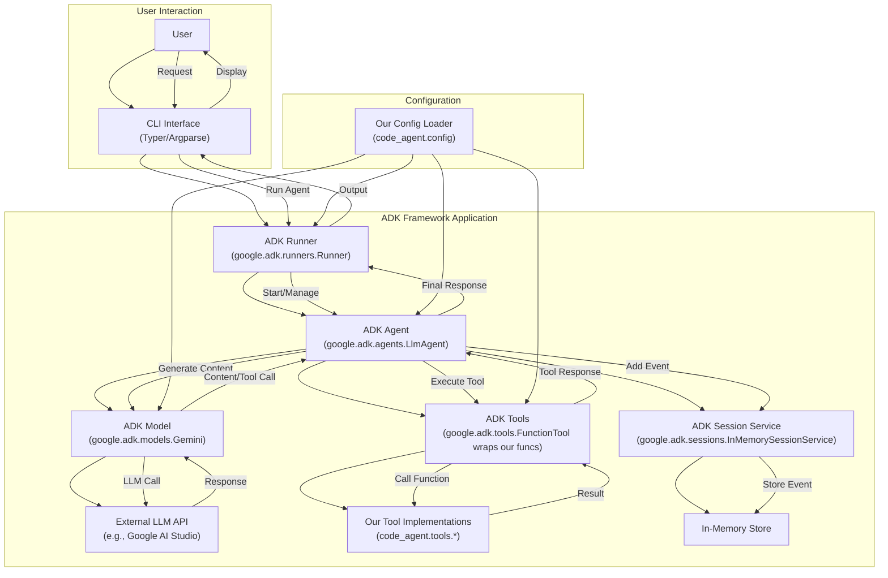

# Planning: Migration to google-adk Framework

## 1. Introduction

This document outlines the plan to migrate our current custom agent implementation (`code_agent`, `cli_agent`) to utilize the Google Agent Development Kit (`google-adk`). The primary goals are to:

*   Reduce the amount of custom framework code we need to maintain.
*   Leverage a standardized, potentially more robust and feature-rich agent framework, including the core **ADK Runtime** ([https://google.github.io/adk-docs/runtime/](https://google.github.io/adk-docs/runtime/)) for orchestrating agent execution.
*   Adopt **Events** ([https://google.github.io/adk-docs/events/](https://google.github.io/adk-docs/events/)) as the fundamental unit for communication, state management, and control flow within the agent system.
*   Utilize ADK **Context** objects ([https://google.github.io/adk-docs/context/](https://google.github.io/adk-docs/context/)) (`InvocationContext`, `ToolContext`, `CallbackContext`) as the standard mechanism for accessing state, services, and invocation details within agents, tools, and callbacks.
*   Enable more robust **agent evaluation** beyond simple pass/fail tests using ADK's evaluation framework ([https://google.github.io/adk-docs/evaluate/](https://google.github.io/adk-docs/evaluate/)) to assess agent trajectory and response quality.
*   Provide mechanisms for implementing robust **Safety and Security** measures ([https://google.github.io/adk-docs/safety/](https://google.github.io/adk-docs/safety/)) through features like Callbacks, Context-aware tools, and structured Authentication.
*   Position the codebase for future **agent interoperability** by adopting standardized structures that align well with emerging protocols like **Agent2Agent (A2A)** ([https://google.github.io/A2A/](https://google.github.io/A2A/)).
*   Improve maintainability and extensibility by adopting ADK conventions.
*   Benefit from future updates and features within the ADK ecosystem.
*   Enable easier implementation of **Multi-Agent Systems** in the future by leveraging ADK primitives like agent hierarchy, **workflow agents** (`SequentialAgent`, `ParallelAgent`, `LoopAgent`), and defined interaction patterns. See [Multi-Agent Systems in ADK](https://google.github.io/adk-docs/agents/multi-agents/) and [Workflow Agents](https://google.github.io/adk-docs/agents/workflow-agents/) for details.
*   Provide a foundation for handling richer input/output beyond text using ADK **Artifacts** ([https://google.github.io/adk-docs/artifacts/](https://google.github.io/adk-docs/artifacts/)) for managing files, images, and other binary data.
*   Allow for fine-grained **observation, customization, and control** of agent behavior through ADK **Callbacks** ([https://google.github.io/adk-docs/callbacks/](https://google.github.io/adk-docs/callbacks/)) at various points in the execution lifecycle.

The official API reference for `google-adk` can be found at: https://google.github.io/adk-docs/api-reference/

## 2. Assessment Summary & Component Mapping

Our analysis revealed significant overlap between our custom code and the components provided by `google-adk`. Migrating will involve replacing or refactoring several parts of our system:

| Current Component                  | `google-adk` Equivalent/Integration Point        | Notes                                                                    |
| :--------------------------------- | :----------------------------------------------- | :----------------------------------------------------------------------- |
| `code_agent.agent.CodeAgent`       | `google.adk.agents.LlmAgent`                     | Replace custom agent loop, state management, and prompt construction.    |
| `code_agent.llm.get_llm_response`  | `google.adk.models.BaseLlm` / `Gemini`           | Replace `litellm` wrapper with ADK model abstraction.                      |
| `code_agent.tools.*_tools.py`      | `google.adk.tools.FunctionTool` / `BaseTool`     | Wrap existing tool functions as `FunctionTool`s for ADK integration.       |
| Session/History (in `CodeAgent`)   | `google.adk.sessions.Session` / `*SessionService` | Replace manual history list with ADK session management (e.g., `InMemory`). |
| `code_agent.cli.main.py`           | `google.adk.runners.Runner` / `InMemoryRunner`   | Replace custom CLI runner logic with ADK runner.                         |
| `cli_agent/`                       | `google.adk.runners.Runner` / `LlmAgent`         | Decommission `cli_agent/` entirely; its functionality will be consolidated into the main agent package using ADK `Runner` and `LlmAgent`. |
| `code_agent.config.*`              | Initialization parameters for ADK components     | Keep config loading logic, adapt to pass values to ADK constructors.       |

## 3. Tech Stack Summary

This project utilizes the following primary technologies:

*   **Language:** Python 3.10+
*   **Package Management:** Poetry
*   **Core Framework (Post-Migration):** Google Agent Development Kit (via `google-cloud-aiplatform[adk]`)
*   **Configuration:** Pydantic (Samples often use `pydantic-settings`)
*   **CLI Framework:** Typer
*   **LLM Interaction (Pre-Migration):** `litellm`
*   **LLM Interaction (Post-Migration):** `google.adk.models` (initially `Gemini`, potentially custom `BaseLlm` wrappers)
*   **Testing:** `pytest`, `pytest-cov`, `pytest-mock`, `pytest-asyncio`
*   **Linting/Formatting:** `ruff`, `pre-commit`
*   **Virtual Environment:** `.venv` (managed by Poetry, potentially accelerated by `uv`)
*   **Installer/Resolver:** Poetry (potential alternative/supplement: `uv`)

## 4. Proposed Target Architecture

The following diagram illustrates the intended architecture after migrating to `google-adk`:

*Diagram Validation Note:* Based on `docs/feature_diagram_validation.md`, labels with punctuation or newlines should be quoted. This diagram uses simple labels or quotes where necessary.

## 5. Migration Milestones

The migration will proceed in the following phases:

1.  **Setup & Dependency Management**:
    *   Ensure `google-cloud-aiplatform[adk]` package is listed as a dependency in `pyproject.toml` (instead of `google-adk` directly, aligning with ADK samples). Update version constraints if necessary.
    *   Install/update dependencies in the `.venv` environment using `poetry install`.
    *   Review ADK documentation for any initial setup or configuration required (e.g., authentication for Google Cloud services if using Vertex AI components later).

2.  **Tool Refactoring**:
    *   Identify all core functions within `code_agent/tools/` that are intended to be used by the agent (e.g., `read_file`, `apply_edit`, `run_native_command`, `web_search`).
    *   Refer to the **[ADK Tools documentation](https://google.github.io/adk-docs/tools/)** for guidance on how to define and wrap tools, especially using `FunctionTool`.
    *   Wrap each core tool function using `google.adk.tools.FunctionTool`. Pay close attention to the guidelines for defining effective tool functions (descriptive names, clear docstrings, type hints, dictionary return types with status) as outlined in the documentation.
    *   Note: These refactored tool functions will receive a `ToolContext` object as their last argument, providing access to session state, artifact/memory services, and authentication helpers (see [Context docs](https://google.github.io/adk-docs/context/)).
    *   Review utility modules like `code_agent/tools/error_utils.py`:
        *   Determine if custom error handling/formatting logic should be integrated into the dictionary return values of the `FunctionTool`s.
        *   Assess if any parts can be simplified or replaced by ADK's standard error reporting within events or tool responses.
    *   Review utility modules like `code_agent/tools/progress_indicators.py`:
        *   Evaluate if custom progress indication is still needed.
        *   If so, investigate using `LongRunningFunctionTool` ([Function Tools docs](https://google.github.io/adk-docs/tools/function-tools/)) for tools that require progress reporting, potentially yielding status dictionaries.
    *   Define clear function signatures, docstrings (for descriptions), and potentially input/output schemas (if complex) for each `FunctionTool`.
    *   Instantiate these tools for later injection into the agent.

**Note on Future Tool Expansion:** While this milestone focuses on wrapping existing functions, migrating to ADK facilitates the future integration of other tool types, such as [Built-in Tools](https://google.github.io/adk-docs/tools/built-in-tools/), [Third-Party Tools](https://google.github.io/adk-docs/tools/third-party-tools/), [OpenAPI Tools](https://google.github.io/adk-docs/tools/openapi-tools/), and particularly the powerful [MCP Tools](https://google.github.io/adk-docs/tools/mcp-tools/) for cloud platform interactions.

3.  **Model Integration**:
    *   Replace the usage of `code_agent.llm.get_llm_response` and direct `litellm` calls.
    *   Instantiate an ADK model, likely `google.adk.models.Gemini`.
    *   Configure the `Gemini` instance using settings loaded by our `code_agent.config` module (e.g., model name, API key). **(Adapt `code_agent.config` interface as needed)**
    *   Verify connectivity to the LLM through the ADK model instance.

4.  **Agent Refactoring**:
    *   Create a new agent class, e.g., `AdkCodeAgent`, inheriting from `google.adk.agents.LlmAgent`.
    *   Refer to the [ADK Agents documentation](https://google.github.io/adk-docs/agents/) for general agent concepts.
    *   Specifically, consult the **[LLM Agent documentation](https://google.github.io/adk-docs/agents/llm-agents/)** for details on configuring parameters like `name`, `model`, `instruction`, `tools`, `generate_content_config`, etc., which are essential for this step.
    *   Note: The agent's core implementation (`_run_async_impl`) will receive an `InvocationContext`, while any attached callbacks will receive `CallbackContext`, providing access to the invocation state and services (see [Context docs](https://google.github.io/adk-docs/context/)).
    *   Initialize `AdkCodeAgent` with the ADK model instance (from step 3) and the list of `FunctionTool` instances (from step 2). **(Adapt `code_agent.config` to provide agent-specific settings if needed)**
    *   Migrate the core instructions and persona definition from `code_agent.agent.CodeAgent.__init__` to the `instruction` or `global_instruction` parameters of `AdkCodeAgent`, following guidance from the LLM Agent documentation.
    *   Review and potentially adapt any complex logic currently within `CodeAgent.run_turn` that isn't automatically handled by `LlmAgent`'s interaction loop (this should be minimal).
    *   Note: Advanced control mechanisms like **Callbacks** (e.g., `before_model_callback`, `after_tool_callback`) can be attached to this agent later for enhanced logging, validation, or behavior modification. See [Types of Callbacks](https://google.github.io/adk-docs/callbacks/types-of-callbacks/).

5.  **Session Integration**:
    *   Review the ADK documentation on [Session](https://google.github.io/adk-docs/sessions/session/), [State](https://google.github.io/adk-docs/sessions/state/), and [Memory](https://google.github.io/adk-docs/sessions/memory/) (see also the [Introduction](https://google.github.io/adk-docs/sessions/)).
    *   Choose and instantiate an ADK Session Service. Start with `google.adk.sessions.InMemorySessionService` for simplicity, as recommended for local development.
    *   Understand how the chosen `SessionService` manages the `Session` object, which contains the `events` list (replacing our `self.history`) and the `state` dictionary (for temporary data).
    *   Ensure the ADK Runner (in the next step) is configured to use this session service.
    *   Remove the manual `self.history` list and associated methods (`add_*_message`, `clear_messages`) from our codebase, relying on ADK sessions.

6.  **Runner Implementation**:
    *   Refactor `code_agent.cli.main.py`. Remove the manual instantiation and running of `CodeAgent`.
    *   Instantiate an ADK `Runner` (e.g., `google.adk.runners.InMemoryRunner`). This component acts as the entry point to the **ADK Runtime**, which will orchestrate the agent's execution. Refer to the [Runtime documentation](https://google.github.io/adk-docs/runtime/) for details on the event loop and component interactions.
    *   Configure the `Runner` with the new `AdkCodeAgent` instance (from step 4) and the session service instance (from step 5). **(Adapt `code_agent.config` to provide runner-specific settings if needed, e.g., `app_name`)**
    *   Configure the `Runner` with an initial `google.adk.artifacts.InMemoryArtifactService` to enable artifact handling capabilities for future use.
    *   Adapt the CLI argument parsing (e.g., using Typer/Argparse) to collect the user's initial prompt and pass it to the `runner.run()` or `runner.run_async()` method.
    *   Handle displaying the final response to the user by processing the stream of **Event** objects yielded by the runner. Understanding the structure of these events (author, content, actions, partial status, `is_final_response()`) is key. See [Events documentation](https://google.github.io/adk-docs/events/).

7.  **Decommission Old Code**:
    *   After verifying the new implementation works correctly through testing:
        *   Delete `code_agent/agent/agent.py`.
        *   Delete `code_agent/llm.py`.
        *   Clean up `code_agent/cli/main.py`, leaving only the ADK runner setup and CLI parsing.
        *   Delete the entire `cli_agent/` directory.
        *   Remove unused imports and potentially `litellm` dependency if no longer needed.

8.  **Testing & Validation**:
    *   Execute the full test suite (`pytest`). Adapt existing tests as needed to work with the ADK agent structure and runner. Pay close attention to tests involving tool calls and state.
    *   Leverage ADK's evaluation capabilities ([https://google.github.io/adk-docs/evaluate/](https://google.github.io/adk-docs/evaluate/)) for more nuanced testing:
        *   Create test files (`*.test.json`) or eval sets (`*.evalset.json`) defining expected interactions, tool calls, and responses.
        *   Use `google.adk.evaluation.AgentEvaluator` within `pytest` or the `adk eval` CLI command to run these evaluations. (Note: This may require adding `google-cloud-aiplatform[evaluation]` to dev dependencies).
        *   Define appropriate evaluation criteria (`tool_trajectory_avg_score`, `response_match_score`) in `test_config.json` if needed.
    *   Perform manual testing of key user workflows.
    *   Verify code coverage remains above the required threshold (e.g., 80%).
    *   Run linters and formatters.

## 6. Considerations & Risks

*   **Dependencies**: Ensure `google-adk` dependencies don't conflict with existing project dependencies.
*   **Learning Curve**: Team members may need time to familiarize themselves with ADK concepts and APIs.
*   **Behavioral Changes**: The `LlmAgent`'s internal prompting and tool-use logic might differ subtly from our custom `CodeAgent`. This could require adjustments to instructions or tool descriptions.
*   **Configuration Mapping**: Ensure all settings from our `config.yaml` (verbosity, rules, API keys, model names) are correctly passed to the relevant ADK component initializers.
*   **Testing Effort**: Significant effort may be required to adapt existing tests to the new ADK-based structure.
*   **LLM Backend Flexibility (`litellm` Replacement & Local Models)**: 
    *   Confirm ADK's built-in `Gemini` model support covers immediate needs.
    *   To support other providers or **local models (e.g., Ollama)**, we will likely need to implement a **custom `BaseLlm` subclass** (see `google.adk.models`). This custom implementation could potentially wrap `litellm` or interact directly with the desired model API (e.g., Ollama's endpoint).
    *   This structured approach via `BaseLlm` replaces the need for `code_agent/llm.py` and parts of `cli_agent/` related to model interaction.
*   **Tool Authentication**: As more tools are added post-migration, especially those accessing protected resources (e.g., Google Cloud services via MCP Tools, external APIs), we will need to configure authentication. ADK provides mechanisms for this (see [ADK Authentication documentation](https://google.github.io/adk-docs/tools/authentication/)) using `AuthScheme` and `AuthCredential`, which the migration enables us to leverage systematically.
*   **Future Deployment Alignment (GKE)**: To facilitate potential future deployment to Kubernetes environments like GKE, we should aim to structure the refactored project according to ADK deployment best practices (see [Deploy to GKE documentation](https://google.github.io/adk-docs/deploy/gke/)). This typically involves:
    *   Having the core ADK agent definition(s) within a dedicated package (e.g., `code_agent/`).
    *   Placing the FastAPI entry point (`main.py` using `get_fast_api_app`), `requirements.txt`, and `Dockerfile` at the project root level, outside the agent package.
    *   This may require adjustments to our current directory structure during or after the main refactoring milestones.
*   **Refactoring Custom Security Logic**: Our existing security checks (likely in `code_agent/tools/security.py`) will need to be refactored. Instead of a direct replacement module, ADK encourages implementing security guardrails and validations using mechanisms like **Callbacks** (e.g., `before_tool_callback`) or integrating checks directly into **Tools** using `ToolContext` to access state/policy information. See the [Safety and Security docs](https://google.github.io/adk-docs/safety/).
*   **Future Agent2Agent (A2A) Protocol Support**: While implementing the A2A protocol ([https://google.github.io/A2A/](https://google.github.io/A2A/)) is outside the scope of this initial migration, refactoring to ADK's structured agents, tools, and event-driven communication provides a significantly better foundation for potentially adopting or interacting with such interoperability standards in the future compared to the current custom implementation.
*   **Environment/Tooling Consistency**: Ensure consistent use of the established environment management tools (Poetry, `.venv`). Avoid temporary environment wrappers like `nix-shell` for running standard project commands (like `poetry install`), as this can lead to inconsistencies or hide underlying environment setup issues.

## 7. Conclusion

Migrating to `