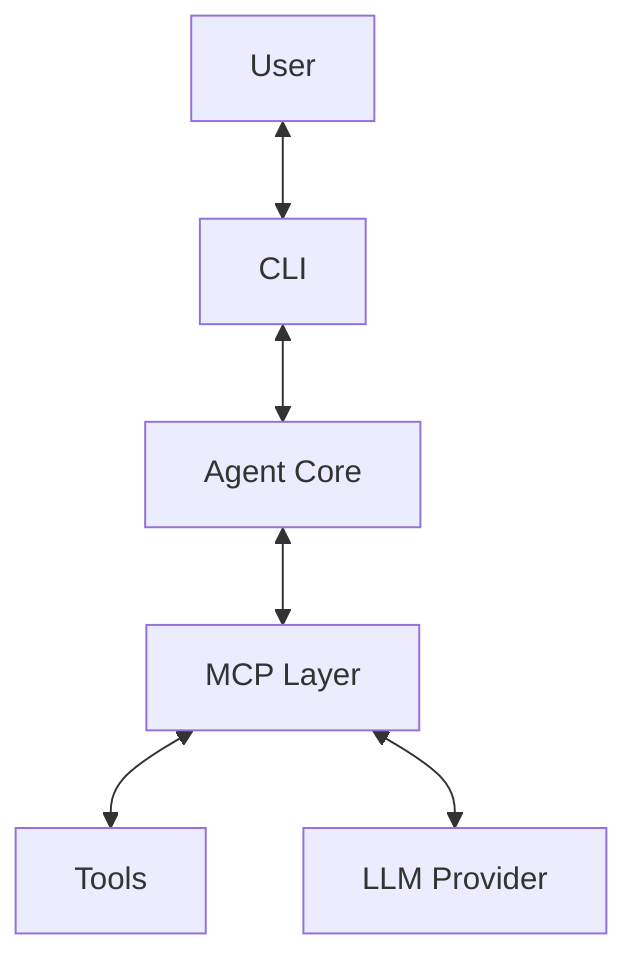

# MCP Support Plan

> **Status Update**: This feature is currently in planning phase. Implementation will begin after completing the core file operation enhancements.

## Overview

This document outlines the plan for integrating Model Control Protocol (MCP) support into the Code Agent. MCP enables more structured and controlled interactions between language models and tools.

## Implementation Plan

### 1. Architecture

The integration with MCP will follow this high-level architecture:

### 2. Components to Implement

1.  **MCP Interface Layer:**
    *   Create an MCP client adapter that conforms to the MCP specification.
    *   Implement the necessary message formats and protocols.
    *   Handle connection management.

2.  **Tool Adapters:**
    *   Create MCP-compliant wrappers for existing tools.
    *   Implement input validation and output formatting according to MCP specifications.
    *   Design a registration system for tools.

3.  **Context Management:**
    *   Build a context tracking system compatible with MCP.
    *   Implement context serialization/deserialization.
    *   Add mechanisms to manage context window limitations.
    *   Create tooling to extract information from contexts.

4.  **Configuration Changes:**
    *   Add MCP-specific configuration options to `config.yaml`.
    *   Create settings for enabling/disabling specific MCP features.
    *   Add configuration for MCP connection parameters.

5.  **Orchestration Layer:**
    *   Create an orchestration layer that manages the interaction between the MCP, the context management system, and the tools.
    *   This layer will be responsible for:
        *   Receiving MCP requests.
        *   Selecting the appropriate tools based on the request and context.
        *   Passing the request and context to the selected tools.
        *   Formatting the tool responses and returning them to the MCP.

6.  **Testing:**
    *   Develop comprehensive unit and integration tests to ensure the correct functionality of the MCP integration.
    *   Test cases should cover:
        *   Tool registration.
        *   Request handling.
        *   Response formatting.
        *   Context management.
        *   Orchestration.

7.  **Deployment:**
    *   Deploy the MCP integration in a phased approach.
    *   Start with a small set of tools and gradually expand the integration to more tools.
    *   Monitor the performance and stability of the integration closely.

## Integration with `google-adk`

*   Utilize the relevant classes and methods from the `google-adk` library to handle the underlying MCP communication and data structures.
*   Ensure that our tool adapters are compatible with the `google-adk`'s MCP implementation.

## Benefits

*   Enhanced tool capabilities through richer context and structured interactions.
*   Improved tool orchestration and accuracy.
*   Reusability of existing tools without major modifications.
*   Leveraging the existing MCP support in the `google-adk` library.

## Risks and Challenges

*   Complexity of integrating with the MCP and the `google-adk`.
*   Potential performance overhead due to the additional layers of abstraction.
*   Ensuring compatibility between our existing tools and the MCP.

## Current Status

Current status of MCP implementation:

| Component | Status | Target Completion |
|-----------|--------|-------------------|
| MCP Interface Layer | Not started | TBD |
| Tool Adapters | Not started | TBD |
| Context Management | Not started | TBD |
| Configuration Changes | Not started | TBD |
| Orchestration Layer | Not started | TBD |
| Testing | Not started | TBD |
| Deployment | Not started | TBD |

## Next Steps

1. Complete core file operation enhancements (size limits and pagination for `read_file`)
2. Finalize design document for MCP integration
3. Implement proof-of-concept for basic MCP integration
4. Adapt existing tools to MCP format
5. Develop and test context management system
6. Roll out to all tools
