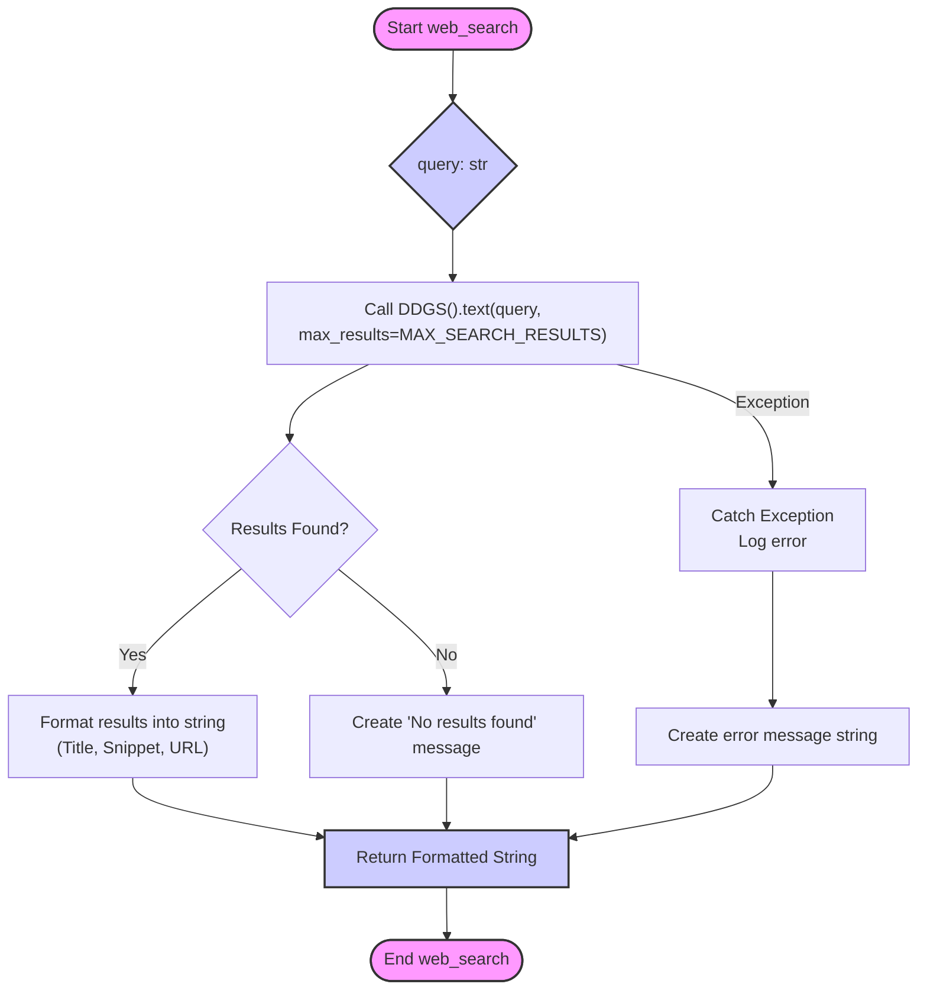
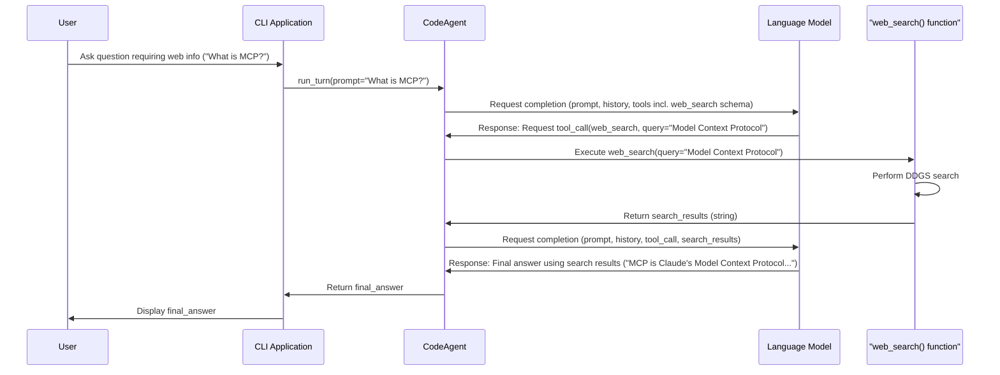

# Web Search Tool Implementation Plan

## 1. Goal

To enhance the Code Agent by adding a `web_search` tool, enabling it to search the web for up-to-date information, external documentation, code examples, or answers to general queries, reducing the need to ask the user when external information is required.

## 2. Approach

We will implement the `web_search` tool using the `duckduckgo-search` Python library. This library is chosen because it allows performing web searches without requiring an API key, simplifying setup and configuration.

The implementation will involve:
- Adding `duckduckgo-search` as a project dependency.
- Creating a `web_search` function within the agent's tools.
- Integrating this function into the `CodeAgent` class by:
    - Updating the system prompt (base instructions) to inform the LLM about the tool.
    - Adding the tool's schema to the list provided to the LLM during function calling.
    - Mapping the tool name to the actual function for execution.
- Adding comprehensive unit and integration tests.

## 3. Implementation Steps

1.  **Add Dependency:**
    - Add `duckduckgo-search` to the project's dependency file (e.g., `pyproject.toml` or `requirements.txt`).
    - Install the dependency into the virtual environment (`.venv/bin/pip install duckduckgo-search`).

2.  **Implement `web_search` Tool Function:**
    - Create the `web_search` function in `code_agent/tools/simple_tools.py`.
    - This function will take a `query` string as input.
    - It will use `duckduckgo_search.DDGS().text()` to perform the search.
    - It should limit the number of results (e.g., `max_results=3`) to avoid overwhelming the context window.
    - Format the results (title, snippet, URL) into a string suitable for the LLM.
    - Include error handling (e.g., `try...except`) and return informative messages on failure or if no results are found.

    ```python
    # Example structure in code_agent/tools/simple_tools.py
    from typing import Optional
    from duckduckgo_search import DDGS

    MAX_SEARCH_RESULTS = 3

    def web_search(query: str) -> Optional[str]:
        # ... (implementation as discussed previously) ...
        pass
    ```

3.  **Integrate into `CodeAgent` (`code_agent/agent/agent.py`):**
    - **Import:** Add `from code_agent.tools.simple_tools import web_search`.
    - **`__init__`:** Add the tool description to `self.base_instruction_parts`:
      ```python
      self.base_instruction_parts.append(
          "- web_search(query): Searches the web using DuckDuckGo to find "
          "up-to-date information or external documentation. Use when local files or commands don't provide the answer."
      )
      ```
    - **`run_turn` (Tool Definitions):** Add the schema to `tool_definitions`:
      ```python
      {
          "type": "function",
          "function": {
              "name": "web_search",
              "description": "Searches the web for information using a query string",
              "parameters": {
                  "type": "object",
                  "properties": {
                      "query": {
                          "type": "string",
                          "description": "The search query string",
                      }
                  },
                  "required": ["query"],
              },
          },
      },
      ```
    - **`run_turn` (Available Tools):** Add the mapping to `available_tools`:
      ```python
      available_tools = {
          # ... other tools ...
          "web_search": web_search,
      }
      ```

4.  **Add Tests:**
    - **Unit Tests:** Create tests for the `web_search` function in `tests/test_simple_tools.py` (or a new `test_web_tools.py`). Mock the `duckduckgo_search.DDGS` class to test:
        - Successful search result formatting.
        - Handling of no results.
        - Handling of exceptions during the search.
    - **Integration Tests:** Add tests in `tests/test_agent.py` (or similar) to simulate an agent interaction where:
        - The user asks a question requiring web search.
        - The LLM (mocked) requests the `web_search` tool.
        - The `web_search` tool (mocked) returns results.
        - The LLM (mocked) generates a final response using the search results.

## 4. Diagrams

### `web_search` Function Logic



### Agent Interaction Sequence



## 5. Future Considerations

- Implement more robust error handling and logging within the `web_search` function.
- Consider adding a summarization step if search results are consistently too verbose for the LLM context.
- Add configuration options (e.g., `max_results`, default search region) to `config.yaml`.
- Potentially add support for other search engines via different libraries/APIs if needed (likely requiring API key management).
